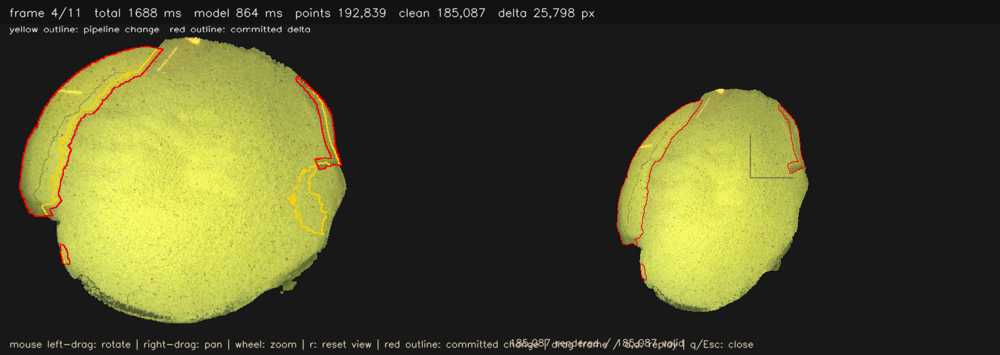

# OmniVGGT Project Context

Last updated: 2026-08-15

## 文档目的

本文件是推理主流程的技术规格文档。它的目标不是给出高层概述，而是把系统行为写到“可以逐项核对实现是否一致”的粒度。文档应当明确回答：

1. 每个阶段究竟输入了什么。
2. 每个阶段改变了哪些状态。
3. 每个判定条件如何计算，阈值依据是什么。
4. 每个失败分支何时触发、触发后做什么。
5. 每个决策会如何影响几何连续性、视觉稳定性和计算负载。

## 系统级问题定义

系统处理的是单目图像序列流，目标是将逐帧观测转换成一个持续演化的二维画布式世界模型。系统没有把全局一致性寄托于外部位姿真值，也不把模型当作全局地图优化器，而是采用下面的分工：

1. 模型只负责局部窗口内的几何观测，重点是深度与置信度。
2. 外部系统负责时序对齐、变化检测、深度校准、写回和回放。
3. 状态是增量更新的，旧状态不会被新帧无条件覆盖。
4. 回放不是重新推理，而是对历史状态差分的正反向应用。

这意味着系统本质上是一个受约束的流式估计器，而不是离线一次性重建器。

## 两条主流程的关系

系统有 Python 与 C++ 两条主流程，工程形态不同，但方法不变量一致：

1. 都先把当前帧对齐到同一个画布域，再谈融合。
2. 都必须区分几何新增与光度变化。
3. 都必须在写回前做重叠区校准。
4. 都以几何稳定优先于纹理激进为原则。
5. 都把历史回放设计为不重跑推理。

Python 更偏单进程调试和迭代，C++ 更偏服务端与可视化分离的部署形态，但两者在行为上应当可对照。

## 数据与状态契约

## 输入契约

每帧输入统一规约为：

1. 帧序信息：帧索引、顺序位置、必要时的时间戳。
2. 图像信息：RGB 数据。
3. 辅助槽位：可空、可占位，但格式必须固定，以保证模型调用接口一致。

输入阶段只做必要标准化，不提前假设几何结构，也不提前假设场景是平面、刚体或静态。

## 模型调用契约

模型调用采用固定五元输入：

1. 图像序列。
2. 外参占位。
3. 内参占位。
4. 深度占位。
5. 掩码占位。

这里的外参和内参占位不是为了“伪装有相机”，而是为了把模型接口固定成统一的局部估计格式。主流程不会依赖这些占位值提供真实几何约束，真正的跨帧一致性由外部模块完成。

## 持久状态契约

跨帧持久状态至少包含：

1. 颜色画布。
2. 深度画布。
3. 置信度画布。
4. 权重画布。
5. 有效掩码。
6. 支撑掩码。
7. 对齐变换历史。
8. 诊断缓存。

这些状态共同定义“当前世界模型”。新帧只能通过受约束写入改变这些状态，不能跳过写入门槛直接覆盖整图。

## 统一主流程详解

以下阶段定义同时适用于两条主流程。

## 阶段 0：会话初始化与参数收敛

### 输入

1. 运行参数。
2. 设备可用性。
3. 输入序列配置。

### 内部状态变化

1. 生成空画布状态。
2. 生成空历史状态。
3. 固定关键阈值与尺寸约束。
4. 记录用于后续诊断的基线信息。

### 判定条件

1. 分辨率是否满足补丁倍数约束。
2. 设备与精度组合是否可执行。
3. 阈值是否落在允许范围。
4. 输入序列是否可枚举。

### 阈值与约束说明

1. 补丁倍数约束不是形式限制，而是为了让模型输入和局部窗口的空间采样对齐。
2. 精度策略优先保证在目标设备上不溢出显存，也不落到明显不稳定的数值模式。
3. 阈值范围检查的目的是阻止把明显不合理的参数带入会话，避免后续状态被污染。

### 输出

1. 规范化后的会话配置。
2. 可运行状态机初态。

### 失败分支

1. 参数非法：直接终止。
2. 设备不可用：回退到次优设备或安全精度。
3. 序列不可枚举：终止而不是跳过，因为缺帧会破坏时间线完整性。

### 质量影响

1. 初始化阶段若把分辨率、补丁约束或精度配置放宽过头，后续每一帧都会承担额外误差或额外负载。
2. 这个阶段是把系统稳定性上限先定住的阶段，不是“只做一次无关紧要的参数读取”。

## 阶段 1：后端就绪与容错

### 输入

1. 权重资源。
2. 设备与精度策略。

### 内部状态变化

1. 后端实例从未初始化变为可调用。
2. 记录后端模式：真实后端或模拟后端。
3. 记录后端冷启动耗时。
4. 准备后续帧级推理的缓存和张量布局。

### 判定条件

1. 权重是否可读。
2. 权重是否与模型结构严格匹配。
3. 后端加载是否成功。
4. 运行精度是否与设备兼容。

### 置信度与后端质量说明

这里的“后端质量”不是几何置信度，而是模型运行可信度。若真实后端不能正常加载，就算外部流程继续，得到的几何也没有意义。因此这个阶段首先判断的是后端是否真的可用，而不是单帧几何是否好看。

### 输出

1. 推理后端句柄。
2. 后端类型标识。
3. 冷启动时间统计。

### 失败分支

1. 真实后端失败：切换模拟后端。
2. 混合精度异常：降级到安全精度。
3. 权重结构不匹配：直接停止，因为这通常意味着模型版本与系统假设不一致。

### 质量影响

1. 后端越稳定，后续阈值调试越有意义。
2. 后端容错的意义是让系统层逻辑可验证，而不是掩盖模型本身的问题。

## 阶段 2：首帧锚定与初始建图

### 输入

1. 首帧图像。

### 内部状态变化

1. 生成锚定参考域。
2. 初始化画布尺寸与边缘冗余。
3. 建立第一版深度、置信度、有效掩码。
4. 保存首帧纹理与支持域作为后续对齐基准。

### 判定条件

1. 首帧有效像素覆盖是否足够。
2. 首帧推理输出是否包含足够可用深度。
3. 首帧是否在空间上形成连续可解释的参考域。

### 首帧置信度口径

首帧阶段不存在“和历史画布比”的置信度，因此首帧质量主要来自模型自身输出的深度与深度置信度是否具有足够的空间覆盖。这里的置信度不是“画布更新可信度”，而是模型观测可信度。若首帧置信度过低，说明参考域本身就不稳，后面所有帧都会在错误基座上展开。

### 输出

1. 初始画布状态。
2. 锚定参考纹理。
3. 参考支持域。

### 失败分支

1. 首帧无有效输出：保留空状态并等待下一帧重试。
2. 首帧覆盖过碎：只保留支持一致性高的区域作为初始有效域。

### 质量影响

1. 首帧不是“尽快写进去就行”，而是整个时间线的基座。
2. 首帧若建立得过窄，后续所有帧都会被边界裁掉；若建立得过宽但噪声太大，会把无效区域也当作真基座。

## 阶段 3：二维对齐

### 输入

1. 当前帧图像。
2. 锚定参考域。
3. 当前有效画布。

### 内部状态变化

1. 更新当前帧到画布的变换。
2. 更新对齐质量诊断缓存。
3. 记录是否发生降级对齐。

### 判定条件

1. 特征匹配数量是否足够。
2. 鲁棒估计内点比例是否达标。
3. 重叠区相位修正响应是否可靠。
4. 对齐后的投影是否仍与画布重叠到足够面积。

### 对齐质量如何解释

对齐质量不是单一数字，而是多个信号的组合：

1. 特征数量说明结构信息是否够。
2. 内点比例说明几何一致性是否够。
3. 相位修正响应说明细微平移是否可信。
4. 重叠面积说明这次写回还有没有足够共同可见区域作为约束。

这些信息共同决定这帧能不能安全进入后续变化检测和写回。

### 输出

1. 粗到细修正后的对齐变换。
2. 对齐质量标记。
3. 降级原因（若有）。

### 失败分支

1. 特征退化：启用平移兜底。
2. 兜底仍不可靠：标记低可信并限制后续写回。
3. 重叠太少：降低该帧的写回信任度，优先保守更新。

### 质量影响

1. 对齐质量直接决定接缝风险。
2. 对齐低可信帧若强写回，会把几何错位写死。
3. 平移兜底不是“强行救回来”，而是“避免把明显错误的复杂变换写进去”。

## 阶段 4：变化检测

### 输入

1. 当前帧对齐到锚定画布后的 RGB 图像。
2. 当前帧对齐后的前景支持掩码。
3. 当前画布的已知有效区域、支持域和颜色。

### 内部状态变化

1. 计算重叠区域的像素亮度差异。
2. 生成支持变化掩码：当前有效支持与历史支持的差异。
3. 生成光度变化掩码：重叠区亮度差异超过稳健阈值。
4. 计算变化候选掩码并膨胀一定半径。
5. 生成用于模型上下文和校准的锚环掩码。
6. 记录支持变化率、光度变化率、鲁棒阈值和连通域过滤结果。

### 具体语义与阈值

1. 支撑变化定义为 `valid_warp & ~reference_support`。
2. 重叠区为 `valid_warp & reference_support & self.valid`。
3. 亮度差异 `diff` 只在重叠区计算，采用三通道绝对差均值。
4. 稳健光度阈值 `robust_thr` 取 `max(image_l1_thr * 2, center + 3.0 * 1.4826 * mad)`，再裁剪到 `[0.08, 0.22]`。
5. 光度变化在重叠区中通过 `diff > robust_thr` 判定，并过滤连通域小于 128 像素。
6. 当 `photo_ratio > scene_jump_ratio` 或 `(photo_ratio > 0.15 && support_ratio < 0.05)` 时，整张光度变化掩码被抑制为空。
7. 最终变化掩码 `change = dilate(support_change | photometric_change, dilate_ksize) & valid_warp`。
8. 支撑提交掩码与光度提交掩码分别来自支持变化和光度变化的膨胀结果，但光度提交仅保留重叠区域。

### 判定条件

1. `change` 的像素比例是否高于最小模型调用阈值。
2. 支撑变化是否显著，作为新几何候选。
3. 光度变化是否被判定为曝光/纹理变化而非几何变化。
4. 对齐是否可靠，否则直接禁用本帧更新。

### 失败分支

1. 对齐失败或 `fallback` 触发且已有画布时，将 `change_mask` 置零并标记 `unreliable_alignment`。
2. 纯光度变化占比过高时，抑制光度变化以避免错误几何。
3. 细碎候选区域小于 256 像素时，从融合掩码中过滤，避免无效模型调用。

### 输出

1. `change_mask`：写回候选核心。
2. `support_change_mask`：几何新增候选。
3. `photometric_change_mask`：纯光度变化候选。
4. `fusion_mask`：用于模型输入的上下文扩展区域。
5. `anchor_ring`：用于深度校准和连续性约束的环带。

### 质量影响

1. 支撑变化误判会把旧面误写为新几何。
2. 光度变化误判会把曝光差写成深度更新。
3. 过度膨胀会把上下文区域误当成几何核心。
4. 变化阶段是“是否进入模型”的第一道硬闸门。

## 阶段 5：窗口构造与模型推理

### 输入

1. `fusion_mask` 和 `change_mask`。
2. 已完成对齐与变化检测的当前图像。
3. 之前帧的画布和锚定图像。

### 内部状态变化

1. 构造模型输入 ROI：首帧为全画布，后续帧为双帧对齐 ROI。
2. 记录 `roi_height` 和 `roi_width`。
3. 记录是否跳过模型调用。
4. 更新模型耗时与候选像素统计。

### 真实行为

1. 首帧或尚未初始化画布时，模型输入为整个当前图像的 `target_width/target_size` 目标尺寸。
2. 后续帧使用 `crop_aligned_roi_pair`，将当前帧与锚帧一起裁剪到 `roi_width/roi_height`。
3. 若已有画布且 `fusion_mask` 经过 256 像素过滤后为空，则本帧模型调用被跳过。
4. 模型调用分两种形式：
   - 单帧：`_single_frame_batch(model_rgb)`。
   - 双帧：`_two_frame_batch(anchor_roi, current_roi)`。
5. 双帧分支的目标是让模型在当前变化片段和锚参考之间建立局部对照，而不是跨帧全局融合。

### 判定条件

1. `fusion_mask` 是否足以生成有效 ROI。
2. 变更比例是否小于 `no_change_ratio`（默认 0.001），若是且已有画布则跳过模型调用。
3. 模型输入边界是否满足 `patch_multiple` 约束。
4. ROI 经过几何裁剪后仍有足够可用像素。

### 输出

1. `warped_depth` 和 `warped_conf`。
2. `warped_roi_valid`：模型 ROI 有效区。
3. `model_valid`、`quality_valid`、`candidate_valid`。
4. `warped_confidence` 和 `model_confidence_threshold`。

### 性能影响

1. 首帧模型成本最高，但只执行一次。
2. 后续帧模型仅在显著变化时执行。
3. 过滤小变化和纯光度变化是延迟控制的关键。

## 阶段 6：深度校准

### 输入

1. `warped_depth`、`warped_conf`、`valid_warp`。
2. 历史 `self.depth`、`self.valid`。
3. `anchor_ring` 和 `quality_valid`。

### 内部状态变化

1. 选择重叠校准样本：`anchor_mask & valid_warp & self.valid & finite warped_depth & finite self.depth & warped_conf > min_conf`。
2. 如果样本少于 128，则退化为不校准。
3. 执行迭代加权最小二乘仿射拟合。
4. 对尺度裁剪到 `[0.25, 4.0]`、对偏置裁剪到 `[-10.0, 10.0]`。
5. 若接缝区像素数 ≥ 64，计算局部残差场并限制到 `[-0.08, 0.08]`。

### 真实行为

1. 首先用 `np.percentile(src, [2, 98])` 去掉深度尾部。
2. 使用 `design = [src, 1]` 进行加权线性拟合。
3. 采用 `residual <= median + 3 * 1.4826 * MAD` 的鲁棒剔除，最多 4 次迭代。
4. 若拟合结果无效（`scale <= 0` 或 `scale > 8` 或 非有限），回退为 `scale=1`，`bias=median(dst-src)`。
5. 对齐后深度 `aligned = warped_depth * scale + bias`。
6. 如果满足 `seam.sum() >= 64`，再使用 `spatial_correction` 和 `propagated_correction` 进行局部边界修正，最终 `correction = clip(0.78 * spatial + 0.22 * propagated, -0.08, 0.08)`。

### 判定条件

1. 校准样本数量是否 ≥ 128。
2. 样本置信度是否高于 `fuse.min_conf`。
3. 拟合后 `scale` 和 `bias` 是否在安全范围内。
4. 接缝残差是否足够稳定，才能启用局部补偿。

### 输出

1. 校准后 `aligned_depth`。
2. 校准系数 `scale`、`bias`。
3. `depth_alignment_anchor_pixels` 和 `depth_alignment_spatial_correction`。

### 质量影响

1. 规模/偏置校准是消除全局尺度漂移的主手段。
2. 局部补偿是减少接缝台阶的辅助手段。
3. 样本不足时，保守地放弃校准比错误校准更稳定。

## 阶段 7：融合写回

### 输入

1. `aligned_depth`。
2. `warped_conf`。
3. `warped_texture` / `warped_rgb`。
4. `change_mask`、`support_change_mask`、`photometric_change_mask`、`anchor_ring`。

### 内部状态变化

1. 生成最终写入掩码 `update_mask`。
2. 生成颜色桥接掩码 `color_bridge_mask`。
3. 计算颜色混合权重 `color_bridge_mix`。
4. 更新画布深度、置信度、权重、颜色和有效标记。

### 真实行为

1. `photo_only_existing = photometric_change_mask & ~support_change_mask`，并在已有画布时进一步约束为 `self.valid`。
2. `update_mask = model_valid & change_mask & ~photo_only_existing`。
3. 若存在 `anchor_ring`，则 `update_mask &= ~anchor_ring`，确保锚环只用于约束，不用于写回。
4. `color_bridge_mask` 由 `support_change_mask` 膨胀 32px 得到，仅允许在旧画布与当前对齐区域之间填色，不写入新深度。
5. `color_bridge_mix = clip(distance_to_anchor / 8.0, 0.0, 1.0)`。
6. 颜色写入使用对齐后的当前纹理，不对模型 ROI 做全局颜色平均。
7. 只有 `valid_obs = update_mask & finite(depth) & conf >= min_conf` 的像素进入融合。

### 权重与写回策略

1. `w_obs = clip(conf, 1e-4, w_max)`。
2. `w_new = min(w_old + w_obs, w_max)`。
3. 对更新像素直接写入 `depth`，而不是与旧深度混合。
4. `conf` 取最大值；`weight` 累积但上限 `w_max`。
5. 颜色写入使用 `color_obs = valid_obs & color_update_mask`，避免旧深度与新颜色混合产生伪影。

### 判定条件

1. 是否存在有效融合像素。
2. 是否应当仅写深度而拒绝颜色桥接。
3. 是否应当在变化核心外保持旧画布稳定。
4. 是否应当通过 `anchor_ring` 强制连续性约束。

### 输出

1. 更新后的 `self.depth`、`self.conf`、`self.weight`、`self.rgb`、`self.valid`。
2. `fused_pixels`。
3. `write_mask` 和 `color_update_mask`。
4. `depth_continuity_mask` / `depth_continuity_delta`。

### 失败分支

1. 没有有效观测时，不更新画布。
2. 颜色桥接为空时，仅写深度。
3. 写回掩码与锚环冲突时收窄写入范围。

### 质量影响

1. 直接写深度避免了“新旧深度混合产生第三面”的问题。
2. 颜色桥接仅用于纹理连续性，不用于几何建立。
3. 锚环不写回是防止写入旧边缘造成重叠条带的关键。

## 阶段 8：历史记录与回放

### 输入

1. 当前提交前的完整画布状态。
2. 提交后的完整画布状态。
3. 记录的 `pipeline_mask` 和 `delta_mask`。

### 内部状态变化

1. 第一帧保留全量基线状态。
2. 后续帧以稀疏字段差分方式保存修改。
3. 维护 `_state` 与 `_cursor`，使回放状态独立于推理状态。
4. 通过 `append()` 强制回到实时尾部，避免历史浏览时出现错乱差分。

### 真实行为

1. `ReplayHistory` 只保存 `rgb`、`depth`、`conf`、`weight`、`valid`、`support` 这六个字段。
2. `make_canvas_delta()` 为每个字段生成稀疏差分，只有更改像素才保存 `index`、`before`、`after`。
3. 初始帧仍然使用 `delta` 记录全量有效掩码，但不会作为普通差分应用。
4. `seek()` 前进或后退时，仅对发生变化的像素重新应用差分，时间复杂度近似 O(changed_pixels)。

### 判定条件

1. 是否为首帧。
2. 是否有实际字段差分。
3. 浏览请求是否超出 `[0, frame_count-1]`。

### 输出

1. 可逆的时间线状态。
2. 当前回放帧的 `pipeline_mask` 与 `delta_mask`。
3. `state()` 返回当前回放画布副本。

### 失败分支

1. 差分序列不一致：优先恢复尾部绝对状态。
2. 浏览越界：夹紧到合法区间。
3. 试图对空历史 `seek()`：抛出异常。

### 性能影响

1. 回放成本与变化量相关，而非全图面积。
2. 稀疏历史避免了每帧保存全画布的内存爆炸。
3. 这使得 Python 交互回放在调试阶段仍然可用。

## 阶段 9：导出与诊断

### 输入

1. 最终画布 `depth`、`rgb`、`valid`。
2. 全流程计时与质量统计。

### 内部状态变化

1. 填补窄缝：`_fill_narrow_gaps(..., pixels=5)`。
2. 规则化高度场：`_regularize_heightfield(..., sigma=4.0, raw_keep=0.15)`。
3. 裁剪边缘：`trim_px = max(3, min(4, round(min(height, width) * 0.006)))`。
4. 生成点云与颜色输出。

### 判定条件

1. 有效点数是否大于门限。
2. 裁剪后是否保留合法连续区域。
3. 统计结构是否完整。

### 输出

1. 导出点云。
2. 诊断报告。
3. 导出前后的差分与边界数据。

### 失败分支

1. 有效点数不足：输出空集并记录诊断。
2. 清洗后几何断裂：保留原始画布日志供复盘。
3. 统计缺失：报告不完整。

## Python 主流程与 C++ 主流程的细节差异

### Python 形态

1. `stream_omnivggt/cli/run_data2_live_replay.py` 作为主入口。
2. 使用 `OmniVGGTBackend` 或 `MockOmniBackend`。若真实 OmniVGGT 加载失败，回退到 `MockOmniBackend`。
3. 运行时将 `cfg.change.flow_mode = "none"`、`cfg.fuse.min_conf = 0.0`，并禁用 `warmup_buckets` 以减少首次延迟。
4. 可选 OpenCV 窗口与 `ReplayHistory` 结合，保持历史回放与实时推理解耦。
5. 适合验证阈值、变化掩码、锚环和颜色桥接策略。

### C++ 形态

1. 入口为 `omnivggt_stream_server.exe` 与 `omnivggt_live_viewer.exe`。
2. 服务器使用 `--model` 和 `--model-pair` 一次性加载固定形状 TorchScript 模型。
3. `--pair-letterbox` 保持 700×700 ROI 的长宽比，不在 C++ 端重新编译图。
4. `--queue-capacity` 1024 使离线回放在单次运行中保持无丢帧历史状态。
5. 观察器端口默认 `37651`，显示进程和推理进程通过 TCP 解耦。
6. C++ 流程更偏向性能稳定性验证、长会话以及与外部可视化的运行时契约。

## 一致性保障机制

两条主流程通过以下机制保持行为一致：

1. 同一输入契约与占位相机策略。
2. 同一变化分层逻辑与抑制逻辑。
3. 同一深度校准先行规则。
4. 同一几何优先写回原则。
5. 同一阶段化统计口径。
6. 同一“低置信度”判定思想：以模型局部置信度、重叠一致性和统计离群性共同判断。

## 典型异常场景与行为规范

### 场景 A：低纹理或重复纹理

1. 对齐可信度下降。
2. 触发降级对齐或写回限制。
3. 优先保证不写错，而不是强行写满。

### 场景 B：剧烈曝光变化

1. 光度变化占比突增。
2. 触发光度抑制，避免误几何更新。
3. 颜色写回改为保守策略。

### 场景 C：新增区域细而碎

1. 小连通域过滤可能误杀细节。
2. 通过上下文扩张与最低面积阈值平衡召回与噪声。

### 场景 D：接缝台阶或双层面

1. 检查深度校准样本量和残差统计。
2. 检查写入域是否误包含上下文区域。
3. 必要时收紧写入域并提高校准样本门限。

### 场景 E：帧级延迟抖动

1. 检查窗口尺寸分布是否异常放大。
2. 检查模型调用跳过率是否过低。
3. 检查回放与显示链路是否与推理主链路耦合过紧。

## 调参与验收建议

### 调参顺序

1. 先稳定对齐，再调变化检测。
2. 再稳定深度校准，再调融合写回。
3. 最后调纹理与导出细节。

### 关键验收指标

1. 对齐可信帧比例。
2. 有效校准样本数分布。
3. 提交掩码面积稳定性。
4. 双层面与暗边出现频率。
5. 阶段级时延分解稳定性。
6. 低置信样本被剔除后的误差下降幅度。

## 文档边界

本文档不覆盖训练、全局图优化与通用闭环问题，仅覆盖当前实时增量重建主流程的方法细节与模块行为。

---

## 实现级方法补充：张量、置信度与几何处理

以下内容只定义方法的输入、输出、公式、阈值、失败条件和状态更新顺序，不依赖具体文件名。除非特别注明，所有空间数组的坐标顺序都是 `y, x`，所有三维点都是 `x, y, z`。

### 1. 输入契约与数值域

1. RGB 图像最终统一为 `H×W×3`、RGB 顺序、`float32`、范围 `[0,1]`；送入模型时转成 `B×S×3×H×W`，其中当前在线推理固定 `B=1`，`S` 是窗口帧数。通用窗口分支只做范围转换和 HWC→CHW，ImageNet 均值/方差在模型的图像编码器内部完成，不应在外部重复归一化。
2. 深度辅助输入为 `B×S×H×W×1`，掩码为 `B×S×H×W`。没有深度输入时两者分别填零；有深度输入时 `depth > 1e-6` 才作为有效掩码。深度重采样使用最近邻，避免双线性插值制造新的有效深度边缘。
3. 外参契约是世界坐标到相机坐标的 `3×4` 矩阵。若输入是相机到世界的 `3×4/4×4` 矩阵，先补成 `4×4`、求逆，再取左上 `3×4`。缺失外参使用 `[I|0]`。通用窗口分支的缺失内参使用
   `K=[[f,0,w/2],[0,f,h/2],[0,0,1]]`，其中 `f=max(w,h)`；锚定画布观察器按照固定导出契约传入单位内参。
4. `camera_gt_index` 和 `depth_gt_index` 是导出/推理时的索引列表，不是运行时的置信度或有效掩码。在线无辅助几何的路径传空列表，模型会使用零占位 token；如果导出时固定了非空索引，运行时虽然仍传五个输入张量，但只有这些固定索引对应的输入会被模型使用。
5. 模型输出在进入外部 CPU 状态、C++ patch 或 NumPy 地图前统一转换为 `float32`；模型 forward 内部仍可保持 BF16/FP16。画布深度、置信度、累积权重、标定残差和三维地图状态也保持 `float32`；RGB 可在显示/导出副本中转成 `uint8`，不能把用于深度校准的状态提前量化。

### 2. OmniVGGT 的 token、head 和输出含义

1. 默认输入尺寸为 `518×518`，patch size 为 `14`。给定输入 `H×W` 时，patch 数为
   `P=(H/14)×(W/14)`；每帧 token 序列包含 1 个 camera token、4 个 register token 和 `P` 个 patch token，因此 patch token 起点是索引 `5`。
2. 聚合器为 24 层、16 个 attention heads、`embed_dim=1024`、`mlp_ratio=4` 的交替帧内/跨帧注意力结构。帧内注意力先对每个帧独立处理 `[B×S,P,C]`；全局注意力再处理 `[B,S×P,C]`。每一对帧内/全局操作的中间结果拼成 `[B,S,P,2C]`，供几何 head 使用。
3. 每帧的 camera token 在四次迭代中更新 9 维 pose 编码：平移 3 维、四元数 4 维、水平/垂直视场角 2 维。每次迭代用前一次 pose 产生 shift、scale、gate，经过自适应 LayerNorm、4 个 trunk block 和一个隐藏维度为 `C/2` 的 MLP 预测增量；平移和四元数增量为线性输出，视场角经过 ReLU。最终输出的 pose 编码不是直接的 `4×4` 矩阵，只有在下游需要相机时才解码。
4. 深度 head 的 DPT 输入维度为 `2048`，输出 2 个通道；点 head 同样输入 `2048`，输出 4 个通道。两者都读取聚合器第 `4、11、17、23` 层的中间结果，分别经过 LayerNorm、`1×1` 投影到 `256/512/1024/1024` 通道、不同倍率的上采样/下采样、4 个融合块和最终卷积，再恢复到输入分辨率。
5. 对每个 head，最后一个通道是置信度 raw logit，其余通道是几何 raw 值。当前深度和点 head 的激活分别为：

   - 深度：`d=exp(r_d)`，因此有效深度应满足有限且 `d>0`。
   - 世界点：`p=sign(r_p)×(exp(|r_p|)-1)`，输出 `x,y,z`，不是简单的单位深度图。
   - 置信度：`c=1+exp(r_c)`，其中 `r_c` 是 raw logit。

   因而当前 `c` 不是 `[0,1]` 概率，理论下界是 `1`，也没有上界。它只能被解释为模型在同一批次/同一 head 内的相对质量分数。不能直接把它当作 softmax 概率、不能用 `1-c` 当作概率缺陷度，也不能跨模型版本比较绝对数值。

6. 置信度的实际使用分三层：

   - 候选有效性：要求 `finite(depth) && depth>0 && finite(conf)`，并且像素落在几何有效域内。
   - 质量门限：后续帧候选数不少于 256 时，用候选置信度的第 20 百分位与 `min_conf` 取最大值：
     `Tq=max(0.1, percentile({c_i},20))`。`c_i>=Tq` 只用于深度标定的高质量重叠样本；写回模型几何时使用更宽松的 `c_i>=0.1`，避免新暴露区域因统计门限过高而全部消失。候选数不足 256 时 `Tq=0.1`。
   - 融合权重：`w_obs=clip(c,1e-4,w_max)`，默认 `w_max=32`。置信度越高，观测对同一地图元素的更新权重越大；它不表示该点的米制误差或概率置信区间。

   首帧不做第 20 百分位筛选，只要候选几何有限就初始化画布；独立点云导出器的 `conf_percentile` 是导出剔除阈值，与在线融合的 `Tq` 是两个不同参数。

### 3. 形状 bucket、缩放和模型输入

1. 通用窗口分支先将图像宽度缩放到 `target_width`，缩放比例为 `s=target_width/src_width`；高度取 `round(src_height×s/14)×14`，再在高度超过 `target_size` 时做中心裁剪。RGB 用双线性，深度用最近邻，内参的第一行乘 `s`、第二行乘 `s` 后再减去裁剪掉的顶部像素。
2. 锚定画布分支使用两套尺寸：匹配/画布基准宽度 `max(700,target_width)`，模型 ROI 最大尺寸由 `target_width/target_size` 给出，并向下取整到 14 的倍数。后续 ROI 以变化区域 bbox 为中心向四周扩展 32 像素；令原 ROI 为 `crop_w×crop_h`、最大模型尺寸为 `max_w×max_h`，则
   `s=min(max_w/crop_w,max_h/crop_h)`，目标尺寸分别为
   `floor(crop_w×s/14)×14` 和 `floor(crop_h×s/14)×14`，至少为一个 patch。
3. 这种 ROI bucket 不把一个小变化强行放大到完整画布，模型 token 数随变化区域缩小；ROI 外的上下文只用于对齐、颜色桥接和深度连续性，不应作为几何写回域。
4. 首帧使用完整匹配画布；后续帧可以使用双帧 `[anchor,current]` 模型，也可以使用固定单帧模型后在外部完成对齐。两帧模型输出中的 `frame index=1` 才是当前帧写回候选，anchor 帧只用来提供重叠几何约束。
5. 模型批次中的未知输入固定为零：深度为全零、mask 为全零；相机占位使用单位外参/内参。模型内部再进行 RGB 的 ImageNet 归一化。外部不能同时做 ImageNet 归一化和 `[0,1]` 归一化，否则会改变训练分布。

### 4. 通用窗口分支的逐帧决策

1. 每帧先执行可选的旋转对齐，再执行可选的高度对齐。外部对齐器返回 `4×4` 世界变换和质量分数；变换左乘相机到世界位姿，最终质量取旋转和高度质量的最小值。失败时使用单位变换、质量置零并 fail-open；质量低于 `0.2` 或 overlap 低于 `0.1` 时记录新 segment/恢复状态，不清空已有地图。
2. 若相邻时间戳间隔大于 `1s`，进入 dropped-frame 保护：记录丢帧、下一次禁用短期光流，不把不连续帧的运动误判为场景变化。
3. 变化检测先把当前图像与参考图像调整到同一 `H×W`。第一帧无参考时直接令 `mask=全1`、`changed_ratio=1`。
4. 图像残差为三通道平均绝对差：
   `e_img(y,x)=mean_c |I_t(y,x,c)-I_ref(y,x,c)|`。
   若同时存在当前/重投影深度，则仅在两者都大于 `1e-6` 的像素计算
   `e_depth=|d_t-d_ref|/max(|d_ref|,1e-6)`，否则该项为零。
5. 光流项使用 Farneback 稠密光流或 LK 稀疏光流。Farneback 取每像素二维位移的 L2 范数；LK 模式把有效跟踪点的平均位移填满整幅图。光流阈值默认 `2px`。
6. 若传入 `[0,1]` 置信度图，置信度惩罚为 `e_conf=clip(1-conf,0,1)`；总分为
   `score=λ_img e_img + λ_depth e_depth + λ_flow(flow_mag/2) + λ_conf e_conf`，默认权重为 `1、1、0.25、0.25`。
7. 改变 mask 使用硬阈值并集，而不是总分阈值：
   `e_img>12/255 || e_depth>0.03 || flow_mag>2 || conf<0.2`，之后使用方形 3×3 膨胀。变化像素按 16×16 网格投影为 block hint，供局部窗口选取。
8. 通用分支的 `conf_map` 约定是 `[0,1]`。如果直接把当前 head 的 `1+exp(raw)` 原始置信度传入该通道，那么 `clip(1-conf,0,1)` 恒为零，低置信度硬阈值也不会触发；因此该分支若启用置信度变化项，必须先做显式归一化或改用百分位排名。锚定画布分支不使用这个 `[0,1]` 假设，而是直接使用相对 percentile gate。
9. 当变化率达到 `0.35` 时触发 full refresh/scene jump；策略模式为 full rebuild 时无条件把 mask 设为全 1。变化率小于等于 `0.001` 且已有历史时跳过模型，只更新轻量状态和统计。

### 5. 通用窗口选择与增量地图

1. 允许的窗口帧数为 `3、4、6、8`。无大变化时目标长度为 4，中等变化大于 `0.02` 时为 6，full refresh 时为 8，最终向上选择最近的合法 bucket。
2. 候选集合是去重后的 keyframe 与短历史，当前帧始终加入。候选分数为
   `score=exp(-age/4)+overlap_bonus×overlap+camera_bonus×has_camera+0.4×has_depth+2×is_anchor+0.5×mean_conf`，默认 `overlap_bonus=1`、`camera_bonus=1`。`overlap` 是候选帧 block-key 与变化 block hint 的交集除以变化 block 数。
3. 若存在带相机的 anchor，优先放到窗口第 0 帧；其余按分数降序填充，避免重复后再用 anchor 补齐长度。模型输入的 camera/depth ground-truth 索引由选中帧中实际含有相机/深度的帧位置生成。
4. 当前帧在第 0 帧、被强制标记、变化率达到 `0.35`，或有外部几何且变化率达到 `0.02` 时晋升 keyframe；有预测和深度且变化率超过 `0.01` 时也可晋升。历史最多保留 `4×max_bucket` 帧，keyframe 最多 32 个。
5. 默认从 `world_points` 取 `S×H×W×3` 点；若不可用，使用深度的归一化针孔近似 `x=grid_x×d、y=grid_y×d、z=d`，其中 `grid_x/grid_y∈[-1,1]`。只保留当前帧且落在变化 mask 中的点，再施加 `conf>=0.1`。
6. 点用 `block_size=voxel_size×block_resolution=0.03×16=0.48` 做空间分块，block key 为 `floor(point/block_size)`。热区最多 512 个 block；按最近更新时间/平均置信度淘汰非 anchor block。启用 cold store 时，每个 block 使用固定槽位，最多保存 2048 点，每点 8 个 float32 槽：`xyz(3)+rgb(3)+weight+valid`，另有索引和 block metadata。
7. 热区 surfel 合并先将既有点按 `0.015m` 量化建索引；观测落入同一量化格时，若 `|z_new-z_old|>0.15m` 且允许遮挡替换，则直接替换旧点；否则使用
   `w_obs=conf×exp(-0.02×max(dt,0))`、`w_new=min(w_old+w_obs,32)`，对点和颜色做加权平均，法线以默认 `+Z` 加权后归一化。没有匹配格时追加 surfel。
8. 背景 TSDF 是轻量 voxel accumulator，不是完整有符号距离场：以 `0.03m` voxel 合并点、累加截断权重到 32，现实现始终以观测点中心为中心且初始 TSDF 为零。它与 surfel/metadata 同时更新，便于后续替换为真正 TSDF 而不改变上层接口。

### 6. 锚定画布分支：匹配、支持域和变化检测

1. 画布状态保存 `rgb/depth/conf/weight/valid/support`，另存 anchor RGB、相机/深度标定和版本号。初始匹配宽度为 `max(700,target_width)`；左右 padding 为 `max(32,round(0.05×width))`，上 padding 为 `max(128,round(0.18×width))`，下 padding 为 `max(64,round(0.09×width))`。padding 只扩大安全工作区，不代表真实几何。
2. 原图按匹配宽度保持长宽比缩放。用于 SIFT/ORB 的匹配图从 `[0,1]` 量化为 `uint8`，量化方式是直接取整；后续模型 ROI 的 float 输入不再经过这一轮 `uint8` 量化。画布初始 `valid=false`、`support=false`、深度/置信度/权重为零。
3. 前景支持域先转灰度，用 Otsu 得到阈值并与 `0.10` 取最大；灰度高于阈值为前景。若前景占比超过 `94%`，直接使用全图；否则做 3×3 开运算和 9×9 闭运算，再取 8 邻域连通域。最大连通域面积至少占图像 `8%` 时保留最大域，否则保留全部前景候选。它只描述“可能有真实内容”，不直接作为写回深度。
4. 首帧锚定变换为单位矩阵。后续帧优先使用 SIFT：最多 1500 个特征、BF matcher、ratio test `0.75`，两张图都少于 8 个关键点或 good matches 少于 8 时失败；使用 RANSAC 重投影阈值 `3px`，至少 8 个内点才接受，并记录内点中位重投影误差。SIFT 失败时改用 ORB 1500；仍失败则使用 phase correlation 平移。
5. phase correlation 输出平移响应；平移结果被限制在合理范围，并以 `1/response` 作为近似 median error。已有画布时若重叠有效像素至少 2048，先用差异不大的区域建立 bbox（差异阈值为 `max(0.08,median+3×1.4826×MAD)`），bbox 扩展 24 像素，至少 64 像素宽高且 mask 平均值至少 `0.08`，再用 Hanning window 做 phase correlation 微调；校正量限制在 ±8 像素，response 低于 `0.02` 不采用。
6. 变换矩阵统一表示当前图像到 anchor 画布：`p_anchor≈H p_current`。当前 RGB、depth、confidence、support 都通过逆映射 warp 到画布；任何越出图像或 padding 的位置都标记为 `valid_warp=false`。
7. 支持变化为
   `support_change=valid_warp & ~reference_support`。
   重叠区域为
   `overlap=valid_warp & reference_support & self.valid`。
   光度差为重叠区域内三通道 RGB 绝对差的平均值。用 overlap 中位数 `m` 和 `MAD` 得到
   `T_photo=clip(max(2×image_l1_thr,m+3×1.4826×MAD),0.08,0.22)`，默认 `image_l1_thr=12/255`；`diff>T_photo` 为光度变化，连通域小于 128 像素的光度变化删除。
8. 若光度变化占比超过 `0.35`，或光度变化占比超过 `0.15` 且支持变化占比小于 `0.05`，认为是曝光/全局外观改变，抑制光度 mask，只保留支持变化。最终
   `change=dilate(support_change|photometric_change,3)&valid_warp`。
   写回前再删除小于 256 像素的模型融合连通域，并排除 anchor ring。已有深度且 `changed_ratio<=0.001` 时直接跳过模型；但仍把当前观测支持域并入 `support`，防止相机运动后支持状态陈旧。

### 7. 锚定画布 ROI、候选和置信度 feather

1. 首帧把完整匹配画布缩放到模型尺寸；模型坐标通过尺度和 padding 仿射回画布。后续只截取 `change` bbox 加 32 像素上下文的 anchor/current 同域 ROI。
2. ROI 经过目标 bucket 缩放后，模型有效区域再收缩 8 像素 support border，避免卷积边缘和 letterbox/上下文边缘被写回。候选 mask 为
   `valid_warp & roi_valid & finite(depth) & depth>0 & finite(conf)`。
3. 后续帧候选数不少于 256 时按第 20 百分位求 `Tq`；`quality_valid=candidate_valid&(conf>=Tq)`，仅供标定；`model_valid=candidate_valid&(conf>=0.1)`，用于生成写回候选。这样新暴露区域即使整体置信度偏低仍可参与融合，但不能污染标定。
4. `model_valid` 内部做距离 feather。对二值 mask 做距离变换，取内部距离第 85 百分位 `p85`，尺度为 `max(1,0.35×p85)`，得到 `feather=clip(distance/scale,0,1)`。写回置信度为 `max(conf×feather,0.1)`；mask 外置信度为零。feather 只衰减边界，不改变模型 raw confidence 的排序。

### 8. 深度标定、残差和接缝连续性

1. 标定目标是把当前 warp 深度 `src` 变换到 anchor 画布深度 `dst`，使用一阶仿射
   `d_aligned=scale×src+bias`。
2. 样本优先取 anchor mask/ring 与 `valid_warp & self.valid` 的交集，并要求两侧深度有限、`warped_conf>0.1`。anchor ring 有效样本少于 128 时退回更宽的 `valid_warp` overlap；仍少于 128 时不标定，返回原始深度。
3. 先删除 `src` 的 2/98 百分位之外样本。设计矩阵为 `A=[src,1]`，权重为 `w=max(conf,1e-4)`，通过
   `argmin_{scale,bias} Σ w_i(A_iθ-dst_i)^2`
   求解；实现上对 `A` 和 `dst` 同时乘 `sqrt(w)` 后做最小二乘。最多 4 次迭代，每次计算残差 `r=dst-(scale×src+bias)`，保留 `|r|<=median(r)+3×1.4826×MAD(r)` 对应的鲁棒内点。scale 非有限时回退到 1，bias 回退到 `median(dst-src)`；最终 scale 限制 `[0.25,4]`，bias 限制 `[-10,10]`。
4. 为消除局部接缝，重叠样本至少 64 个时，对残差 `e=canvas_depth-d_aligned` 分别做两种估计：
   - 空间项：在归一化 `x,y` 上拟合 `[x,y,1]` 仿射残差，最多 5 次 MAD 内点迭代；
   - 传播项：从可靠 ring 样本向 ROI 内传播，使用最近距离和 `σ=24` 的高斯权重。

   修正为 `clip(0.78×e_spatial+0.22×e_propagated,-0.08,0.08)`，再加到仿射深度上。修正只用于小尺度接缝连续性，不得吸收大范围场景跳变。

5. 几何写回前再做 anchor 深度连续性约束。用旧画布深度的 `σ=6` 局部高斯归一化卷积形成连续参考面；在新旧边界 2.5 像素内收集新区域与旧区域的残差，以 `σ=2~4` 传播边界校正。若边界样本不足，退回二次曲面拟合。新区域沿同一表面的深度采用连续参考，旧区域重叠部分保留画布原深度，从而避免把同一平面写成两层平行面。

### 9. 颜色、深度和画布融合

1. 光度变化只发生在旧有效区域时，定义
   `photo_only_existing=photometric_change & ~support_change & self.valid`。
   模型几何更新域为
   `update_mask=model_valid & change & ~photo_only_existing & ~anchor_ring`。
   这会避免曝光变化把旧表面误写成新几何。
2. 支持变化周围使用半径 32 的椭圆膨胀生成颜色桥接域。桥接仅在旧画布有效、当前 warp 有效、非 anchor ring 且不属于 `update_mask` 时成立；令到非 anchor ring 的距离为 `q`，颜色混合比例为 `mix=clip(q/8,0,1)`。桥接只写 RGB，不写 depth/conf/weight，防止没有新几何证据时改变表面位置。
3. 当前 RGB 是局部观测的权威颜色，但颜色转移前先计算旧画布与当前 warp 的低频残差，使用 `σ=24` 的高斯平滑；每通道用残差中位数和 MAD 去除异常，修正截断在 ±0.05。支持重叠区的旧色/新色比例按距 ring 的距离决定并限制在 `0.65~0.95`，ring 本身不直接写入。
4. 几何观测只有同时满足 `update_mask`、深度有限、`depth>0`、置信度不少于 `0.1` 才进入 `_fuse`。对有效像素初始化/读取 `depth,conf,weight,valid,rgb`：
   `w_obs=clip(conf,1e-4,32)`；
   `weight_new=min(weight_old+w_obs,32)`；
   `depth_new=depth_observed`（当前策略是几何直接覆盖，而不是深度加权平均）；
   `conf_new=max(conf_old,conf_observed)`；
   `valid=true`。
   RGB 按上面的颜色域单独写入。因而 `weight` 记录累计观测强度，`conf` 记录当前已见质量上界，两者语义不同。
5. 每个提交都会记录变化比例、有效像素数、融合像素数、对齐内点、fallback、标定样本数、scale/bias、接缝修正幅度和各阶段耗时。只允许在几何写回域更新 `last_update_frame`；support-only 和 color-only 更新不能伪装成新的深度观测。

### 10. 导出、回放和不变量

1. 导出副本先用 11×11 close 填补最多约 5 像素的窄缝，再用最近有效深度填洞；不修改在线画布。密集区域用 5×5 中值滤波去除 ridge，若局部密度大于 `0.72` 且残差超过 `max(0.025,6×1.4826×MAD)` 则拒绝异常；再以 `σ=4` 高斯归一化卷积平滑，平滑结果与原深度按 `0.85/0.15` 混合。
2. 最后腐蚀 3~4 像素边缘，具体为 `max(3,min(4,round(0.006×min(H,W))))`；输出坐标归一化为
   `x=(col-W/2)/max(H,W)`、`y=-(row-H/2)/max(H,W)`、`z=depth`。平面残差拟合基底 `[1,x,y,x²,xy,y²]`，做 3 次 MAD 内点迭代，阈值为 `4×1.4826×MAD`，残差上限再取 `min(3×1.4826×MAD,0.03×median_abs_depth)`，最终以基准深度的中位绝对值归一化。
3. 增量地图只保存发生变化的字段和像素/slot：RGB、depth、conf、weight、valid、support 以及必要的 dirty tile；回放应用 delta，不重新运行模型。版本前进/回退都要求 `from_version/to_version` 连续，越界帧号被 clamp 到合法范围。
4. 所有并发实现都遵守：推理线程只能生成基于某个 `base_version` 的候选，唯一提交者先验证当前版本仍等于 `base_version`，再应用 patch 并递增版本；版本不符的候选必须丢弃或重新计算，不能合并到新状态。这样保证读者永远看到一个完整画布，而不会看到半个 patch。

## 轻量化与推理显存控制（实现级）

### 1. 显存主要消耗在哪里

设 `P=(H/14)(W/14)`，模型的 patch token 数量是 `P`，窗口有 `S` 帧。主干的显存来自参数、QKV/MLP 激活和跨帧 global attention；global attention 的 token 规模是 `S×P`，其注意力相关临时张量随 token 数近似二次增长。DPT head 还会同时保留 4 个中间层的多尺度特征。因此：

1. 把宽高同时缩小一半，patch token 约变为原来的四分之一，显存和计算通常下降幅度大于简单的像素比例。
2. 把窗口从 2 帧变成 1 帧，除了输入和 DPT 线性部分减少外，还会显著减少跨帧 global attention 的临时张量。
3. 仅减少输出 PLY 点数不会减少主干峰值显存；必须减少输入 token、主干激活、head 数量或计算精度。

### 2. 当前可直接使用的减显存操作

| 操作 | 具体实现 | 显存收益/代价 |
| --- | --- | --- |
| BF16/FP16 权重与激活 | CUDA 上将模型和 image/depth/mask 设为 BF16 或 FP16，并在 forward/head 范围打开 CUDA autocast | 参数从 FP32 约 4 bytes/参数降为 2 bytes/参数；部分激活和卷积临时张量也减半。BF16 动态范围更安全，FP16 通常更快但更易溢出 |
| `inference_mode` | 整个推理包在 `torch.inference_mode()` 内，而不是只使用 `no_grad()` | 移除 autograd graph、版本计数和 view tracking，降低临时对象与峰值；不改变结果定义 |
| 只保留深度输出 | 使用 observer-depth-only 结构，只保留 camera head、depth head、depth confidence，删除 point head | 删除一个完整 DPT point head 的中间特征和输出，适合只维护 heightfield；不能再直接得到 world points |
| S1/S2 输入 | 首帧用单帧，后续最多 anchor+current 两帧；不把整个历史送入主干 | 降低 `S×P`，同时避免把历史缓存复制到 GPU |
| ROI/bucket | 只对变化 bbox+32px 上下文做推理，宽高向下取整到 14 的倍数 | 输入无变化区域时跳过模型；变化小则 token 显著减少，代价是需要外部对齐/标定/融合 |
| no-change skip | `changed_ratio<=0.001` 时只更新 support/状态，不做模型 forward | 该帧峰值显存和推理时间都接近零；阈值过低会降低跳过率 |
| C++ 结果及时落 CPU | 输出先转 CPU FP32，GPU tensor 生命周期结束后再进入地图/回放 | 避免 GPU 长期保存历史画布和 delta；CPU 内存增加，但更适合长会话 |
| pinned/non-blocking 传输 | CUDA 路径对 CPU staging tensor 使用 pinned memory，并以 `non_blocking` 复制到设备 | 可重叠部分拷贝和计算；不改变模型峰值，需避免无限积压 pinned buffer |

`min_conf=0.1`、置信度百分位或 PLY 剔除只改变保留点数量，不会降低主干 forward 的峰值；只有与 ROI、head 删除或跳帧一起使用才会产生显存收益。

### 3. 输出精度应该如何降低

1. 推荐组合是：模型参数/中间激活 BF16，输入 image/depth/mask BF16，camera/intrinsics/extrinsics FP32，depth/conf/pose 输出在 head 返回处显式 `.float()`，之后的深度仿射、MAD、Gaussian seam correction、画布状态和地图融合全部 FP32。
2. 不能把 depth 在 GPU 输出后立即转 FP16 再做 affine calibration：scale/bias 的 2/98 分位、MAD 和 ±0.08 seam clamp 都可能受到量化噪声影响，表现为台阶和双层面。
3. 置信度也不能转成 `uint8` 再参与 percentile；至少保留 FP32，或保留排序所需的高精度标量。RGB 只在显示和 PLY 颜色副本中转 `uint8`。
4. 当前结构不把 FP8/INT8/INT4 当作可直接替换的开关。原因是 24 层 transformer、LayerNorm、SDPA、DPT transpose convolution 和 confidence/depth activation 需要完整的 kernel 覆盖及校准；没有重新校准和端到端误差验证时，量化可能比 BF16 更省显存但破坏深度尺度。
5. 若只需要相对表面而不需要点云，可关闭 point head；若连视场角/anchor camera 都不需要，理论上可进一步关闭 camera head，但当前锚定画布的默认路径用 pose 的 FoV 生成/校验相机内参，因此不能在不改下游契约的情况下删除 camera head。

### 4. 结构级进一步优化及限制

1. DPT 默认 `frames_chunk_size=8`；当前在线 `S≤2` 时等于一次处理所有帧，没有额外收益。若以后窗口扩大到 4/6/8，可将其改为 1/2/4，在 head 阶段分块释放中间特征；这只降低 DPT 峰值，聚合器的全局 attention 仍按完整 `S` 运行。
2. 聚合器当前为 24 层都生成中间结果，head 实际只读取 `[4,11,17,23]`。可以在推理图中只保留这四层并保留最后一层的 camera token；这会减少中间层引用和 head 输入的 GPU 生命周期，但必须同时检查 camera head 的最后层依赖、TorchScript trace 和数值回归，不能只在 Python 侧删除列表元素。
3. `preload_patch_embed=false` 避免启动阶段额外预加载 patch embed 权重，主要减少启动时的重复权重驻留，不会显著减少 forward 激活峰值。
4. `torch.compile` 的 reduce-overhead 模式可能改善稳定形状的吞吐，但编译缓存和 graph workspace 可能增加显存；8GB 卡默认不应为了轻量化强制打开。若启用，应对每个 `(S,H,W,dtype)` bucket 单独预热并测量 peak memory。
5. checkpointing 只在训练分支生效，推理时不能依赖它降低显存；如果对 eval graph 强行启用，需要重新确认 autograd、TorchScript 和输出一致性。
6. 推理历史应保存为 CPU 的稀疏 delta，而不是保存每帧完整 `H×W` canvas。回放通过 snapshot+delta 重建；快照间隔默认 60 个提交版本。这样显存不随流长度增长，磁盘/CPU 内存才是主要增长项。

### 5. C++ 侧的显存控制

1. 固定 shape 的 TorchScript 运行时只加载与当前 `S,H,W` 相符的图。动态 pair bucket 模式按精确 ROI 尺寸按需加载，替换旧 pair module，避免把所有大尺寸 pair 图同时驻留造成数 GB 的重复参数。
2. letterbox 模式只加载一个固定 pair 图：先保持 ROI 长宽比缩放，再用边缘复制填充到固定尺寸；填充区域不进入支持域，模型结果映射回画布时扣除 `pad_x/pad_y`。它减少 artifact 数量，但会对小 ROI 计算更多 padding 像素。
3. 运行时以 BF16/FP16 autocast 执行模型，输出立即转 CPU FP32；不要把整幅 canonical canvas、历史 delta 或 viewer buffer 保存在 CUDA tensor 中。
4. 使用简单 executor、固定输入尺寸和一次性 warmup，避免 profiling executor 在首次 CUDA 调用时建立大规模 profile workspace。导出图保留 traced submodule 边界时更容易避免 LibTorch 对完全内联 transformer 选择极慢的 CUDA 路径；是否 freeze/optimize 必须以实际首帧和稳态 peak memory 测试为准。

### 6. 已测量的显存量级

当前 8GB RTX 5060 Laptop GPU 上，几何优先的 BF16、`target_size=700` 测试峰值约 4269 MiB；同尺寸 FP32 峰值约 6601 MiB，推理后系统报告可用显存接近 0 MiB，而几何残差改善很小。BF16、`target_size=1008` 的高分辨率诊断峰值约 6369 MiB，同样不适合作为默认。上述数值包含当前进程/allocator 状态，不能当作所有 GPU 的硬上限；验收应同时记录设备、其他进程占用、输入帧数、point head 是否开启和模型 warmup 状态。

## C++ 部署与运行时契约（实现级）

### 1. 部署边界

C++ 端不重新实现 transformer，也不读取 safetensors；模型在 Python 侧被导出为固定签名 TorchScript，C++ 负责图像/ROI 前处理、LibTorch 调用、输出校验、2D 对齐、变化检测、深度标定、融合、历史存储和 TCP 发布。模型之外的这些模块不是 TorchScript 的一部分，必须由 C++ 运行时显式执行。

当前验证组合为：Windows GPU、MSVC 14.29/C++17、LibTorch 2.7.0+CUDA 12.8、CUDA 12.8、OpenCV 4.10.0；设备要求是可用 CUDA GPU。当前路径不编译自定义 CUDA kernel，只链接 LibTorch 的 `torch/torch_cpu/torch_cuda/c10/c10_cuda/caffe2_nvrtc` 导入库并在运行时调用 GPU。

### 2. TorchScript 固定接口

1. 导出输入固定为五个 tensor：

   - `images`: `[1,S,3,H,W]`，RGB、`[0,1]`；
   - `extrinsics`: `[1,S,3,4]`，FP32；
   - `intrinsics`: `[1,S,3,3]`，FP32；
   - `depth`: `[1,S,H,W,1]`，模型 dtype；
   - `mask`: `[1,S,H,W]`，模型 dtype。

   `H`、`W` 必须是 14 的倍数，`S` 必须与导出时完全相同。运行时不能把 S2 图当 S1 图加载，也不能传不同 H/W 期待图自动 resize。

2. 完整点云图输出五项：`pose_enc [1,S,9]`、`depth [1,S,H,W,1]`、`depth_conf [1,S,H,W]`、`world_points [1,S,H,W,3]`、`world_points_conf [1,S,H,W]`。观察器深度图只输出前三项，以删除 point head 并降低显存。
3. 导出 wrapper 在聚合器 inference 后调用 camera/depth（以及可选 point）head；head 位于与 Python 相同的 CUDA autocast 范围内；所有输出 `.float()` 后返回。导出示例使用 `torch.inference_mode()`、`torch.jit.trace(...,strict=False,check_trace=False)`，因为该模型含有固定索引和动态分支，严格 trace 检查会把不影响运行的结构差异当成失败。
4. 导出校准输入必须是单位外参和单位内参，而不是全零相机 tensor；否则 trace 可能把错误的 camera branch 固定到图中。未知 depth/mask 仍为全零。
5. `camera_indices/depth_indices` 在导出时排序、去重并检查范围；运行时传入的五个输入不会改变这些 baked-in 索引。若边缘端要使用新的辅助相机/深度帧，必须重新导出。
6. 追求轻量时使用 BF16/FP16 模型与 autocast；若使用 FP32 graph+BF16 autocast，应让 Python 导出端、C++ autocast 和输出 float contract 完全一致。CPU tracing 只能使用 FP32；当前 C++ 部署不把 CUDA 失败静默切换到 CPU。

### 3. C++ 前处理与输出检查

1. 读取图像后统一成 RGB；首帧匹配路径按目标宽度保持长宽比，高度取最近整数。为复刻匹配逻辑，`[0,1]` RGB 在 SIFT/ORB 前按直接取整转 `uint8`；后续 ROI 模型输入保留 float，避免二次量化。
2. 首帧模型输入是完整画布的固定尺寸；当前帧 ROI 通过变化 bbox+32px context 生成。精确 bucket 模式将 ROI 缩放到最近的 14 倍数，pair artifact 必须与此精确尺寸一致；letterbox 模式将 ROI 等比例缩放后做边缘复制填充，填充区域从 `roi_valid` 中排除。
3. 调用前创建 identity extrinsics/intrinsics、zero depth/mask，并将 image/depth/mask 以选定 dtype 放到 CUDA；相机张量保持 FP32。CUDA staging buffer 可 pinned，复制使用 non-blocking，但必须等待当前 candidate 结束后释放或复用。
4. C++ 运行时对 tuple 做强校验：至少存在 pose/depth/depth_conf；depth 必须是 5 维且最后一维为 1，confidence 必须是 4 维；S、H、W 和输出帧索引必须与请求匹配，所有输出先转 CPU FP32。depth/conf 中非有限、负深度和越界帧直接标记 invalid，不进入融合。
5. pose 的第 7/8 维解码视场角；若值非有限或不在约 `0.01~3.1` 弧度范围，使用 `1.2` 的保守 fallback，并记录诊断。世界点不可用时可按归一化网格回退 depth backprojection，但必须明确这不是模型的 world coordinate。

### 4. 固定模型、动态 pair 和 letterbox 的选择

| 模式 | 模型图 | 运行时行为 | 适用场景 |
| --- | --- | --- | --- |
| 单帧固定图 | `S=1,H,W` 固定 | 每帧单图推理，再由 C++ 做 homography/phase 对齐和外部融合 | 已验证、依赖少、显存最稳定 |
| 精确 pair bucket | 每个 ROI 尺寸一个 `S=2,H,W` 图 | 按当前 ROI 精确加载一个 pair 图，替换旧图；不拉伸 ROI | 变化区域差异大、希望保留双帧模型几何 |
| pair letterbox | 一个固定 `S=2,H,W` 图 | ROI 等比缩放+边缘复制 padding，扣除 padding 后投影 | artifact 少、部署简单，代价是 padding 计算和边缘有效域处理 |

观察器的 pair/ROI 模式会在模型输出后执行 8px support border、candidate finite/depth/conf 检查、20 百分位质量 gate 和 depth affine calibration，再进入画布融合；固定单帧边缘路径只用 `min_conf` 做在线写回门限，导出时的 `conf_percentile` 只用于最终 PLY 剔除。无论哪种模式，都不能把 letterbox padding 当作真实新表面。

固定单帧边缘路径的融合细节也不同：它把当前 warp 图像在 9×9 close 后用 17×17 band 膨胀形成模型输入区域；深度标定需要至少 128 个 `valid_warp & canvas_valid & conf>=min_conf` 样本，使用一次一阶 affine 拟合并限制 scale `[0.25,4]`、bias `[-10,10]`；在线 `model_valid` 只要求有限深度和 `conf>=min_conf`。通过 mask 的像素以 `w_obs=clip(conf,1e-4,32)` 与旧 depth、RGB 做加权平均，`weight` 截断到 32、`conf` 取最大值；这条路径不等价于观察器的“新几何直接覆盖旧 depth”策略。

### 5. Windows CUDA 加载与启动检查

1. 配置阶段只需要 C++17、LibTorch GPU 包、OpenCV C++ 配置目录和 CUDA runtime；因为没有自定义 `.cu` 文件，CMake 不应强制开启 CUDA language 编译。手动链接导入库可绕开当前 VS2019/CUDA 12.8 组合在 CMake CUDA compiler detection 上的失败。
2. 运行 `--device cuda` 时先显式加载 `c10_cuda.dll` 和 `torch_cuda.dll`，再检查 `torch::cuda::is_available()`。任一 DLL 缺失、驱动不兼容或 CUDA 不可用都必须硬失败，并输出依赖/设备诊断，不得偷偷跑 CPU 形成错误性能结论。
3. 启动时检查：LibTorch 版本与导出端一致、模型文件可读、模型 dtype 与 autocast 合法、输入尺寸为 14 倍数、pair 图覆盖当前模式、CUDA 可用。随后对单帧和实际会使用的 pair shape 做一次 warmup，并在 warmup 后同步 CUDA 再开始计时。
4. 导出端和运行端的 PyTorch/LibTorch 大版本必须对齐；当前验证是 PyTorch 2.7.0+cu128 导出、LibTorch 2.7.0+cu128 加载。仅把 Python 的 `.safetensors` 或不同大版本导出的 `.pt` 直接交给 C++，不能视为兼容。

### 6. C++ 流式状态机与并发

1. 目录输入先经过稳定性检查：连续两次扫描中文件大小和修改时间不变才入队。生产者为每帧分配单调 `frame_seq`；队列有界，离线回放容量可设 1024，实时模式队列满时合并中间帧但保留最新帧，并把被合并帧标记 `Coalesced`。
2. 每帧状态依次为 `Received→Aligning→DiffReady→Inferencing→Committed`；无变化走 `NoChange`，合并走 `Coalesced`，异常走 `Failed`。推理线程读取一个 authoritative state snapshot，生成 `CandidatePatch(base_version=当前版本)`，不得直接修改画布。
3. 唯一提交线程验证 `state.version==patch.base_version` 后才应用 patch，生成 `PointCloudDelta` 并把版本递增。delta 至少包含 frame seq、from/to version、changed ratio、valid count、scene jump、anchor 初始化/相机状态、slot changes、support changes 和 dirty tiles。版本不匹配的 patch 必须拒绝，避免慢推理覆盖较新的提交。
4. 服务端、推理线程、提交线程和 viewer 通过版本化 little-endian TCP 包解耦。viewer 的 live state 与 playback state 分开；实时包包含 hello/snapshot/frame status/delta/live head，历史请求返回 replay begin、snapshot、连续 delta、replay end。viewer 不参与推理，也不拥有权威画布。

### 7. 历史持久化与恢复

1. 每次运行建立独立历史目录，保存运行 metadata、frame index、delta 数据、delta index、定期 snapshot 和 metrics CSV。delta header 包含 magic、schema、frame、from/to version、changed count、payload size 和 CRC；当前 payload 为未压缩，compressed size 与 uncompressed size 相同。
2. 每 60 个 committed version 写一次 snapshot，并使用临时文件写完后原子 rename；delta append 和 index append 都必须在 header/payload 完整后执行。恢复时先读取不大于最新版本的 snapshot，再按版本顺序前向应用 delta；CRC、magic、schema、payload 长度或版本链不一致时拒绝恢复，不用损坏数据拼出“看似可用”的点云。
3. 回放目标帧通过最近 snapshot + forward deltas 构建，不重新调用模型；前进和后退都使用同一套 slot/state 反向应用规则。快速拖动时间轴时使用 generation 取消旧 seek，避免旧回放任务无限排队。

### 8. C++ 与 Python 的边界及验收

1. C++ 固定窗口程序只验证 TorchScript 推理和基础点云导出；C++ 流式观察器额外实现 anchor canvas、对齐、变化检测、深度标定、单层融合、版本化 delta 和 TCP 回放。Python 通用窗口分支的 active-window selector、keyframe、hybrid surfel/TSDF/cold-store 不是 TorchScript 自动携带的能力。
2. C++ 当前外部对齐路径没有 Python callable 插件 ABI；它只实现实际部署所需的 2D homography/phase、heightfield/depth continuity 和融合规则。需要新的旋转/高度对齐器时，应在 C++ 边界增加明确的数据契约，不要把任意 Python callback 假设为可部署能力。
3. 部署验收至少包括：实际 `device=cuda`；模型输入 shape 与 artifact 一致；首帧/稳态 peak VRAM；S1/S2 输出维度；非有限 depth/conf 过滤；homography inlier 与 fallback 统计；changed ratio/no-change skip；scale/bias 与 seam correction；delta 前进/回退、snapshot 恢复、CRC 校验；viewer 版本不一致时的 resync。
4. 最终性能指标应分开记录图像读取、匹配/对齐、变化检测、ROI 前处理、模型 forward、输出搬运、depth calibration、fusion、commit 和 TCP/viewer 时间。只报告总帧时间会把首次 TorchScript warmup、CUDA 同步或历史写盘抖动误认为模型推理速度。

---

## 数据契约补充：每一阶段实际保存的对象

上一节描述的是算法；本节补足实际对象的字段、形状、dtype、生命周期和“哪个计数对应哪个集合”。省略数组内容时只省略重复元素，不省略字段本身。

### 1. Python 输入对象

每一帧进入流式接口时是一个 `InputPacket`：

```text
InputPacket {
  frame_id:       int
  timestamp:      float
  rgb:            H×W×3, uint8 或 float32
  depth:          null 或 H×W / H×W×1, float32
  intrinsic:      null 或 3×3, float32
  extrinsic_c2w:  null 或 3×4/4×4, float32
  meta:           dict[str, Any]
}
```

`meta` 不参与模型几何计算，但会携带 source 标识、预处理信息、block keys、mean confidence、强制 anchor 等运行时标签。`timestamp` 只用于丢帧判断和 keyframe recency，不会被当作模型输入。

### 2. 模型 batch 对象

通用窗口和锚定画布虽然选帧策略不同，送进 backend 的 batch 都具有以下字段：

```text
Batch {
  images:          [1,S,3,Hm,Wm], float32(host) -> BF16/FP16(device)
  depth:           [1,S,Hm,Wm,1], float32(host) -> model dtype(device)
  mask:            [1,S,Hm,Wm],   float32(host) -> model dtype(device)
  intrinsics:      [1,S,3,3],     float32
  extrinsics:      [1,S,3,4],     float32
  camera_gt_index: list[int]
  depth_gt_index:  list[int]
}
```

锚定画布无辅助相机/深度时，`camera_gt_index=[]`、`depth_gt_index=[]`，`depth/mask` 全零，`intrinsics/extrinsics` 为单位占位；通用窗口若某帧有真实辅助输入，则只在对应 index 处保留其值。backend 将前四个图像/辅助大张量搬到 CUDA，但不会把 `selected_window` 的 Python 对象复制进模型。

### 3. 预测对象与像素筛选对象

完整模型输出的统一逻辑形状为：

```text
OmniPrediction {
  world_points:      [S,Hm,Wm,3] 或 [1,S,Hm,Wm,3]
  world_points_conf:[S,Hm,Wm]   或 [1,S,Hm,Wm]
  depth:             null 或 [S,Hm,Wm,1]
  depth_conf:       null 或 [S,Hm,Wm]
  pose_enc:          null 或 [S,9]
  extra:             dict
}
```

模型 wrapper 的 batch 维可能保留，也可能在 backend 标准化时 squeeze；进入画布前必须选定 frame index 并压成 `Hm×Wm` 的 `depth/conf`。锚定画布首帧取 index 0，双帧 ROI 后续帧取 index 1。候选像素依次经过：

```text
candidate_valid
 = valid_warp
 & warped_roi_valid
 & isfinite(depth)
 & (depth > 0)
 & isfinite(conf)
```

后续帧的 `quality_valid` 只用于标定，`model_valid` 才参与写回；因此 `quality_valid.sum()`、`model_valid.sum()`、`fused_pixels` 不能互换。

### 4. 锚定画布状态对象

Python 在线画布的真实数组是：

```text
CanvasState {
  rgb:     [Hc,Wc,3], float32, [0,1]
  depth:   [Hc,Wc],   float32
  conf:    [Hc,Wc],   float32
  weight:  [Hc,Wc],   float32
  valid:   [Hc,Wc],   bool
  support: [Hc,Wc],   bool
}
```

其中 `valid` 表示有可提交几何，`support` 表示当前/历史观测覆盖过该 canonical cell；support 可以为真而 valid 仍为假。`weight` 是累计观测强度，`conf` 是已见置信度上界，RGB 是独立的颜色写回结果。对一个 `y,x` cell，`slot=y×Wc+x` 只在 C++ 版本中显式使用；Python sparse delta 使用二维数组索引。

画布尺寸不是模型尺寸。以本次真实 1920×1200 输入、匹配宽度 700 为例：匹配图高度为 `round(1200×700/1920)=438`，左右 padding 为 35、上 padding 为 128、下 padding 为 64，所以 canonical canvas 为 `630×770`；首帧模型再将未 padding 的 `438×700` 图缩到 patch-compatible 的 `434×700`。左右 35 来自 `round(700×0.05)`，不是固定 32。

### 5. Python 稀疏回放对象

每个提交帧的回放记录为：

```text
ReplayFrame {
  frame_id:       int
  image_name:     string
  metrics:        dict[str, Any]
  pipeline_mask:  [Hc,Wc], bool
  delta:          null 或 CanvasDelta
}

CanvasDelta {
  frame_id:       int
  fields:         tuple[FieldDelta, ...]
  changed_mask:   [Hc,Wc], bool
}

FieldDelta {
  name:           rgb/depth/conf/weight/valid/support
  index:          null 或 int64[N]，按 row-major 展平的 cell index
  before/after:   null 或 [N,*trailing_shape]
  before_full:    null 或完整字段
  after_full:     null 或完整字段
  trailing_shape: ()、(3,) 等
}
```

首帧 `delta.fields=()`，但它把完整 `CanvasState` 保存为 initial state，并把 valid 区作为首帧显示 mask；不能把首帧误认为“没有 delta”。后续字段只要任意通道发生差异就产生该 cell 的 index，浮点 NaN 与 NaN 被视为相等；所有字段的 cell mask 做 OR 得到 `changed_mask`。因此：

```text
fused_pixels = 本帧实际写入新几何的像素数
delta_pixels  = 六个状态字段中任意字段发生变化的像素数
anchor_pixels = 仅用于标定的稳定 ring 像素数
```

颜色桥接或 support-only 更新可以增加 `delta_pixels`，却不增加 `fused_pixels`；回放必须同时保存它们的 before/after 才能精确前进和后退。

### 6. C++ 观察器对象

C++ 观察器把每个 canonical cell 序列化为 slot，而不是保存 Python 的 `weight`：

```text
CanvasState {
  width,height:       int
  depth:              float32[width×height]
  confidence:         float32[width×height]
  rgba:               uint32[width×height]       # r | g<<8 | b<<16 | a<<24
  last_update_frame:  uint32[width×height]
  valid:              uint8[width×height]
  support:            uint8[width×height]
  anchor_rgba:        uint32[width×height]
  anchor_camera:      fx,fy,cx,cy,depth_scale,depth_bias: float32
  version:            uint64
  last_frame:         uint64
  initialized:        bool
}

CandidatePatch {
  frame_seq,base_version: uint64
  width,height:            int
  changed_ratio:           float32
  scene_jump,initialize:   bool
  anchor_camera:           6×float32
  anchor_rgba:             uint32[width×height] 或空
  updates:                 {slot_id:uint32, after:SlotValue}[]
  observed_slots:          uint32[]
}

SlotValue {
  depth,confidence: float32
  rgba,last_update_frame: uint32
  valid:            uint8
}
```

`observed_slots` 只更新 support；`updates` 才更新 depth/conf/RGBA/valid。提交者先验证 `state.version==base_version`，然后生成 `PointCloudDelta`，其中每个 change 保存 slot 的 before/after。C++ TCP 包头固定 12 字节：little-endian `u32 magic=0x5047564f`（字节为 `4f 56 47 50`）、`u16 schema=1`、`u16 message_type`、`u32 payload_size`；payload 之后不能有未解析尾字节。

## 端到端真实数据样例（精简但字段完整）

### 1. 样例来源和运行覆盖项

下面样例直接取工作区已有的 12 帧 Python aligned-canvas CUDA 输出及其最终 PLY，不重新启动模型。原始 12 张图均为 `1920×1200`，本次运行的实际覆盖项是：

为避免把重复字段铺满全文，只展开四个能覆盖不同分支的 frame：`frame_id=0` 表示首帧初始化，`frame_id=1` 表示正常的 homography 对齐与增量融合，`frame_id=4` 表示变化较大的 ROI，`frame_id=11` 表示 `bad_homography` 后跳过模型的情况；其余 8 帧只在汇总统计和最终结果中体现。

```json
{
  "backend": "omnivggt-pytorch",
  "device": "cuda",
  "dtype": "bf16",
  "target_width": 700,
  "target_size": 700,
  "patch_multiple": 14,
  "warmup_buckets": [],
  "preload_patch_embed": false,
  "flow_mode": "none",
  "fuse_min_conf": 0.0,
  "camera_input": null,
  "depth_input": null
}
```

这里的 `fuse_min_conf=0.0` 是该次 CLI 为了保留边界几何而覆盖的值，不是配置类默认的 `0.1`。所以这个样例中的首帧和后续写回门限不能直接套用默认配置；后续仍会使用第 20 百分位作为标定质量门限。

### 2. 输入数据样式

第一帧的精简实际样本如下；数组主体用形状表示，像素值是该图真实读取值：

```json
{
  "frame_id": 0,
  "timestamp": 0.0,
  "rgb": {
    "shape": [1200, 1920, 3],
    "dtype": "uint8",
    "range": [0, 255],
    "mean_rgb": [130.612, 134.535, 57.498]
  },
  "depth": null,
  "intrinsic": null,
  "extrinsic_c2w": null,
  "meta": {"source": "image sequence", "has_camera": false, "has_depth": false}
}
```

RGB 像素进入模型前统一转换为 `[0,1] float32`；实际图像内容见后面的输入帧和流程图片。缺失的相机/深度不是删除字段，而是由后续 batch 显式补成固定形状的占位张量。

### 3. 第一帧的中间数据样式

第一帧的实际尺寸变化为：

```text
raw RGB                 [1200,1920,3] uint8
matching RGB            [438,700,3] float32, [0,1]
canonical canvas        [630,770,3] float32, [0,1]
first model RGB         [434,700,3] float32
images(host)            [1,1,3,434,700] float32
images(device)          [1,1,3,434,700] bfloat16
depth(host/device)      [1,1,434,700,1] float32 -> bfloat16
mask(host/device)       [1,1,434,700] float32 -> bfloat16
extrinsics/intrinsics   [1,1,3,4]/[1,1,3,3] float32
```

首帧用单位变换，不需要 homography。模型输出先按 `[1,S,Hm,Wm,*]` 解包，再取 frame 0，warp 回 `[630,770]` 画布。首帧在线状态的有效几何数为 `163010`，RGB/depth/conf/weight/valid/support 都以画布坐标保存；padding 像素存在于数组中，但不因“在数组内”而自动变成 valid。

首帧实际 metrics：

```json
{
  "frame_id": 0,
  "roi": [700, 434],
  "changed_ratio": 0.336034,
  "photometric_changed_ratio": 0.0,
  "support_changed_ratio": 0.336034,
  "homography_inliers": 0,
  "homography_error_px": null,
  "anchor_pixels": 0,
  "fused_pixels": 163010,
  "delta_pixels": 163010,
  "point_count": 163010,
  "model_ms": 1140.262,
  "total_ms": 1222.280,
  "skipped_model": false,
  "fallback_reason": null
}
```

### 4. 后续帧的中间数据样式

第二帧仍使用相同的 `[630,770]` canonical canvas，但变化区域裁剪后得到 `672×700` ROI。它的模型输入是双帧：

```text
anchor/current ROI       [700,672,3] each, float32 host
images(host)             [1,2,3,700,672] float32
images(device)           [1,2,3,700,672] bfloat16
depth/mask               [1,2,700,672,1]/[1,2,700,672]
model output current     depth/conf -> [700,672]/[700,672]
projected candidate      depth/conf -> [630,770]/[630,770]
```

第二帧真实流程记录如下：SIFT/ORB 对齐得到 67 个内点、内点中位误差 `0.262896px`；变化 mask 占 `2.122861%`，其中光度变化占 `0.075036%`、支持变化占 `1.709132%`；anchor ring 有 `29627` 个像素。`fused_pixels=9714` 只计新几何写回，`delta_pixels=20720` 还包括 RGB/depth/conf/weight/valid/support 中发生变化的 cell，因此两者不相等。

```json
{
  "frame_id": 1,
  "roi": [672, 700],
  "changed_ratio": 0.021229,
  "photometric_changed_ratio": 0.000750,
  "support_changed_ratio": 0.017091,
  "homography_inliers": 67,
  "homography_error_px": 0.262896,
  "anchor_pixels": 29627,
  "fused_pixels": 9714,
  "delta_pixels": 20720,
  "point_count_after": 171301,
  "model_ms": 1296.620,
  "total_ms": 2106.987,
  "skipped_model": false,
  "fallback_reason": null,
  "delta_fields": ["rgb", "depth", "conf", "weight", "valid", "support"]
}
```

### 5. 变化较大的帧和跳过帧

第 5 个 frame（`frame_id=4`）的变化率升到 `0.050649`，ROI 为 `700×560`，对齐仍有 21 个内点、误差 `0.733780px`；本帧写入 15330 个新几何像素，delta 触及 25798 个 cell，在线 point count 到 `192840`。它说明 ROI 会随变化区域改变，模型尺寸不等于 canonical canvas 尺寸。

最后一个 frame（`frame_id=11`）没有再次推理：对齐被标记 `bad_homography`，变化率为 0，`roi=[0,0]`、`model_ms=0`、`fused_pixels=0`、`delta_pixels=0`，保留在线 point count `193764`。这一帧的 `total_ms=138.873` 仍非零，因为读取、预处理、对齐和失败判定已经执行；`skipped_model=true` 不表示整帧没有任何计算。

### 6. 最终输出数据样式

该次运行的 summary 实际值为：

```json
{
  "image_count": 12,
  "backend_load_ms": 13836.832,
  "first_input_to_pointcloud_ms_including_backend_load": 15124.111,
  "first_frame_total_ms": 1222.280,
  "first_frame_model_ms": 1140.262,
  "subsequent_avg_total_ms": 1462.262,
  "subsequent_p90_total_ms": 1859.015,
  "subsequent_avg_model_ms": 814.393,
  "subsequent_avg_delta_pixels": 6759.545,
  "subsequent_avg_anchor_pixels": 15759.273,
  "final_point_count": 186011,
  "replay": {"frame_count": 12, "delta_history": true}
}
```

最终 ASCII PLY 的字段是 `x,y,z: float` 加 `red,green,blue: uchar`；文件头声明 `vertex=186011`。前三个真实顶点为：

```text
-0.125974  0.319481  0.012463  212 192  65
-0.124675  0.319481  0.012510  232 207  75
-0.123377  0.319481  0.012551  247 221  89
```

整个输出点云的实际统计为：

```text
xyz_min      = [-0.457143, -0.329870, -0.010020]
xyz_max      = [ 0.185714,  0.319481,  0.022858]
xyz_mean     = [-0.131717,  0.001463,  0.001423]
z_percentile = p00 -0.010020, p01 -0.008534,
               p50  0.000000, p99  0.017647, p100 0.022858
rgb_mean     = [198.043, 203.758, 84.368]
```

这里 `final_point_count=186011` 小于最后一帧在线 `point_count=193764` 是预期行为：在线 count 统计当前 `valid` canvas；导出阶段还会执行窄缝填补、密集区域平滑、异常/边界裁剪和最终有效性筛选。不能用 PLY 行数反推某一帧的 `fused_pixels`，也不能把 `delta_pixels` 当作最终点数。

### 7. 从输入到输出的最小可复现记录

把上面的对象串成一条完整记录，可以写成：

```text
raw frame 0
  [1200,1920,3] uint8
      ↓ RGB range + resize + zero padding
matching/canvas
  [438,700,3] -> [630,770,3] float32
      ↓ full-frame patch-compatible resize
model batch
  images [1,1,3,434,700] BF16 on CUDA
      ↓ OmniVGGT inference
prediction frame 0
  depth/conf [434,700] -> warp -> [630,770]
      ↓ candidate + finite/depth/conf + first-frame initialization
canvas state
  valid cells = 163010
      ↓ frame 1: homography + change + ROI [672,700]
      ↓ quality calibration + write mask + six-field sparse delta
canvas state
  point count = 171301, delta cells = 20720
      ↓ 12 frames + reversible history
export
  ASCII PLY vertices = 186011, x/y/z float + RGB uchar
```

这份记录中每个箭头都对应一次数据域变化：`uint8 HWC → float32 matching → padded canvas → BF16 NCHW model input → float32 projected depth/conf → bool masks + float32 state → sparse before/after delta → exported normalized point cloud`。任何实现若跳过其中的 dtype、shape、坐标域或计数语义转换，都不能认为与当前方法等价。
---

### 8. 图像内容级数据：实际图像流程

上一版只列出 RGB 数值切片；这里改为直接放入从真实输入重新生成的图片。图中的主体内容均来自实际帧，黑色区域是算法产生的 padding 或透视 warp 空间，不是示意纹理。

#### 8.1 输入帧

下面四帧对应首帧初始化、正常增量、大变化和对齐失败四种情况；不展开其余重复帧。


每个输入仍先按原始 `1920×1200 RGB` 读取；图中显示的是实际相机画面，不是经过模型生成的预览。

#### 8.2 matching 与 canonical canvas

左图是实际的 `700×438` matching RGB，右图是加入左/右 `35 px`、上 `128 px`、下 `64 px` padding 后的 `770×630` canonical canvas。黑色边界会进入数组，但随后由 `valid/support` 决定是否参与几何。


#### 8.3 识别：灰度特征、匹配和单应性

识别阶段在 padded canvas 上生成灰度图，再执行 SIFT（不可用时回退 ORB）、Lowe ratio 筛选、BFMatcher 和 RANSAC 单应性估计。下面是实际 frame 1 到 frame 0 的特征匹配可视化；绿色连线是参与 RANSAC 的匹配。


该步骤输出 current-to-anchor 的几何变换；它不是直接把两张图按相同坐标裁剪，而是先把 current warp 到 anchor canvas，再从变化 mask 的包围盒提取 ROI。

#### 8.4 正常变化帧：anchor/current ROI

frame 1 的实际流程是：变化核心外扩 `32 px` 上下文，得到 `[31,52,565,606)` 的 canvas crop；裁剪后再按 patch multiple `14` 缩放为 `700×672`。左侧是 anchor ROI，右侧是经过当前帧 homography 对齐后的 current ROI。


这两张图随后组成双帧图像 batch：`anchor/current HWC → uint8 round-trip → CHW → [1,2,3,700,672] → CUDA BF16`。图中 current ROI 上方或边缘出现的黑色区域来自透视 warp 的无效支持，后续 `warped_roi_valid` 和 model-space margin 会将其排除。

#### 8.5 大变化帧：更宽的 ROI

frame 4 的上下文 crop 为 `[0,48,558,502)`，裁剪前是 `454×558`，最终 bucket 为 `560×700`；它与 frame 1 使用同一套 anchor/current 机制，但实际图像内容和输入比例不同。


#### 8.6 对齐失败帧：有输入图，但没有模型图像 batch

frame 11 仍然有真实输入图像，但特征识别结果为 `bad_homography`，因此不生成可信 ROI，也不构造新的双帧模型输入；流程保留上一帧 canvas。


图像内容的真实流转可以概括为：

```text
真实 RGB 输入图
  → matching resize
  → padded anchor canvas
  → gray + SIFT/ORB feature matching
  → homography warp + change/fusion mask
  → context crop
  → anchor/current ROI resize
  → CHW image batch
  → CUDA BF16 inference
```

#### 8.7 一键运行可视化窗口：对齐画布与点云

下面是实际一键运行窗口在 `frame 4` 的静态截图，直接复用了 `LiveReplayViewer` 的渲染路径。左侧不是新的模型输出，而是融合后的 `state.rgb` 对齐画布；右侧是同一个画布状态经过 `export_canvas_pointcloud` 和固定相机投影得到的点云视图。两侧都使用该帧的同一个 `delta_mask`，因此红色部分表示同一批已提交变化在图像域和点云域中的对应位置。



这张截图中的颜色和几何操作是实际代码行为：

1. 左侧先把 `state.rgb` 从 `[0,1]` 转为 `[0,255]` 的 `uint8`，再从 RGB 转为 OpenCV 使用的 BGR；`valid=false` 的画布像素填成黑色。
2. pipeline 变化只绘制黄色外轮廓：`pipeline_edge = pipeline_mask & ~erode(pipeline_mask, 2)`。
3. 真正写回画布的变化绘制红色外轮廓：`delta_edge = delta_mask & ~erode(delta_mask, 2)`；内部 RGB 不被红色填充覆盖，所以仍能看见原始纹理。
4. 右侧先从有效 `depth/rgb/valid` 生成清理后的点云；投影后将点对应回 canonical canvas，得到 `changed` 标记，再用 `3×3` 膨胀减去变化点本身生成红色点云外环。
5. 截图生成时未设置点数下采样上限（`max_points=0`），窗口头部的 `points` 是在线状态点数，`clean` 是经过点云导出清理后实际送入投影的点数，`delta` 是当前帧差分写回触及的 canonical cell 数。

因此窗口中的红框不是后处理贴图，也不是人工绘制的示意框，而是从 `delta_mask` 计算出的诊断轮廓；拖动时间轴回放时，左侧画布、右侧点云和红色变化标记会一起切换到对应历史状态。

## 9. 当前实现口径：三图推理、预处理分离、显存生命周期与实时链路（2026-08-15）

本节覆盖当前代码已经落地的实现，优先级高于文档前面针对旧版本 C++ 路径的描述。这里的“当前实现”指 Windows 与 Linux observer 核心保持镜像的版本；Windows 已有真实 CUDA 三图回放验证，Linux 侧代码和启动参数同步，但没有把未经本机 CUDA 实测的结果写成 Linux 实测结论。

### 9.1 三图输入的两种实际模式

三图模式的输入语义是“一个逻辑观测由连续三张源图组成”，默认长度为 3、步长为 1、中间图为锚点。连续 12 张图的逻辑窗口严格为：

```text
组 0: 0, 1, 2       锚点 1
组 1: 1, 2, 3       锚点 2
组 2: 2, 3, 4       锚点 3
...
组 9: 9, 10, 11     锚点 10
```

组序号和源图序号是两个不同的编号：组序号用于版本、队列和回放；源图序号用于说明滑窗复用关系。12 张源图因此得到 10 个逻辑组，而不是 12 次推理。尾部不足三张时不复制最后一张、不补零、不把不完整窗口伪装成完整组；一次性运行会忽略不完整尾部，持续输入则继续等待下一张图。

当前有两个三图分支，不能只看到“输入组大小为 3”就认为一定发生了三图 batch forward。

| 分支 | 模型 forward | 三张图的作用 | 几何写入规则 |
|---|---|---|---|
| B3S1 group | 一次 `B=3,S=1`，输入 `[3,1,3,H,W]` | 三张图是三个独立单图样本，共享一次 CUDA forward | 中间锚图独占几何和彩色所有权；左右输出只做组内标定、拒绝统计和诊断，不直接写入深度 |
| observation group | 仍接收三张图，但实际下游保持普通 S1/S2 | 三张图先做相邻图像预对齐；侧图不与锚图 RGB 混合 | 锚图进入普通首帧 S1 或后续 S2；侧图不会因为“被分组”而进入模型序列 |

B3S1 分支不等于原生 `S=3`。原生 `S=3` 会在序列维组织三帧；当前分支沿 batch 维组织三份 `[1,1,3,H,W]`，再沿 batch 维拼接，因此三个样本之间不共享序列注意力，也不把三份深度当成同一个多相机表面直接拼接。三图模式也不允许在 group graph 失败时静默退回三次串行单图 forward；模型或输出形状不满足契约时直接失败并记录失败状态。

默认启动配置会产生长度为 3 的滑窗，但只有显式提供 B3S1 group graph 时才进入第一行分支。没有 group graph 时，启动器采用“组三图观察 + 普通 S1/S2 更新”的第二行分支；显式设置单输入兼容模式时，输入组大小为 1，完全回到普通首帧/双帧路径。固定 pair-letterbox 和动态 pair bucket 也是普通 S1/S2 路径的两种模型输入策略，不是第三种三图融合算法。

### 9.2 从原始输入到预处理对象

#### 9.2.1 逻辑输入对象

目录输入和内存输入最终都被规整成同一种逻辑记录。文件路径只用于读图和恢复去重；推理线程使用的是解码后的共享图像或预处理对象。

```json
{
  "frame_seq": 0,
  "group_key": "source-000|source-001|source-002",
  "group_source_seqs": [0, 1, 2],
  "group_anchor_index": 1,
  "path_is_anchor": true,
  "group_images": ["shared_rgb_0", "shared_rgb_1", "shared_rgb_2"]
}
```

`frame_seq` 是逻辑组序号；`group_source_seqs` 是源图序号；`group_anchor_index=1` 表示第二张图是坐标锚；`group_images` 在目录输入中可以为空而只保留路径，在内存输入中则是三个共享的 `cv::Mat` 所有权对象。滑窗组中的同一源图可由相邻组共享，避免重复复制大图。

#### 9.2.2 解码、颜色和尺寸

每张图先按 RGB 解释：灰度图复制成三个通道，BGR 转 RGB，BGRA 丢弃 alpha 后转 RGB。原始图像通常是 `H0×W0×3 uint8`；转换成 `float32` 时只做除以 255，不做 ImageNet 均值/方差归一化。模型内部的聚合器负责它自己的归一化，C++ 侧不能提前再做一遍。

以当前测试图的原始 `1200×1920` 为例，matching 宽度是 700：

```text
scale_x       = 700 / 1920 = 0.3645833...
resized_height= round(1200 * scale_x) = 438
match_rgb_f   : [438, 700, 3] float32, RGB, [0,1]
match_rgb_u8  : [438, 700, 3] uint8, floor(match_rgb_f * 255)
```

这里的 `floor` 是有意保留的契约。C++ 的 `convertTo(..., CV_8U)` 会执行四舍五入，而 Python 的 `astype(uint8)` 是截断；在 SIFT 边界上差一个灰度值就可能改变 keypoint、匹配集合和最终 ROI，因此 matching 图的量化必须使用逐通道 `floor(clamp(v,0,1)*255)`。

然后把 matching 图复制到固定 canonical canvas。当前一键尺寸下：

```text
canvas                 : [630, 770, 3]
左 padding              : max(32, round(700*0.05)) = 35 px
上 padding              : max(128, round(700*0.18)) = 128 px
右 padding              : 770 - 35 - 700 = 35 px
下 padding              : 630 - 128 - 438 = 64 px
```

canvas 的 RGB 仍保留一份 `float32` 和一份 `uint8`。黑色 padding 进入数组，但不自动成为表面：后续 `support`、`valid_warp`、model support 和 finite/depth/confidence 条件共同决定它是否有资格进入模型或 Canvas。

#### 9.2.3 foreground/support 掩码

support 不是简单的“非黑像素”判断，当前计算过程为：

```text
gray = (R + G + B) / 3
gray_u8 = floor(gray * 255)
otsu = Otsu(gray_u8)
threshold = max(0.10*255, otsu)
mask = gray_u8 > threshold
```

如果初始前景比例超过 94%，说明 Otsu 把几乎整张图判成前景，此时直接把整张图设为有效。否则依次做 `3×3` 开运算、`9×9` 闭运算，再做 8 连通域分析；只有最大连通域面积达到整图 8% 以上时才保留“最大连通域”结果，否则保留形态学后的整体 mask。这样既能去掉孤立噪声，又不会把纹理稀疏的真实主体误删。

#### 9.2.4 组内图像识别与预对齐

B3S1 group 分支在模型前先把左右图对齐到中间锚图的 matching/canvas 坐标；observation group 也会计算这些对齐结果，但只用于诊断和后续扩展，不把侧图 RGB 融合进普通 S1/S2 输入。

组内图到图单应性使用 matching 图上的灰度均值通道：

```text
gray = (R + G + B) / 3
detector = SIFT(最多1200个 keypoint)，不可用时 ORB(最多1200个)
BFMatcher + Lowe ratio: d0 < 0.75*d1
RANSAC reprojection threshold: 3 px
接受条件: good match 至少 8 个，RANSAC inlier 至少 8 个
```

得到 `H_side_to_anchor` 后，先从 matching 坐标变换到 canvas 坐标，再用透视 warp：

```text
H_canvas = T_pad * H_side_to_anchor * T_pad_inverse
RGB      : INTER_LINEAR
support  : INTER_NEAREST，再二值化到 0/255
```

三张 warp 后的 RGB 仍分别保存为三个 `[630,770,3] float32`；三个 support 分别保存为三个 `[630,770] uint8`，并额外得到 union support。union 只用于诊断和覆盖统计，B3S1 最终模型 ROI 使用锚图 support，不能用三个旋转视图的并集直接定义几何画布，否则外接矩形内的非凸空洞会被误认为表面。

#### 9.2.5 当前帧到持久 Canvas 的对齐

已初始化时，当前锚图和持久 anchor RGB 都在 padded canvas 上做特征匹配。当前帧使用 SIFT 1500，ORB 是不可用时的回退；匹配比值仍为 0.75，RANSAC 阈值仍为 3 px，至少 8 个 inlier 才接受。`homography_error_px` 记录所有 RANSAC inlier 的重投影误差中位数，而不是均值。

特征失败或不足时做 phase correlation 平移回退，并记录失败原因。若已有上一次成功单应性，当前实现会优先复用上一次 `last_homography`，然后再尝试小范围相位精修；这避免 native OpenCV 偶尔少于 8 个特征时产生一个假的大跳变。相位精修只在有效重叠不少于 2048 像素时执行：

1. 在粗 warp 与当前 Canvas 的重叠区计算三通道绝对差均值。
2. 用差值中位数 `center` 和 MAD 建立稳定区阈值 `max(0.08, center+3*1.4826*MAD)`。
3. 稳定区包围盒外扩 24 px，裁剪区域至少 `64×64`。
4. 先对两幅灰度 crop 去均值，只把稳定区之外置零；对 crop 乘一次 Hanning window。
5. 调用 phase correlation，平移量各轴限制到 `[-8,8]`，response 必须不小于 0.02；通过后左乘平移矩阵更新 H。

若当前帧既没有可接受 H，也没有可复用的上一次 H，流程 fail-closed：不提交新的深度和彩色几何，变化统计置为 0，状态保留上一帧。这个分支不是“把输入图当新表面”，也不是用黑 padding 补齐模型输入。

### 9.3 变化检测、跳帧和 ROI 选择

#### 9.3.1 光度变化和 support 变化

当前帧 warp 到 Canvas 后，先构造重叠域：

```text
overlap = valid_warp & canvas_support & canvas_valid
d(u)    = (|R_current-R_canvas| + |G_current-G_canvas| + |B_current-B_canvas|) / 3
```

在 overlap 内计算 `center=median(d)`、`MAD=median(|d-center|)`，并得到光度阈值：

```text
photo_threshold = clamp(
    max(2*image_l1_thr, center + 3*1.4826*MAD),
    0.08,
    0.22
)
```

当前启动配置的 `image_l1_thr=12/255≈0.04706`，所以固定分支下限 `2*image_l1_thr≈0.09412`。阈值后的 photo mask 只保留 overlap 内区域，再删除面积小于 128 像素的连通域。

support 变化是：

```text
support_change = valid_warp & ~canvas_support
```

如果光度变化比例大于 0.35，或者光度变化大于 0.15 且 support 变化小于 0.05，认为光度差更像全局曝光/对齐异常；此时清空 photo mask，只保留真实 support 变化。最终 change mask 是 `photo_mask | support_change`，做默认 `3×3` 膨胀并与 `valid_warp` 相交。提交用的 support/photo mask 还各自再做一次相同的 3 像素膨胀，使变化统计、融合范围和写回范围一致。

#### 9.3.2 anchor ring 和 fusion mask

已初始化帧的 anchor ring 只在旧 Canvas 已有几何、当前 warp 有效的区域建立：

```text
inner = dilate(change_mask, 椭圆半径 8)
outer = dilate(change_mask, 椭圆半径 32)
anchor_ring = (outer - inner) & old_valid & current_valid
```

它是深度 affine 标定的优先区域，不是要覆盖的区域。fusion mask 则先用 `9×9` 闭运算连接窄小变化，再用 `17×17` 膨胀形成上下文带，最后与 valid warp 相交，并删除面积小于 256 像素的连通域。ROI 因此包含变化核心和上下文，但 ROI 外的 Canvas 像素不会因为被模型看到而自动更新。

当初始化帧已存在且 `changed_ratio <= no_change_ratio` 时跳过模型；当前默认 `no_change_ratio=0.001`。跳过并不等于丢弃观测：流程可生成只含 `observed_slots` 的 support patch，`forward_calls=0`。如果 support 真的从 0 变为 1，`commit_patch` 会因为 support delta 增加版本，此时终态可以是 `Committed`；如果 support 也没有变化，才保持 `to_version==from_version` 并以 `NoChange` 结束。首次帧无论变化比例如何都必须运行模型。

#### 9.3.3 aspect-preserving bucket

ROI bucket 计算不把任意矩形强行拉伸到正方形。给定 crop 宽高 `(cw,ch)` 和模型上限 `(mw,mh)`：

```text
scale = min(mw/cw, mh/ch)
tw = clamp(floor_to_14(cw*scale), 14, mw)
th = clamp(floor_to_14(ch*scale), 14, mh)
```

`floor_to_14(v)=max(14,floor(v/14)*14)`。B3S1 的上限是 `406×252`；普通动态 pair 的上限是 `700×700`，但每个精确 `(tw,th)` 需要对应的 S=2 TorchScript bucket。固定 pair-letterbox 则直接使用 `700×700`，把保持比例的内容矩形放到模型输入中。

后续帧的变化包围盒先外扩 32 px 并裁到 Canvas 边界，然后才计算 bucket。模型输入尺寸较大时使用 `BORDER_REPLICATE` 填充，不使用黑边；`model_to_canvas` 只记录内容矩形到 Canvas 的映射，复制边界不参与有效几何。

### 9.4 三图 B3S1 的模型输入、输出和组内裁决

#### 9.4.1 首组模型图像

首次三图 group 的 ROI 从锚图在 Canvas 上的 matching 区域开始。当前数据中 ROI 约为 `700×438`，按 `406×252` 上限得到 `392×252` 内容区：

```text
内容区                : [252,392,3] float32 RGB
模型画布              : [252,406,3] float32 RGB
左右 replicate padding: 左 7 px、右 7 px，上下 0 px
模型 support          : [252,406]，内容四周各 8 px 置 0
```

后续窗口的 ROI 可能更窄，例如一个实际窗口得到 `238×252` 内容区，居中放入 `406×252`，左右各 84 px 复制边界。三张已对齐的 group RGB 都使用同一个 ROI、同一个内容缩放和同一个复制边界，保证 batch 内空间坐标一致。

#### 9.4.2 B=3,S=1 张量契约

单张 `CV_32FC3` 先按模型输入转换为 CHW；转换器逐通道执行 `floor(clamp(v,0,1)*255)/255`，因此 C++ 的 float ROI 在进入模型时与 Python 的 uint8 round-trip 语义一致。随后构造并搬到 CUDA：

```text
images      [3,1,3,252,406]  selected dtype, CUDA
extrinsics  [3,1,3,4]        float32, CUDA, 每个 batch 都是 [I|0]
intrinsics  [3,1,3,3]        float32, CUDA, 每个 batch 都是单位矩阵
depth_input [3,1,252,406,1]  selected dtype, CUDA, 全零
mask        [3,1,252,406]    selected dtype, CUDA, 全零
```

实际 forward 只有一次。C++ 在 forward 前进入 `InferenceMode`，关闭 autograd、版本计数和 view tracking；若 dtype 为 BF16/FP16，再进入 CUDA autocast。模型产物可以是 FP32 TorchScript，但激活计算按 selected autocast dtype 执行；若明确选择 float32，autocast 不启用。

返回值至少需要：

```text
pose       [3,1,9]
depth      [3,1,252,406,1]
depth_conf [3,1,252,406]
```

也允许返回：

```text
world_points       [3,1,252,406,3]
world_points_conf  [3,1,252,406]
```

所有输出立即 `.to(CPU, float32).contiguous()`，随后按 batch 0、1、2 复制到三个 `CV_32FC1` depth/confidence（可选 `CV_32FC3` world points）。任何 `[1,3,...]`、缺失 batch 维、空间尺寸不匹配或输出没有 3 个 batch 的情况都直接报错，不能把错误的序列模型当作 B3S1。

pose 的第 8、9 个值（零基索引 7、8）分别作为 `fov_h/fov_w`；若不在 `(0.01,3.1)` 或非有限，则各自回退到 1.2。这个回退只用于后续 AnchorCamera 计算，不会修改 depth。

#### 9.4.3 中间锚图独占几何

三份预测在进入融合时先按锚图索引取出 `fused=predictions[anchor_index]`。锚图有效条件是有限、`depth>0` 且 `confidence>=min_conf`。对每个侧图只在锚图有效像素上按 `step=max(1,H*W/60000)` 采样；有效样本少于 128 个直接拒绝。

侧图标定的初值为：

```text
bias0 = median(anchor_depth) - median(side_depth)
scale0 = 1
```

随后做 4 轮无权 affine 最小二乘：

```text
anchor ≈ scale * side + bias
```

每一轮按残差的中位数和 MAD 更新 inlier：

```text
residual_i = anchor_i - (scale*side_i + bias)
center     = median(residual)
limit      = max(0.08, 3*1.4826*max(MAD,1e-6))
keep_i     = |residual_i-center| <= limit
```

若 scale/bias 非有限、scale 不大于 0 或大于 8，则拒绝；通过初检后 scale clamp 到 `[0.25,4]`，bias clamp 到 `[-10,10]`；最终 residual 中位数大于 0.25 也拒绝。`group_max_depth_residual` 记录通过计算过的侧图中最大最终残差。

当前代码的最终裁决是“锚图唯一几何所有者”：即使侧图通过上述 affine 和 residual 检查，也不把 `scale*side+bias` 写回锚图无效像素，而是计入 rejected-source 统计。这是有意的质量策略，用来避免旋转视图边缘在不严格共面时生成竖直点云片或第二高度层。因而 `group_fused_sources` 不是“进入最终几何的侧图数量”；当前最终几何源始终是锚图，侧图只影响诊断指标。

#### 9.4.4 内部窄缝修复，不填外部 aperture

B3S1 只在“旧 support 内部的模型无效孔洞”中执行窄缝修复：

```text
group_support       = old_canvas_support & current_anchor_valid_warp
group_hole          = group_support & ~canvas_valid
candidate hole      = group_hole 的 8 连通域
```

一个候选连通域只有同时满足以下条件才被填：

```text
32 <= area <= 30000
thickness = min(width,height) <= 24
length >= 6 * thickness
孔洞长轴两侧各有至少 50% 的 source_mask 有效像素
```

通过后，用最近有效 source 的 depth/confidence 初始化，再沿长轴方向插值。候选 RGB 的最大通道小于 0.08 时删除，防止把黑色外部 aperture 当成物体。随后沿短轴用 `5×1` 或 `1×5` kernel 扩展一像素级边缘，但只允许进入旧 support 的 5×5 halo、当前 Canvas 尚未 valid、且 depth 有限/大于 0/confidence 不低于阈值的位置。

被接受的 gap 进入 `group_gap_protected`。后续滑窗的 `update_mask` 会排除这块已修复几何，避免下一组再次用另一份深度覆盖它；gap depth 最后还会参照旧 Canvas 做局部连续性插值。这个修复只补内部窄缝，不把侧图旋转矩形外的区域扩展成几何。

#### 9.4.5 RGB 所有权和红框相关的实际行为

group 分支只把锚图 warp RGB 作为当前观察的主 RGB；侧图不直接刷进 Canvas。普通单图路径可使用较宽的 RGB bridge，group 路径的 bridge extent 只有 7 px，并且只在 support 扩展、非 anchor ring、尚未由 geometry update 覆盖的位置建立；旧的整片旧 Canvas 回刷、二层颜色桥接和额外 group color refresh 逻辑保持关闭。

gap RGB 修复顺序是：

1. 只从 gap 外、亮度至少 0.08 的当前锚图像素取源。
2. 沿 gap 短轴方向寻找前后源并线性插值。
3. 仍为零的 unresolved 像素才使用半径 3 的 Navier-Stokes inpaint。
4. 由非 gap source 构造 `6 px` Gaussian 低频场；只有当前 gap 平均亮度低于该场的 65% 时，才按 0.8/0.2 混合修正。

这套规则是为了让内部修复条带保持当前锚图纹理，而不是复制一条侧图颜色带。前文 8.7 的实际窗口截图中，左侧画布和右侧点云使用同一帧的 delta mask；红色轮廓不是模型输出，而是变化 mask 的边界诊断。

### 9.5 置信度、深度标定和最终写回

#### 9.5.1 模型有效性和 frame-local confidence threshold

模型投影回 Canvas 后，初始 `candidate_valid` 逐像素满足：

```text
valid_warp != 0
depth is finite and depth > 0
confidence is finite and confidence >= min_conf
model_support after inverse ROI mapping != 0
```

这里的 confidence 是模型直接输出的 confidence，不是由 depth 梯度、颜色差或点密度反推。库默认 `min_conf=0.1`，当前一键启动参数为 `min_conf=0.0`；因此一键运行中真正的后续质量门由 frame-local percentile、finite/depth 和 geometry mask 共同提供。

已初始化帧若 candidate 至少有 256 个有效像素，则把所有 candidate confidence 排序，按 NumPy 线性 percentile 规则取 20 分位：

```text
position = 0.20 * (N-1)
lower   = floor(position)
upper   = ceil(position)
p20     = c[lower] + (c[upper]-c[lower])*(position-lower)
quality_threshold = max(min_conf, p20)
```

小于该阈值的 candidate 被从 `quality_valid` 中移除。首帧不做这一步的历史百分位筛选，以免空 Canvas 上没有可比的质量分布。

#### 9.5.2 Canvas 深度 affine

已初始化帧优先在 anchor ring 上采样；若 ring 有效样本不足 128 个，再退回整个 valid overlap。每个样本必须同时满足 mask、valid warp、旧 Canvas valid、depth/旧 depth 有限、confidence 严格大于 `min_conf`。然后只按 source depth 的 2% 到 98% 线性 percentile 去除极端值，保留 source/destination/confidence 的同一索引。

之后用 confidence 作为权重解：

```text
destination_i ≈ scale*source_i + bias
weight_i = confidence_i
```

做 4 轮加权最小二乘与 MAD inlier 重筛，MAD 阈值为 `3*1.4826*MAD`。scale/bias 非法时回退为 scale=1、median bias；最后 scale clamp `[0.25,4]`，bias clamp `[-10,10]`。这是“置信度如何进入深度标定”的具体位置：confidence 不直接乘 depth，而是进入 affine 正规方程的权重。

全局 affine 后还做局部接缝残差修正：在 calibration seam 与 target mask 内计算 `old_canvas_depth - aligned_depth`，用空间拟合和 sigma=24 的 propagated residual 组合：

```text
correction = 0.78 * spatial + 0.22 * propagated
correction = clamp(correction, -0.08, 0.08)
aligned_depth += correction
```

这样可以消除“ring 上总体 scale 对了，但新 ROI 边界仍有局部倾斜”的情况。

#### 9.5.3 写回 mask 和 feathered confidence

几何写回的基础 mask 为：

```text
update_mask = model_valid & change_mask
update_mask &= ~photo_only_existing
update_mask &= ~anchor_ring
update_mask &= ~group_gap_protected        (group 分支)
update_mask |= group_gap_fill              (内部 gap 修复)
```

`photo_only_existing = photometric_change & ~support_change & canvas_valid`，因此仅曝光变化不会无条件重写旧几何。gap 是明确的 geometry repair 例外。

已初始化帧的写回 confidence 还带边缘 feather。先对 `candidate_valid` 做距离变换，取距离集合的 P85：

```text
feather_scale = max(1, 0.35 * p85)
feather       = clamp(distance_to_valid / feather_scale, 0, 1)
commit_conf   = max(raw_confidence * feather, min_conf)
```

无效位置的 `commit_conf` 置零。这个值只用于写回的 `SlotValue.confidence`，不是重新送入模型的输入。

#### 9.5.4 CandidatePatch 到 CanvasState

推理线程只产生候选，不直接修改权威 Canvas。每个 geometry update 至少包含：

```text
slot_id = y*canvas_width + x
depth = aligned_depth[y,x]
confidence = commit_confidence[y,x]
rgba = fused_rgb[y,x] 量化后的 RGBA
last_update_frame = frame_seq
valid = 1
```

`observed_slots` 则记录本帧 `valid_warp` 的所有 slot，用于 support 变化；它可以比 geometry updates 多。若只是 color bridge，保留旧 depth/confidence/last_update_frame/valid，只替换 rgba，回放时不会凭颜色 patch 生成第二层深度。

提交线程检查 `patch.base_version == authoritative_state.version`。通过后将每个 slot 的 before/after 写成 `SlotDelta`，support 写成 `SupportDelta`；若只有 support 变化也可以增加版本，若 updates/support/anchor 都没有变化则 `to_version==from_version`，不增加版本。Canvas 的 32×32 tile 被标记为 dirty，viewer 只需处理受影响 tile。

### 9.6 显存和内存生命周期

#### 9.6.1 CPU 权威状态的大小

当前默认 Canvas 是 `770×630=485100` 个 slot。初始化后，权威 `CanvasState` 至少包含：

```text
depth             485100 * 4 bytes = 1.94 MB
confidence        485100 * 4 bytes = 1.94 MB
rgba              485100 * 4 bytes = 1.94 MB
last_update_frame 485100 * 4 bytes = 1.94 MB
valid             485100 * 1 byte  = 0.49 MB
support           485100 * 1 byte  = 0.49 MB
anchor_rgba       485100 * 4 bytes = 1.94 MB
```

合计约 10.67 MB（十进制近似），这是单份权威 state，不包括 STL 容器容量、临时 OpenCV Mat 和网络包。推理进程另外保留 `anchor_rgb_float` 和 `live_rgb_float` 两份 `[630,770,3] float32`，各约 5.82 MB：前者保持原始稳定 anchor texture，后者保持最近一次对齐 RGB，分别服务 homography/photometric diff 和下一帧配准。版本日志不把每帧完整 state 放进内存，而是把快照与 sparse delta 放在持久存储中。

#### 9.6.2 三图 group 的 CPU/GPU 预算

B3S1 模型输入本身的显存大小并不是峰值的主要来源，但必须明确它的数量级：

```text
images BF16 = 3*1*3*252*406*2 bytes ≈ 1.84 MB
depth input = 3*1*252*406*2 bytes     ≈ 0.61 MB
mask        = 3*1*252*406*2 bytes     ≈ 0.61 MB
```

相机张量是 FP32，但尺寸很小。真正占显存的是 transformer 权重、attention/MLP 激活、TorchScript graph 和 CUDA allocator cache；因此不能仅凭输入 tensor 很小就认为三图模式一定低显存。

CPU 侧一个 group 会暂时持有三张图的 matching RGB、canvas RGB、support、组内 warp RGB/support 和 ROI 临时 Mat。后续滑窗还会与下一组共享重叠源图。为了不让这些 CPU 图像随队列长度线性增长，预处理开始前必须取得 in-flight token，当前最大同时存在的逻辑组为 3；推理提交确认后才释放 token。

#### 9.6.3 GPU 模型的驻留规则

模型加载和激活采用以下顺序：

1. group 分支只加载 group graph，并在启动阶段用 `406×252` 的三张零图 warmup 一次；它不同时加载普通 S1/S2 图。
2. observation/单图分支先加载 S1 graph；若使用固定 pair 或 letterbox，再加载 S2 graph；若使用动态 pair 目录，启动阶段不把所有形状全部加载到 GPU。
3. 动态 pair 采用 exact shape 查找和 GPU LRU，最多保留 2 个 pair graph。需要第三个 bucket 时，先把最久未使用 graph 移到 CPU，再从 cache 中删除，最后才反序列化新 graph；不让旧 graph 和新 graph 在加载峰值阶段同时驻留 GPU。
4. 首帧 S1 forward 完成后，非 group 分支把 S1 module 移到 CPU、清空 module handle，释放首帧专用图为后续 pair bucket 腾出的显存。group 分支没有这个动作，因为它本来没有普通 S1 graph。
5. 每次 forward 结束后，pose/depth/confidence/world points（如果存在）立即转成 CPU FP32；GPU 不保留供后续 Canvas 融合的整幅输出。

这解释了动态 bucket 的取舍：动态尺寸减少无效像素和 activation 峰值，但会增加 CPU 侧 graph/cache 管理和模型切换；固定 `700×700` 形状减少 graph 数量和主机 cache，但会把窄 ROI 置于更大的模型输入中，显存峰值通常更高。

#### 9.6.4 队列和客户端的内存上限

服务端有三层队列：原始逻辑组队列、预处理对象队列、候选提交队列。启动参数的 `queue_capacity` 同时用于前两层，候选队列容量为 `queue_capacity+2`。外部实时模式默认容量较小，优先保留最新组；离线一键回放会把容量设为 1024，确保模型 warmup 时不丢源图历史。

即使离线 raw queue 有 1024 个元素，它们主要是路径、序号和组元数据；真正包含解码 RGB 的 PreparedInput 仍受 `MAX_INFLIGHT_GROUPS=3` 限制。推理 worker 在提交线程确认该组已经处理后才释放 token，因此不会因为预处理快于 CUDA 而无限堆积三张图的 CPU Mat。

每个 viewer client 还有独立的 live queue 256 和 replay queue 64。客户端慢时只影响自己的包队列：live queue 丢包后发送 `ResyncRequired(current_version)` 和新的完整 snapshot；replay queue 溢出则终止本次 replay 或要求重新 seek，不阻塞权威 Canvas 和其他客户端。

### 9.7 实时推理和版本提交的并发设计

#### 9.7.1 五类线程的所有权

当前服务端把职责拆成 accept、source、preprocess、inference、commit 五条执行线：

```text
source      → RawFrame queue
preprocess  → PreparedInput queue
inference   → CandidateCommit queue
commit      → CanvasState / VersionStore / broadcast
accept      → ClientSession
```

只有 inference worker 创建并使用 LibTorch/CUDA `InferenceEngine`；OpenCV 解码、SIFT/ORB、warp、mask 和 ROI 构造在 preprocess 或 inference 的 CPU 阶段完成。只有 commit worker 可以调用 `commit_patch` 修改权威 Canvas；inference worker 只能读取 state snapshot 并生成候选。

推理 worker 的取组顺序是：

1. 从 PreparedInput queue 取一个组。
2. 在该组开始时复制权威 Canvas snapshot，得到 `base_version`。
3. 对这个 snapshot 做全部对齐、变化、模型、深度标定和 patch 构造。
4. 把 CandidateCommit 推入 commit queue。
5. 等待 commit worker 回报该 `frame_seq` 已处理，再取下一组。

第 5 步保证连续两个候选不会拿到相同 `base_version`。commit worker 若发现 `state.version != patch.base_version`，直接拒绝该候选并记录 Failed；不做“强行覆盖当前 state”的隐式合并。

#### 9.7.2 目录实时输入的稳定性和滑窗

源目录每次扫描按路径排序，只接受扩展名为 png/jpg/jpeg/bmp 的普通文件。一个文件的大小和修改时间连续两次扫描都没有变化，才进入 stable set；默认扫描间隔约 50 ms，最小不会低于 10 ms。这样可以避免相机或复制程序尚未写完文件时被提前解码。

单图模式按稳定文件逐个发出；三图模式维护下一个 group start，用 `start += stride` 生成滑窗。队列满时 `push_latest` 先删除最旧等待项，再放入最新项，删除的整个逻辑组以 `Coalesced` 记录，不能只删组内某一张图。一次性回放通过大队列保留全部组；普通实时输入通过“最新组优先”降低延迟。

内存输入接口固定支持 `group_size=3,stride=1,anchor=1`。它把每张外部 `cv::Mat` clone 成 shared image，组间只共享滑窗重叠的 shared pointer；输入接口关闭时清空未完成的尾部窗口，不补齐不完整组。

#### 9.7.3 状态事件和失败语义

每个逻辑组会经历这些可观测状态：

```text
Received → Aligning → DiffReady → Inferencing → Committed
                                                ↘ NoChange
任意阶段异常                                  → Failed
队列丢弃                                      → Coalesced
```

`Received` 只说明组已进入系统；`NoChange` 表示当前帧经过配准但没有几何需要更新，可以仍然包含 support observation；`Committed` 才表示产生了真实版本或初始化 anchor；`Coalesced` 不伪造模型输出；`Failed` 不推进版本。每个状态都写入 group manifest 和 FrameRecord，viewer 只把 commit_version 与真实版本对应，不把收到时间当成几何版本。

#### 9.7.4 实时网络与历史回放分离

客户端连接建立后先收到 hello、当前 snapshot 和 live head，然后 live 与 replay 使用不同队列。客户端发起 replay request 时，服务端只保留该客户端最新一次请求；新的 generation 会取消旧 generation 的 delta 构造。这样用户快速拖动时间轴时，不会让旧 seek 任务继续把过时历史塞进发送队列。

live queue 出现丢包时，服务端不尝试猜测缺失的中间 delta，而是发送当前版本的 resync marker 和完整 snapshot。客户端以 snapshot 重新建立 Playback/Live 的基线，再应用其后的 delta。replay 线程只读取 VersionStore，不锁住推理或 commit 的主循环。

#### 9.7.5 持久化、校验和恢复

每次真实版本提交写入：帧记录、可逆 slot before/after、support before/after、dirty tile、指标和版本号。增量记录是 little-endian 二进制，固定 48 字节头，包含：

```text
magic              0x4c44564f（ASCII 语义为 OVDL）
schema             1
frame_seq          uint64
from_version       uint64
to_version         uint64
change_count       uint32
uncompressed_size  uint32
compressed_size    uint32（当前未压缩，因此等于 uncompressed_size）
crc32              uint32
```

读取时同时检查 magic/schema、记录长度、payload CRC、header 中的 frame/version/change_count 与 payload 解码结果；任何不一致都拒绝恢复，不返回部分状态。快照默认每 60 个非零 commit_version 写一次，先写临时文件再原子改名；恢复时加载不大于目标版本的最近快照，再顺序应用后续 delta。

历史压实时保留最近指定数量的逻辑组：先从当前 state 反向应用 delta 得到保留窗口前一版本的 base state，再把 base snapshot 和剩余 delta/index/metrics 原子替换，最后重新打开 store。三图 resume 必须存在非空 group manifest，并按完整 `group_key` 去重；不能把旧单图 run 的 image name 当成三图滑窗完成记录。

#### 9.7.6 停止和关闭

停止顺序是先设置 stop flag，再关闭输入、预处理、候选队列，等待 source/preprocess/inference/commit 线程排空或退出，最后关闭监听 socket 和 accept 线程。监听 socket 的关闭要唤醒阻塞的 accept；Linux 路径额外对 socket 做双向 shutdown，启动器先发送 TERM 并等待有限时间，超过约 5 秒才 KILL，避免一键运行在 viewer 关闭后无限等待。

### 9.8 C++ 运行时契约与部署选择

当前 observer 只接受 CUDA device；请求 CPU 或 CUDA 不可用时在启动阶段失败，不静默切换 CPU。Windows 在 CUDA 初始化前显式加载 LibTorch CUDA DLL；dtype 可选 float32、float16 或 bfloat16，当前一键配置是 BF16 autocast。group width/height 必须为 14 的倍数；S1/S2/group 模型的输出空间尺寸必须与请求 ROI 一致。

普通 S1/S2 路径有两个选择：

```text
动态 pair：按 ROI 精确 bucket 导出并加载，模型输入保持内容比例
固定 pair：使用 700×700 graph，内容矩形保持比例后 replicate letterbox
```

动态 pair 缺少精确 artifact 是硬错误，不会偷偷使用更大的错误形状；固定 pair 只有在内容矩形不超过 700×700 时可用。B3S1 group 使用独立 `406×252` 上限，不依赖 pair artifact；它的 group graph 必须明确是 `batch=3,sequence=1`。

启动阶段必须完成一次 warmup 后再记正式 model_ms：group warmup 使用三张 `406×252` 零图；普通路径使用首帧 S1 bucket，并在固定 pair/单 bucket 动态 pair 情况下 warmup pair。TorchScript forward 使用 simple executor，避免 profiling executor 在 transformer graph 上进行长时间首调用 specialization。

### 9.9 当前一键运行参数的真实含义

当前一键 observer 的核心尺寸和策略是：

```text
device                  cuda
dtype                   bf16
matching width          700
pair upper bound        700×700
canvas                  770×630
first S1 model          700×434
group model             406×252
group size/stride       3/1
anchor index            1
queue capacity          offline replay 1024；普通 server 默认 3
no_change_ratio         0.001
scene_jump_ratio        0.35
min_conf                一键参数 0.0；库默认 0.1
viewer max points      0（不做显示点数上限下采样）
```

如果未提供 group graph，启动输出中仍会看到“groups of 3”，但模型统计应显示普通路径的 `forward_batch_size=1`、`forward_sequence_size=1`（首帧）或 2（后续）；只有 group graph 分支才显示 `forward_batch_size=3`、`forward_sequence_size=1`。判断是否真正使用三图 batch，必须看 metrics 的 forward 三元组，不能只看窗口标题或输入组大小。

### 9.10 当前实现中必须保留的边界

1. 三图 batch 的主要收益是一次 CUDA forward 处理三份独立单图，不是把三份 depth 直接叠加。
2. 当前 B3S1 侧图不会扩展最终几何覆盖；若未来要让侧图补洞，必须新增“侧图到锚图的空间 support、深度可信度和视差拒绝”三重契约，不能只删除当前的 reject 计数。
3. 三图 observation 分支的三张输入不等于模型收到三张序列图；它们只是预处理上下文，真正模型仍是 S1/S2。
4. `min_conf=0.0` 只代表启动时不做固定下限筛选，不代表任何 depth 都可写入；finite、depth>0、ROI support、frame-local p20、affine/continuity 和 update mask 仍然生效。
5. support observation、geometry update、color-only bridge 是三种不同事件；不能用 `observed_slots` 数量推断新增点数，也不能用 `valid_point_count` 推断本帧 delta 大小。
6. 在线 Canvas 点数、delta slot 数、导出 PLY 点数分别对应当前 state、当前提交更新和导出清理后的结果，三者不要求相等。

## 10. 端到端实际数据样例：三图输入 → 流程对象 → 输出状态

本节不展示 12 张图的像素数值，而是选择首组、正常变化组和无几何更新组，展示真实回放中会出现的几种数据形态。图像内容仍使用前文 8.1–8.7 的实际图片和窗口截图；这里用 `I0/I1/I2` 这类逻辑标识代替源文件名，避免把路径字符串混入方法契约。下面的尺寸、计数和 timing 数值取自已有 Windows B3S1 回放输出；timing 会随机器和 CUDA warmup 状态变化，shape、dtype、forward 次数和状态语义不随机器变化。

### 10.1 输入数据样式：连续三图滑窗

首个逻辑组在进入预处理队列时的完整语义可以精简成：

```json
{
  "frame_seq": 0,
  "group_key": "I0|I1|I2",
  "group_source_seqs": [0, 1, 2],
  "group_anchor_index": 1,
  "path": "I1",
  "group_paths": ["I0", "I1", "I2"],
  "image_shape_each": [1200, 1920, 3],
  "image_dtype_each": "uint8",
  "color_order": "RGB"
}
```

第二个组只增加一张新源图，前两张由滑窗复用：

```json
{
  "frame_seq": 1,
  "group_key": "I1|I2|I3",
  "group_source_seqs": [1, 2, 3],
  "group_anchor_index": 1,
  "path": "I2",
  "group_paths": ["I1", "I2", "I3"],
  "reused_source_seqs": [1, 2],
  "new_source_seqs": [3]
}
```

manifest 的一行是 CSV 语义，而不是把三个路径用未转义分隔符拼成一个不可解析字段。去掉路径细节后的实际形态如下：

```text
frame_seq,group_key,source_seq_0,image_0,source_seq_1,image_1,source_seq_2,image_2,anchor_index,status
0,"I0|I1|I2",0,"I0",1,"I1",2,"I2",1,Received
0,"I0|I1|I2",0,"I0",1,"I1",2,"I2",1,Committed
1,"I1|I2|I3",1,"I1",2,"I2",3,"I3",1,Received
1,"I1|I2|I3",1,"I1",2,"I2",3,"I3",1,NoChange
```

同一 `frame_seq` 出现 `Received` 后再出现终态，是为了保留状态迁移；resume 去重读取的是每个 group_key 的最后状态，只有最后状态为 `Committed` 或 `NoChange` 才认为该组已完成。

### 10.2 预处理对象样式：同一组三张图的实际形状

以首组为例，三个 `FrameImage` 的共同字段为：

```text
original RGB                 [1200,1920,3] uint8
match_rgb_f                  [438,700,3]   float32, [0,1]
match_rgb_u8                 [438,700,3]   uint8, floor-quantized
canvas rgb_f                 [630,770,3]   float32
canvas rgb_u8                [630,770,3]   uint8
foreground support           [630,770]     uint8 {0,255}
```

预处理完成后三个 group 数组的形状为：

```text
group_warped_rgb_f[0..2]     3 × [630,770,3] float32
group_valid_warp[0..2]      3 × [630,770]   uint8
group_union_valid            [630,770]      uint8
anchor index                 1
```

当前实际三图 group 不把 `group_union_valid` 当成几何 ownership；组内 ROI 使用中图的 aligned support。首组的实际 ROI/letterbox 数据可以表示为：

```json
{
  "roi_canvas_rect": {"x": 35, "y": 128, "width": 700, "height": 438},
  "aspect_bucket_content": [392, 252],
  "model_input": [406, 252],
  "replicate_padding": {"left": 7, "top": 0, "right": 7, "bottom": 0},
  "model_support_margin": 8,
  "model_to_canvas": {
    "scale_x": 700.0/392.0,
    "scale_y": 438.0/252.0,
    "translate_x": 35-7*(700.0/392.0),
    "translate_y": 128
  }
}
```

这里 `model_to_canvas` 的分数形式特意保留，表示真实映射公式；实际计算使用 float32。ROI 内容矩形以 `INTER_AREA` 缩放，模型输入的左右边界由 `BORDER_REPLICATE` 复制；反变换时只有内容矩形和其 8 像素 margin 外的有效区域可以生成 `warped_roi_valid`。

### 10.3 模型输入和输出样式

B3S1 首组送入 CUDA 的实际张量契约为：

```json
{
  "images": {"shape": [3,1,3,252,406], "dtype": "bfloat16", "device": "cuda"},
  "extrinsics": {"shape": [3,1,3,4], "dtype": "float32", "device": "cuda"},
  "intrinsics": {"shape": [3,1,3,3], "dtype": "float32", "device": "cuda"},
  "depth_input": {"shape": [3,1,252,406,1], "dtype": "bfloat16", "fill": 0},
  "mask": {"shape": [3,1,252,406], "dtype": "bfloat16", "fill": 0},
  "forward_calls": 1
}
```

模型输出先在 CUDA 上产生，随后立刻转 CPU FP32；进入 C++ 融合对象后是：

```text
pose[0..2]                 3 × [1,9] float32
depth[0..2]                3 × [252,406] float32
confidence[0..2]           3 × [252,406] float32
optional world_points     3 × [252,406,3] float32
optional point_conf       3 × [252,406] float32
```

最终 `Prediction` 只有锚图那一份作为 group geometry prediction 继续向下传递；两份侧图 prediction 在 `fuse_group_predictions` 中完成采样、affine、MAD residual 和拒绝统计后释放或离开后续几何路径。

### 10.4 实际 metrics 数据：首组、变化组和尾部组

下面三行保留了真实 B3S1 回放中的数值，`image` 字段仅替换成锚图逻辑标识。字段顺序与当前 metrics 契约一致：

```text
frame_seq,image,total_ms,read_ms,align2d_ms,diff_ms,model_ms,depth_align_ms,patch_ms,changed_ratio,changed_point_count,valid_point_count,homography_inliers,homography_error_px,roi_width,roi_height,model_input_width,model_input_height,photometric_changed_ratio,support_changed_ratio,skipped_model,fallback,group_size,group_stride,group_anchor_index,forward_calls,forward_batch_size,forward_sequence_size,group_fused_sources,group_rejected_sources,group_max_depth_residual
0,anchor_I1,412.042,277.148,0.025,14.337,361.385,0.736,18.471,0.363,162980,162980,0,-1.000,392,252,406,252,0.000,0.343,no,None,3,1,1,1,3,1,3,0,0.035
1,anchor_I2,965.527,261.948,153.177,30.583,356.969,57.398,324.258,0.017,15689,168554,152,0.308,238,252,406,252,0.003,0.000,no,None,3,1,1,1,3,1,2,1,0.029
2,anchor_I3,911.690,256.438,137.487,27.238,359.193,65.055,277.184,0.074,41554,198997,76,0.318,238,252,406,252,0.006,0.000,no,None,3,1,1,1,3,1,3,0,0.013
```

逐列解释这三种情况：

```text
frame 0:
  changed_ratio=0.363，首次初始化；ROI 内容 392×252，模型固定 406×252；
  没有上一帧可供 homography 标定，因此 inliers=0、error=-1；
  forward_calls=1、batch=3、sequence=1，三图确实是一次 B3S1。

frame 1:
  当前锚图与 Canvas 的 RANSAC 得到 152 个 inlier，median error=0.308 px；
  变化比例下降到 0.017，但仍生成 15689 个 geometry/color update；
  ROI 变窄到 238×252，仍用同一 406×252 group graph，左右复制边界各 84 px。

frame 2:
  RANSAC 仍有 76 个 inlier，误差 0.318 px；变化区域扩大，changed_point_count=41554；
  group_max_depth_residual=0.013，说明两侧深度标定统计的最大中位残差仍在拒绝门内；
  但当前最终几何仍只由锚图写入，不能把该字段解读为侧图写入点数。
```

`group_fused_sources` 和 `group_rejected_sources` 必须结合当前代码语义解读：当前 source policy 的最终几何 owner 是锚图；若后续修改这两个计数的初始化或侧图统计逻辑，仍不能用它们替代 `changed_point_count`。

### 10.5 CandidatePatch 和 CanvasState 的实际数据样式

首组的候选补丁可精简为：

```json
{
  "frame_seq": 0,
  "base_version": 0,
  "width": 770,
  "height": 630,
  "changed_ratio": 0.363,
  "scene_jump": true,
  "initialize_canvas": true,
  "anchor_rgba_shape": [630,770],
  "observed_slots_count": 162980,
  "updates_count": 162980,
  "update_value": {
    "slot_id": "y*770+x",
    "depth": "aligned_depth[y,x]",
    "confidence": "commit_confidence[y,x]",
    "rgba": "fused_rgb[y,x] quantized to RGBA",
    "last_update_frame": 0,
    "valid": 1
  }
}
```

`scene_jump=true` 是因为 `0.363 >= scene_jump_ratio(0.35)`，它是状态标记，不代表失败；首帧仍然可以正常初始化 Canvas。`anchor_rgba_shape` 对应 485100 个 uint32，而不是只保存 162980 个颜色。

第二个变化组的候选补丁只保留摘要：

```json
{
  "frame_seq": 1,
  "base_version": 1,
  "changed_ratio": 0.017,
  "scene_jump": false,
  "initialize_canvas": false,
  "updates_count": 15689,
  "observed_slots_count": "all valid_warp slots, may be larger than 15689",
  "geometry_update_rule": "update_mask & finite/depth/confidence checks",
  "color_only_rule": "preserve old depth/confidence; replace rgba only"
}
```

提交后，首组得到 `from_version=0,to_version=1,valid_point_count=162980`；第二组若确实有更新，则得到 `from_version=1,to_version=2,valid_point_count=168554`。delta 内每个 slot 保存 before/after，support 另存 before/after；dirty tile 按 32×32 网格编号，而不是把 770×630 全画布作为每次网络更新。

### 10.6 无几何更新但仍完成推理的实际样式

已有三图回放的后段出现过以下情况：

```text
changed_ratio          0.005 ~ 0.009
forward_calls          1
forward_batch_size     3
changed_point_count    0
valid_point_count      218494（保持不变）
status                 NoChange 或后续有 support/颜色语义的终态
```

这说明“执行了 B3S1 forward”与“产生了 geometry update”是两个独立事实：模型可能有输出，但经过 ROI support、frame-local confidence、anchor ring、photo-only-existing、group gap protection 和最终 update mask 后，没有 slot 满足写回条件。相反，真正触发 `changed_ratio<=0.001` 的跳模帧会出现 `skipped_model=yes`、`forward_calls=0`，并可能只带 `observed_slots` support patch。

### 10.7 从流程对象到窗口和点云输出

在线输出至少有三种不同粒度：

```text
CanvasState.valid count       当前权威画布有多少有效 slot
CandidatePatch.updates count  当前候选要改变多少 slot
PointCloudDelta.changes count 提交后实际 before/after 不相等的 slot
viewer points                 从当前 snapshot 的 depth/rgb/valid 投影出的点
PLY points                    导出清理、边界筛选和异常剔除后的点
```

viewer 的左侧画布把 `[0,1] float RGB` 转为 RGB uint8，再转 BGR 显示；valid=false 的 slot 显示为黑色。变化区域只画轮廓：

```text
pipeline_edge = pipeline_mask & ~erode(pipeline_mask, 2)
delta_edge    = delta_mask    & ~erode(delta_mask, 2)
```

右侧点云使用同一 Canvas 的 depth/rgb/valid 生成点，再把点映射回 canonical slot；红色点云外环来自 delta 对应点的 `3×3` 膨胀减去原变化点，不会把红色填充到整片点云。viewer 不设置显示点数上限时，头部的 points 是在线 valid count，clean 是清理后送入投影的数量，delta 是本帧触及的 canonical cell 数。

### 10.8 已有真实三图回放的核对结论

已有 12 张源图的三图 B3S1 回放满足：10 个逻辑组、滑窗连续、每个非跳模组 `forward_calls=1`、`forward_batch_size=3`、`forward_sequence_size=1`。实测 group 模型阶段大约在 0.32–0.36 秒/组，完整组耗时受读图、三组内图像对齐、当前帧到 Canvas 的 homography、diff、depth affine、patch 和写盘影响，不能只用 model_ms 代替 total_ms。

质量复核中，锚图独占几何、关闭整片旧 RGB refresh、内部 gap 修复和保护 mask 后，最终点云不再出现三层高度面、三条颜色带或外部黑 aperture 被填成矩形的现象。固定 pair 与动态 pair 的单图/双图基准仍然有效，但不能与 B3S1 的“每组三张输入、一次 batch forward”吞吐直接混为同一个分母。

## 11. 当前 C++ 部署环境与验证边界

### 11.1 两个平台的共同运行时契约

Windows 和 Linux 使用同一套 observer 数据契约：CUDA inference、BF16/FP16 autocast、CPU FP32 output、OpenCV CPU 预处理、版本化 Canvas 和 TCP viewer。平台差异只应存在于动态库加载、编译器和启动器，不应改变：

```text
RGB channel order       RGB
model input range       [0,1]，进入 tensor 前保持 uint8-floor 等价语义
camera tensor dtype     float32
depth/mask input        selected autocast dtype，值全 0
output postprocess      CPU float32
group tensor            [3,1,3,H,W]
pair tensor             [1,2,3,H,W]
Canvas                   float depth/confidence + uint32 RGBA + uint8 masks
```

### 11.2 Windows 运行条件

当前 Windows 部署以 MSVC/VS2019 ABI、LibTorch 2.7.0 CUDA 12.8、OpenCV 4.10 和 NVIDIA CUDA 运行时为基线。启动前必须能找到 LibTorch 的 `c10_cuda`/`torch_cuda` 动态库、OpenCV 图像/高层 GUI 组件和 CUDA 驱动；CUDA 不可用时启动失败而不是转 CPU。

Windows 真实验证覆盖了：

```text
真实连续 12 图输入
三图 123/234/345 滑窗
B3S1 一组一次 forward
历史 delta/snapshot/replay
resume 不重复处理已经完成的 group_key
viewer 左侧 Canvas + 右侧点云 + 红色变化轮廓
```

### 11.3 Linux 独立部署边界

Linux 包按 Ubuntu 24.04、g++ 13.3、RTX 5090 级 CUDA 环境组织，OpenCV 依赖 core/imgcodecs/imgproc/features2d/calib3d；viewer 另外需要 highgui。Linux 构建不要求本机安装 nvcc，前提是 LibTorch CUDA 库、CUDA driver 和编译时需要的 C++ 头/库可用。

Linux 侧已同步普通 S1/S2、B3S1 group、目录滑窗、内存输入对象、bounded queue、resume/compaction、viewer 协议和 graceful shutdown；当前文档不把 Linux CUDA 编译或吞吐数字宣称为本机实测。部署验收时仍需在目标机分别验证：

1. `torch::cuda::is_available()` 为 true，且模型首次 warmup 后能进入正式 loop。
2. B3S1 输出维度严格为 `[3,1,H,W,*]`，普通 pair 输出严格为 `[1,2,H,W,*]`。
3. 动态 pair 的 exact bucket 缺失会报错，固定 pair 的 replicate letterbox 不会把 padding 写成 geometry。
4. 发送 SIGTERM/关闭 viewer 后，source、preprocess、inference、commit 和 accept 都能退出，历史能正常 reopen。
5. resume 使用 group_key 去重，三图滑窗不会因为重复源图而重复提交。

### 11.4 目标机上的最小验收数据

不要只看 viewer 是否显示画面；至少同时核对以下不变量：

```text
输入 12 张、group_size=3、stride=1  → 逻辑组数 10
每个非跳模 group                  → forward_calls=1
B3S1 group                         → batch=3, sequence=1
普通首帧/后续帧                    → batch=1, sequence=1/2
缺失/错误模型输出                  → Failed，不静默回退到三次串行 forward
Canvas patch                        → base_version 等于提交前权威 version
delta                               → from_version < to_version 才是非空几何版本
no-op                               → from_version == to_version，不伪造 delta
恢复                                → snapshot + delta 结果 hash 与原状态一致
```

如果只记录 `total_ms` 而不记录 `forward_calls、forward_batch_size、forward_sequence_size、roi/model shape、skipped_model、fallback`，不能证明当前运行走的是目标方法；如果只看最终 PLY 点数而不看 `support/valid/changed` 三类 mask，也不能证明外部 aperture 没有被错误填充。
