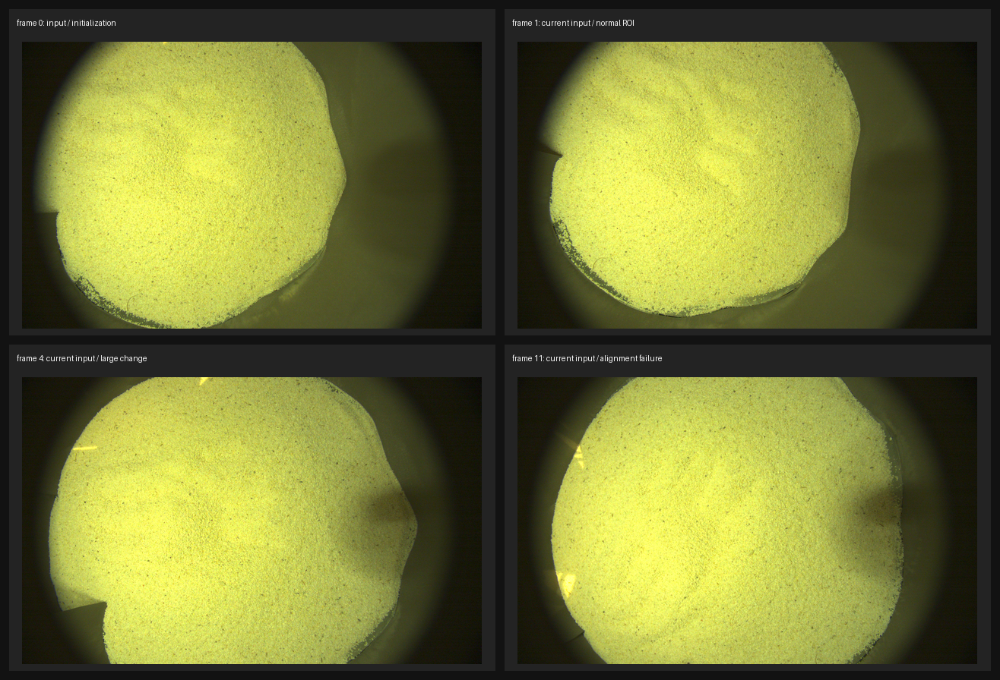
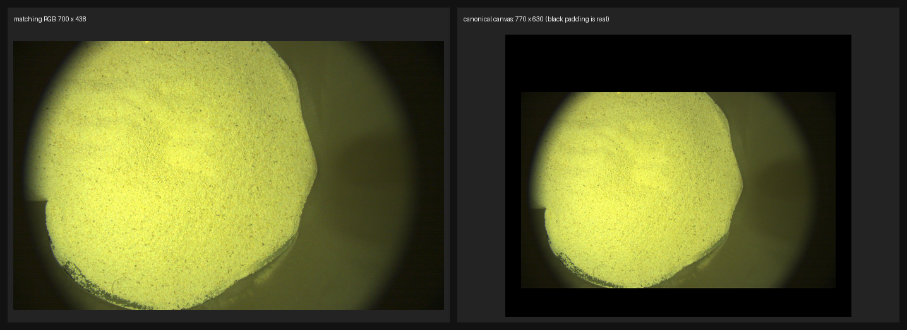
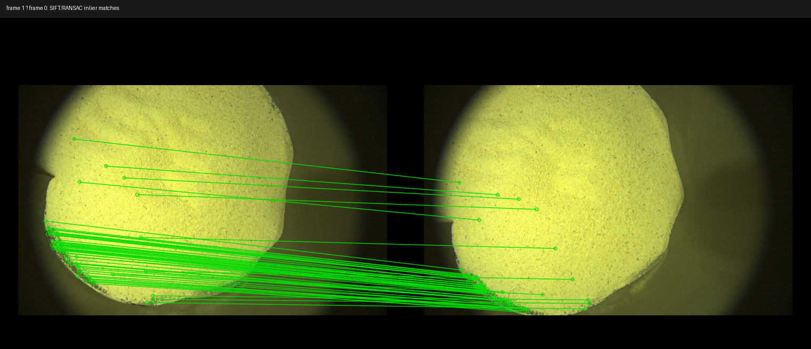
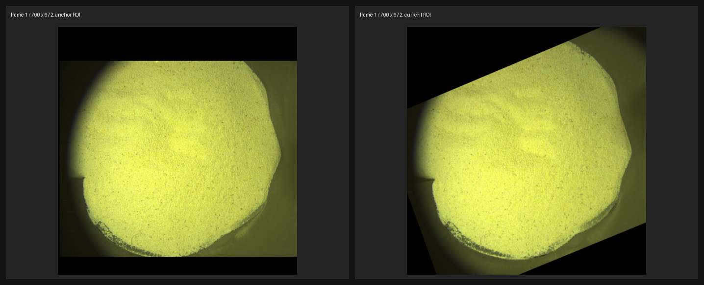
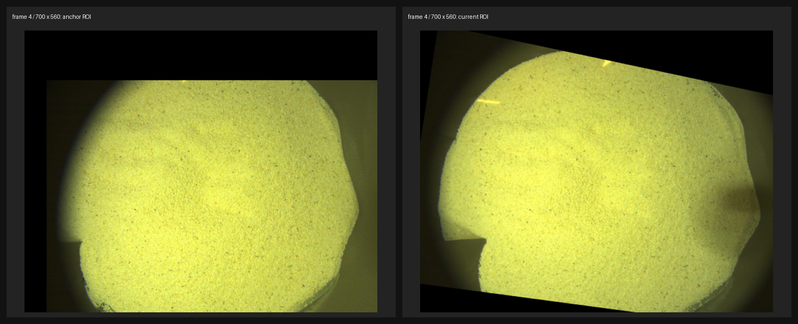
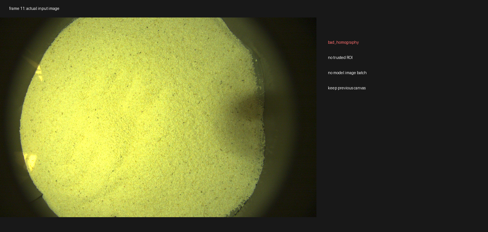

# OmniVGGT Project Context

Last updated: 2026-06-15

## First-read rule

Read this file before inspecting the full repository. It records the stable project map, environment notes, and low-VRAM inference decisions so future edits do not need a full rescan.

## Project shape

- `inference.py`: CLI demo/inference entry. Loads `OmniVGGT`, reads image/camera/depth folders via `visual_util.py`, runs `model.inference`, converts pose encodings, optionally exports GLB, then starts a `viser` viewer.
- `visual_util.py`: image/camera/depth loading, resize/crop logic, sky/background masks, GLB conversion helpers.
- `omnivggt/models/omnivggt.py`: top-level model. Contains `ZeroAggregator`, `CameraHead`, `DPTHead` for depth and point prediction.
- `omnivggt/models/aggregator.py`: base alternating-attention transformer and DINOv2 patch embedding construction.
- `omnivggt/models/omnivggt_aggregator.py`: OmniVGGT aggregator with camera/depth auxiliary-token injection and inference path.
- `omnivggt/heads/`: camera and dense DPT heads.
- `omnivggt/layers/`: ViT, attention, MLP, RoPE, patch embedding layers.
- `configs/`: training/test configs. Not required for CLI inference.
- `checkpoints/`: local model files. `OmniVGGT.safetensors` is present.
- `example/`: sample image/camera/depth folders.
- `reconstruct_sand_pointcloud.py`: data2-oriented no-ghost point-cloud CLI. It selects 2-3 keyframes from a rotating aperture sequence, estimates homographies, runs OmniVGGT only on selected frames, warps each depth map into a canonical anchor canvas, locks secondary frames to the anchor depth reference, soft-blends all frames into one height field, then outputs plane-residual Z so the near-planar sand surface stays continuous. It has support regularization, internal-hole filling, post-trim hole filling, two-frame support filtering, and boundary trimming for thin continuous surfaces. It also has optional training-free detail modes: `parallax_flow` from multi-view residual flow, and photometric luminance relief for visualization only.

## Current local environment findings

- GPU: `NVIDIA GeForce RTX 5060 Laptop GPU`, total 8151 MiB, compute capability 12.0.
- At inspection time, available VRAM was about 6264 MiB because other processes were using about 1636 MiB.
- `C:\Users\30738\anaconda3\envs\omnivggt` now has `torch 2.7.0+cu128`; CUDA is available.
- `C:\Users\30738\anaconda3\envs\vggt` has `torch 2.7.0+cu128`, CUDA available, and the runtime packages needed by this repo.
- `C:\Users\30738\miniconda3\envs\cu128` has CUDA PyTorch but is missing several OmniVGGT dependencies.
- Weight file: `checkpoints/OmniVGGT.safetensors`, 1505 tensors, 1,217,494,552 parameters, all `torch.float32`; raw FP32 parameter storage is about 4.54 GiB.

## Inference memory risks

- Loading FP32 weights on an 8GB GPU leaves too little room for activations; BF16 is the working path.
- BF16/FP16 model weights reduce raw parameter memory to about 2.27 GiB. RTX 5060 reports BF16 support.
- FP8 is not a practical quick fix in this PyTorch model: float8 dtypes exist, but Linear/Conv/LayerNorm/SDPA/DPT coverage and calibration are not drop-in. Prefer BF16 first.
- `inference.py` now defaults to CUDA + BF16 and loads at most 3 sorted images via `--max_images 3`.
- The dense point head is optional for visualization because depth + camera can be unprojected into points. Disabling `point_head` can save parameters and compute, but the 3-image 518px smoke test also passes with the point head enabled.
- `OmniVGGT.forward/inference` now preserves the caller's autocast state for heads. This avoids the BF16/FP32 LayerNorm dtype mismatch caused by forcing autocast off.
- Aggregator inference originally stores all 24 layer intermediates in `aggregated_tokens_list`, while the DPT heads only use layers `[4, 11, 17, 23]` and the camera head uses the final layer. Keeping only those inference intermediates can reduce activation retention.

## Recommended 8GB GPU path

1. Use `C:\Users\30738\anaconda3\envs\omnivggt\python.exe`.
2. Run inference with BF16, which is now the `inference.py` default.
3. Keep `--max_images` in the 1-3 range. The script now rejects values above 3 for this 8GB setup.
4. `--target_size 518` is feasible for 3 images in the included smoke test. Drop to `336` only if other desktop processes consume much more VRAM.
5. Use `--no_visualize` for memory smoke tests; visualization converts outputs to CPU/NumPy and starts a server.
6. Avoid FP8 unless doing a separate quantization/export path with calibration.

## Verified smoke tests

- 1 image, `target_size=336`, BF16, point head disabled: passed; peak allocated VRAM about 2512 MiB.
- 3 images, `target_size=336`, BF16, point head disabled: passed; peak allocated VRAM about 2691 MiB.
- 3 images, `target_size=518`, BF16, point head disabled: passed; peak allocated VRAM about 3240 MiB.
- 3 images, `target_size=518`, BF16, full model with point head enabled: passed; peak allocated VRAM about 3307 MiB.

## Useful commands

CUDA smoke test:

```powershell
& 'C:\Users\30738\anaconda3\envs\omnivggt\python.exe' 'C:\Users\30738\Desktop\project\3dre\VGGT\OmniVGGT\inference.py' `
  --image_folder 'C:\Users\30738\Desktop\project\3dre\VGGT\OmniVGGT\example\meetingroom\images' `
  --max_images 3 --no_visualize
```

Interactive viewer:

```powershell
& 'C:\Users\30738\anaconda3\envs\omnivggt\python.exe' 'C:\Users\30738\Desktop\project\3dre\VGGT\OmniVGGT\inference.py' `
  --image_folder '<your-image-folder>' --max_images 3
```

data2 no-ghost point-cloud reconstruction:

```powershell
& 'C:\Users\30738\anaconda3\envs\omnivggt\python.exe' 'C:\Users\30738\Desktop\project\3dre\VGGT\OmniVGGT\reconstruct_sand_pointcloud.py' `
  --image_folder 'C:\Users\30738\Desktop\project\3dre\VGGT\OmniVGGT\data2' `
  --output_dir 'C:\Users\30738\Desktop\project\3dre\VGGT\OmniVGGT\outputs\data2_pointcloud' `
  --num_keyframes 3 --mode balanced
```

Verified output for the default data2 command:

- Selected keyframes: `Image_20260423192541434.jpg`, `Image_20260423192801758.jpg`, `Image_20260423192929499.jpg`.
- Outputs: `pointcloud.ply`, `scene.glb`, `keyframes.json`, `alignment_report.json`, `alignment_preview.jpg`.
- Current default point count: 84,026.
- Peak allocated VRAM: about 3397 MiB.
- Vertical ghosting fix: default `--depth_align affine` estimates per-keyframe `z_aligned = scale * z + offset` from overlapping canonical cells before fusion. For the verified run, overlap cells were about 61.7k per non-reference frame, and median absolute depth residual dropped from about 0.022/0.027 to about 0.0067/0.0052. Normalized point-cloud Z range narrowed from about `[-0.096, 0.147]` to `[-0.018, 0.040]`.
- Current seam/ghost/bending fix after visual inspection: default `--fusion_mode soft_blend --surface_model plane_residual` no longer discards secondary frames and no longer trusts a multi-frame 3D pose fusion. It uses one selected anchor image as the canonical 2D coordinate system, keeps `--update_reference_depth` off by default so secondary frames cannot bend the anchor surface, and emits only one point per canonical XY cell.
- The default output Z is now a robust fitted-plane residual with `--plane_residual_mad_multiplier 3.0`, which clamps high residual edge artifacts while preserving continuous near-planar relief. Use `--surface_model depth` only for diagnosis; it can reintroduce apparent global bending.
- Latest verified run selected `Image_20260423192929499.jpg`, `Image_20260423192541434.jpg`, `Image_20260423192801758.jpg`; anchor original index was `7`; output point count was 94,171; duplicate canonical XY points after rounding were 0; effective fusion weight fractions were about 40.4%, 27.5%, and 32.1%, so the result is not a single-frame fallback.
- For the same run, secondary-frame local median absolute depth residuals dropped from about 0.0317 to 0.00435 and from about 0.0126 to 0.00238 before fusion. Robust plane residual MAD was about 0.00438, residual-clipped fraction about 5.8%, and normalized output Z percentiles were approximately `[-0.02497, -0.01615, -0.01100, 0.0, 0.02497, 0.02497, 0.02497]` at `[0,1,5,50,95,99,100]`. Peak allocated VRAM remained about 3397 MiB.
- Optional anchor override: pass `--anchor_index 0` to force the first file in sorted order as the anchor. Default `-1` auto-selects the best-connected anchor, which is usually safer for low-texture sand.
- Depth-detail note: BF16/FP32 precision is not the main limiter for sand-grain detail. `fp32 + target_size=700` ran successfully but peak allocated VRAM rose to about 6601 MiB and free VRAM reported 0 MiB; its plane residual MAD was only slightly lower than BF16. Use FP32 only when memory is available and numerical comparison is needed.
- Accuracy-first output with `--anchor_index 3 --target_size 700 --depth_detail_source none` is at `outputs/data2_pointcloud_anchor3_bf16_700_accurate` and `outputs/data2_pointcloud_anchor3_fp32_700_accurate`. BF16 700 accurate used three images with effective weights about 42.2%, 28.6%, 29.1%, filled 275 internal hole cells, removed 52,356 boundary cells, and output 515,634 points. This is the safer geometry output.
- Training-free geometric detail output is `outputs/data2_pointcloud_anchor3_bf16_700_parallax`, generated with `--depth_detail_source parallax_flow --depth_detail_strength 0.006 --depth_detail_sigma 7 --parallax_flow_scale 0.5`. It uses residual optical flow after homography alignment, not luminance height. It still used three images with the same weights as the accurate output and added normalized Z detail of about `[-0.0028, 0.0028]` P01-P99. This is relative micro-relief; scale/sign are not physically calibrated.
- Photometric outputs such as `outputs/data2_pointcloud_anchor3_bf16_700_detail` are not recommended for accuracy. They can make image texture visible in Z but can create a thick-looking layer and edge relief because luminance is not guaranteed to equal depth.
- BF16 `target_size=1008` ran at `outputs/data2_pointcloud_anchor3_bf16_1008_accurate` with peak allocated VRAM about 6369 MiB and free VRAM reported 0 MiB. It is a useful high-resolution diagnostic but still did not recover strong sand-grain depth detail directly from OmniVGGT.
- Latest hole/edge fix: keyframe selection is now scored by coverage, compactness, and hole penalties instead of greedy area alone. With `--anchor_index 3`, it selects `Image_20260423192657308.jpg`, `Image_20260423192801758.jpg`, and `Image_20260423192942731.jpg` instead of the earlier `...92517173.jpg` third frame. Z outlier handling in soft blending now clips height instead of deleting points, preventing artificial holes.
- Current recommended accurate output is `outputs/data2_pointcloud_anchor3_bf16_700_v5_support2`, generated with `--anchor_index 3 --target_size 700 --depth_detail_source none --min_support_frames 2 --support_close 81 --boundary_trim 36`. It outputs 440,911 points, has no detected internal holes, uses three images with effective weights about 45.7%, 31.8%, 22.5%, adds 20,098 support-regularized cells, and removes 95,798 unreliable boundary cells. This is the best current geometry-first output.
- Current optional geometric-detail output is `outputs/data2_pointcloud_anchor3_bf16_700_v5_parallax`, generated with the same support settings plus `--depth_detail_source parallax_flow --depth_detail_strength 0.006 --depth_detail_sigma 7 --parallax_flow_scale 0.5`. It keeps 440,911 points and adds residual-flow detail of about `[-0.00283, 0.00283]` normalized Z P01-P99.
---

## 实现级方法补充：张量、置信度与几何处理

以下内容只定义方法的输入、输出、公式、阈值、失败条件和状态更新顺序，不依赖具体文件名。除非特别注明，所有空间数组的坐标顺序都是 `y, x`，所有三维点都是 `x, y, z`。

### 1. 输入契约与数值域

1. RGB 图像最终统一为 `H×W×3`、RGB 顺序、`float32`、范围 `[0,1]`；送入模型时转成 `B×S×3×H×W`，其中当前在线推理固定 `B=1`，`S` 是窗口帧数。通用窗口分支只做范围转换和 HWC→CHW，ImageNet 均值/方差在模型的图像编码器内部完成，不应在外部重复归一化。
2. 深度辅助输入为 `B×S×H×W×1`，掩码为 `B×S×H×W`。没有深度输入时两者分别填零；有深度输入时 `depth > 1e-6` 才作为有效掩码。深度重采样使用最近邻，避免双线性插值制造新的有效深度边缘。
3. 外参契约是世界坐标到相机坐标的 `3×4` 矩阵。若输入是相机到世界的 `3×4/4×4` 矩阵，先补成 `4×4`、求逆，再取左上 `3×4`。缺失外参使用 `[I|0]`。通用窗口分支的缺失内参使用
   `K=[[f,0,w/2],[0,f,h/2],[0,0,1]]`，其中 `f=max(w,h)`；锚定画布观察器按照固定导出契约传入单位内参。
4. `camera_gt_index` 和 `depth_gt_index` 是导出/推理时的索引列表，不是运行时的置信度或有效掩码。在线无辅助几何的路径传空列表，模型会使用零占位 token；如果导出时固定了非空索引，运行时虽然仍传五个输入张量，但只有这些固定索引对应的输入会被模型使用。
5. 模型输出在进入外部 CPU 状态、C++ patch 或 NumPy 地图前统一转换为 `float32`；模型 forward 内部仍可保持 BF16/FP16。画布深度、置信度、累积权重、标定残差和三维地图状态也保持 `float32`；RGB 可在显示/导出副本中转成 `uint8`，不能把用于深度校准的状态提前量化。

### 2. OmniVGGT 的 token、head 和输出含义

1. 默认输入尺寸为 `518×518`，patch size 为 `14`。给定输入 `H×W` 时，patch 数为
   `P=(H/14)×(W/14)`；每帧 token 序列包含 1 个 camera token、4 个 register token 和 `P` 个 patch token，因此 patch token 起点是索引 `5`。
2. 聚合器为 24 层、16 个 attention heads、`embed_dim=1024`、`mlp_ratio=4` 的交替帧内/跨帧注意力结构。帧内注意力先对每个帧独立处理 `[B×S,P,C]`；全局注意力再处理 `[B,S×P,C]`。每一对帧内/全局操作的中间结果拼成 `[B,S,P,2C]`，供几何 head 使用。
3. 每帧的 camera token 在四次迭代中更新 9 维 pose 编码：平移 3 维、四元数 4 维、水平/垂直视场角 2 维。每次迭代用前一次 pose 产生 shift、scale、gate，经过自适应 LayerNorm、4 个 trunk block 和一个隐藏维度为 `C/2` 的 MLP 预测增量；平移和四元数增量为线性输出，视场角经过 ReLU。最终输出的 pose 编码不是直接的 `4×4` 矩阵，只有在下游需要相机时才解码。
4. 深度 head 的 DPT 输入维度为 `2048`，输出 2 个通道；点 head 同样输入 `2048`，输出 4 个通道。两者都读取聚合器第 `4、11、17、23` 层的中间结果，分别经过 LayerNorm、`1×1` 投影到 `256/512/1024/1024` 通道、不同倍率的上采样/下采样、4 个融合块和最终卷积，再恢复到输入分辨率。
5. 对每个 head，最后一个通道是置信度 raw logit，其余通道是几何 raw 值。当前深度和点 head 的激活分别为：

   - 深度：`d=exp(r_d)`，因此有效深度应满足有限且 `d>0`。
   - 世界点：`p=sign(r_p)×(exp(|r_p|)-1)`，输出 `x,y,z`，不是简单的单位深度图。
   - 置信度：`c=1+exp(r_c)`，其中 `r_c` 是 raw logit。

   因而当前 `c` 不是 `[0,1]` 概率，理论下界是 `1`，也没有上界。它只能被解释为模型在同一批次/同一 head 内的相对质量分数。不能直接把它当作 softmax 概率、不能用 `1-c` 当作概率缺陷度，也不能跨模型版本比较绝对数值。

6. 置信度的实际使用分三层：

   - 候选有效性：要求 `finite(depth) && depth>0 && finite(conf)`，并且像素落在几何有效域内。
   - 质量门限：后续帧候选数不少于 256 时，用候选置信度的第 20 百分位与 `min_conf` 取最大值：
     `Tq=max(0.1, percentile({c_i},20))`。`c_i>=Tq` 只用于深度标定的高质量重叠样本；写回模型几何时使用更宽松的 `c_i>=0.1`，避免新暴露区域因统计门限过高而全部消失。候选数不足 256 时 `Tq=0.1`。
   - 融合权重：`w_obs=clip(c,1e-4,w_max)`，默认 `w_max=32`。置信度越高，观测对同一地图元素的更新权重越大；它不表示该点的米制误差或概率置信区间。

   首帧不做第 20 百分位筛选，只要候选几何有限就初始化画布；独立点云导出器的 `conf_percentile` 是导出剔除阈值，与在线融合的 `Tq` 是两个不同参数。

### 3. 形状 bucket、缩放和模型输入

1. 通用窗口分支先将图像宽度缩放到 `target_width`，缩放比例为 `s=target_width/src_width`；高度取 `round(src_height×s/14)×14`，再在高度超过 `target_size` 时做中心裁剪。RGB 用双线性，深度用最近邻，内参的第一行乘 `s`、第二行乘 `s` 后再减去裁剪掉的顶部像素。
2. 锚定画布分支使用两套尺寸：匹配/画布基准宽度 `max(700,target_width)`，模型 ROI 最大尺寸由 `target_width/target_size` 给出，并向下取整到 14 的倍数。后续 ROI 以变化区域 bbox 为中心向四周扩展 32 像素；令原 ROI 为 `crop_w×crop_h`、最大模型尺寸为 `max_w×max_h`，则
   `s=min(max_w/crop_w,max_h/crop_h)`，目标尺寸分别为
   `floor(crop_w×s/14)×14` 和 `floor(crop_h×s/14)×14`，至少为一个 patch。
3. 这种 ROI bucket 不把一个小变化强行放大到完整画布，模型 token 数随变化区域缩小；ROI 外的上下文只用于对齐、颜色桥接和深度连续性，不应作为几何写回域。
4. 首帧使用完整匹配画布；后续帧可以使用双帧 `[anchor,current]` 模型，也可以使用固定单帧模型后在外部完成对齐。两帧模型输出中的 `frame index=1` 才是当前帧写回候选，anchor 帧只用来提供重叠几何约束。
5. 模型批次中的未知输入固定为零：深度为全零、mask 为全零；相机占位使用单位外参/内参。模型内部再进行 RGB 的 ImageNet 归一化。外部不能同时做 ImageNet 归一化和 `[0,1]` 归一化，否则会改变训练分布。

### 4. 通用窗口分支的逐帧决策

1. 每帧先执行可选的旋转对齐，再执行可选的高度对齐。外部对齐器返回 `4×4` 世界变换和质量分数；变换左乘相机到世界位姿，最终质量取旋转和高度质量的最小值。失败时使用单位变换、质量置零并 fail-open；质量低于 `0.2` 或 overlap 低于 `0.1` 时记录新 segment/恢复状态，不清空已有地图。
2. 若相邻时间戳间隔大于 `1s`，进入 dropped-frame 保护：记录丢帧、下一次禁用短期光流，不把不连续帧的运动误判为场景变化。
3. 变化检测先把当前图像与参考图像调整到同一 `H×W`。第一帧无参考时直接令 `mask=全1`、`changed_ratio=1`。
4. 图像残差为三通道平均绝对差：
   `e_img(y,x)=mean_c |I_t(y,x,c)-I_ref(y,x,c)|`。
   若同时存在当前/重投影深度，则仅在两者都大于 `1e-6` 的像素计算
   `e_depth=|d_t-d_ref|/max(|d_ref|,1e-6)`，否则该项为零。
5. 光流项使用 Farneback 稠密光流或 LK 稀疏光流。Farneback 取每像素二维位移的 L2 范数；LK 模式把有效跟踪点的平均位移填满整幅图。光流阈值默认 `2px`。
6. 若传入 `[0,1]` 置信度图，置信度惩罚为 `e_conf=clip(1-conf,0,1)`；总分为
   `score=λ_img e_img + λ_depth e_depth + λ_flow(flow_mag/2) + λ_conf e_conf`，默认权重为 `1、1、0.25、0.25`。
7. 改变 mask 使用硬阈值并集，而不是总分阈值：
   `e_img>12/255 || e_depth>0.03 || flow_mag>2 || conf<0.2`，之后使用方形 3×3 膨胀。变化像素按 16×16 网格投影为 block hint，供局部窗口选取。
8. 通用分支的 `conf_map` 约定是 `[0,1]`。如果直接把当前 head 的 `1+exp(raw)` 原始置信度传入该通道，那么 `clip(1-conf,0,1)` 恒为零，低置信度硬阈值也不会触发；因此该分支若启用置信度变化项，必须先做显式归一化或改用百分位排名。锚定画布分支不使用这个 `[0,1]` 假设，而是直接使用相对 percentile gate。
9. 当变化率达到 `0.35` 时触发 full refresh/scene jump；策略模式为 full rebuild 时无条件把 mask 设为全 1。变化率小于等于 `0.001` 且已有历史时跳过模型，只更新轻量状态和统计。

### 5. 通用窗口选择与增量地图

1. 允许的窗口帧数为 `3、4、6、8`。无大变化时目标长度为 4，中等变化大于 `0.02` 时为 6，full refresh 时为 8，最终向上选择最近的合法 bucket。
2. 候选集合是去重后的 keyframe 与短历史，当前帧始终加入。候选分数为
   `score=exp(-age/4)+overlap_bonus×overlap+camera_bonus×has_camera+0.4×has_depth+2×is_anchor+0.5×mean_conf`，默认 `overlap_bonus=1`、`camera_bonus=1`。`overlap` 是候选帧 block-key 与变化 block hint 的交集除以变化 block 数。
3. 若存在带相机的 anchor，优先放到窗口第 0 帧；其余按分数降序填充，避免重复后再用 anchor 补齐长度。模型输入的 camera/depth ground-truth 索引由选中帧中实际含有相机/深度的帧位置生成。
4. 当前帧在第 0 帧、被强制标记、变化率达到 `0.35`，或有外部几何且变化率达到 `0.02` 时晋升 keyframe；有预测和深度且变化率超过 `0.01` 时也可晋升。历史最多保留 `4×max_bucket` 帧，keyframe 最多 32 个。
5. 默认从 `world_points` 取 `S×H×W×3` 点；若不可用，使用深度的归一化针孔近似 `x=grid_x×d、y=grid_y×d、z=d`，其中 `grid_x/grid_y∈[-1,1]`。只保留当前帧且落在变化 mask 中的点，再施加 `conf>=0.1`。
6. 点用 `block_size=voxel_size×block_resolution=0.03×16=0.48` 做空间分块，block key 为 `floor(point/block_size)`。热区最多 512 个 block；按最近更新时间/平均置信度淘汰非 anchor block。启用 cold store 时，每个 block 使用固定槽位，最多保存 2048 点，每点 8 个 float32 槽：`xyz(3)+rgb(3)+weight+valid`，另有索引和 block metadata。
7. 热区 surfel 合并先将既有点按 `0.015m` 量化建索引；观测落入同一量化格时，若 `|z_new-z_old|>0.15m` 且允许遮挡替换，则直接替换旧点；否则使用
   `w_obs=conf×exp(-0.02×max(dt,0))`、`w_new=min(w_old+w_obs,32)`，对点和颜色做加权平均，法线以默认 `+Z` 加权后归一化。没有匹配格时追加 surfel。
8. 背景 TSDF 是轻量 voxel accumulator，不是完整有符号距离场：以 `0.03m` voxel 合并点、累加截断权重到 32，现实现始终以观测点中心为中心且初始 TSDF 为零。它与 surfel/metadata 同时更新，便于后续替换为真正 TSDF 而不改变上层接口。

### 6. 锚定画布分支：匹配、支持域和变化检测

1. 画布状态保存 `rgb/depth/conf/weight/valid/support`，另存 anchor RGB、相机/深度标定和版本号。初始匹配宽度为 `max(700,target_width)`；左右 padding 为 `max(32,round(0.05×width))`，上 padding 为 `max(128,round(0.18×width))`，下 padding 为 `max(64,round(0.09×width))`。padding 只扩大安全工作区，不代表真实几何。
2. 原图按匹配宽度保持长宽比缩放。用于 SIFT/ORB 的匹配图从 `[0,1]` 量化为 `uint8`，量化方式是直接取整；后续模型 ROI 的 float 输入不再经过这一轮 `uint8` 量化。画布初始 `valid=false`、`support=false`、深度/置信度/权重为零。
3. 前景支持域先转灰度，用 Otsu 得到阈值并与 `0.10` 取最大；灰度高于阈值为前景。若前景占比超过 `94%`，直接使用全图；否则做 3×3 开运算和 9×9 闭运算，再取 8 邻域连通域。最大连通域面积至少占图像 `8%` 时保留最大域，否则保留全部前景候选。它只描述“可能有真实内容”，不直接作为写回深度。
4. 首帧锚定变换为单位矩阵。后续帧优先使用 SIFT：最多 1500 个特征、BF matcher、ratio test `0.75`，两张图都少于 8 个关键点或 good matches 少于 8 时失败；使用 RANSAC 重投影阈值 `3px`，至少 8 个内点才接受，并记录内点中位重投影误差。SIFT 失败时改用 ORB 1500；仍失败则使用 phase correlation 平移。
5. phase correlation 输出平移响应；平移结果被限制在合理范围，并以 `1/response` 作为近似 median error。已有画布时若重叠有效像素至少 2048，先用差异不大的区域建立 bbox（差异阈值为 `max(0.08,median+3×1.4826×MAD)`），bbox 扩展 24 像素，至少 64 像素宽高且 mask 平均值至少 `0.08`，再用 Hanning window 做 phase correlation 微调；校正量限制在 ±8 像素，response 低于 `0.02` 不采用。
6. 变换矩阵统一表示当前图像到 anchor 画布：`p_anchor≈H p_current`。当前 RGB、depth、confidence、support 都通过逆映射 warp 到画布；任何越出图像或 padding 的位置都标记为 `valid_warp=false`。
7. 支持变化为
   `support_change=valid_warp & ~reference_support`。
   重叠区域为
   `overlap=valid_warp & reference_support & self.valid`。
   光度差为重叠区域内三通道 RGB 绝对差的平均值。用 overlap 中位数 `m` 和 `MAD` 得到
   `T_photo=clip(max(2×image_l1_thr,m+3×1.4826×MAD),0.08,0.22)`，默认 `image_l1_thr=12/255`；`diff>T_photo` 为光度变化，连通域小于 128 像素的光度变化删除。
8. 若光度变化占比超过 `0.35`，或光度变化占比超过 `0.15` 且支持变化占比小于 `0.05`，认为是曝光/全局外观改变，抑制光度 mask，只保留支持变化。最终
   `change=dilate(support_change|photometric_change,3)&valid_warp`。
   写回前再删除小于 256 像素的模型融合连通域，并排除 anchor ring。已有深度且 `changed_ratio<=0.001` 时直接跳过模型；但仍把当前观测支持域并入 `support`，防止相机运动后支持状态陈旧。

### 7. 锚定画布 ROI、候选和置信度 feather

1. 首帧把完整匹配画布缩放到模型尺寸；模型坐标通过尺度和 padding 仿射回画布。后续只截取 `change` bbox 加 32 像素上下文的 anchor/current 同域 ROI。
2. ROI 经过目标 bucket 缩放后，模型有效区域再收缩 8 像素 support border，避免卷积边缘和 letterbox/上下文边缘被写回。候选 mask 为
   `valid_warp & roi_valid & finite(depth) & depth>0 & finite(conf)`。
3. 后续帧候选数不少于 256 时按第 20 百分位求 `Tq`；`quality_valid=candidate_valid&(conf>=Tq)`，仅供标定；`model_valid=candidate_valid&(conf>=0.1)`，用于生成写回候选。这样新暴露区域即使整体置信度偏低仍可参与融合，但不能污染标定。
4. `model_valid` 内部做距离 feather。对二值 mask 做距离变换，取内部距离第 85 百分位 `p85`，尺度为 `max(1,0.35×p85)`，得到 `feather=clip(distance/scale,0,1)`。写回置信度为 `max(conf×feather,0.1)`；mask 外置信度为零。feather 只衰减边界，不改变模型 raw confidence 的排序。

### 8. 深度标定、残差和接缝连续性

1. 标定目标是把当前 warp 深度 `src` 变换到 anchor 画布深度 `dst`，使用一阶仿射
   `d_aligned=scale×src+bias`。
2. 样本优先取 anchor mask/ring 与 `valid_warp & self.valid` 的交集，并要求两侧深度有限、`warped_conf>0.1`。anchor ring 有效样本少于 128 时退回更宽的 `valid_warp` overlap；仍少于 128 时不标定，返回原始深度。
3. 先删除 `src` 的 2/98 百分位之外样本。设计矩阵为 `A=[src,1]`，权重为 `w=max(conf,1e-4)`，通过
   `argmin_{scale,bias} Σ w_i(A_iθ-dst_i)^2`
   求解；实现上对 `A` 和 `dst` 同时乘 `sqrt(w)` 后做最小二乘。最多 4 次迭代，每次计算残差 `r=dst-(scale×src+bias)`，保留 `|r|<=median(r)+3×1.4826×MAD(r)` 对应的鲁棒内点。scale 非有限时回退到 1，bias 回退到 `median(dst-src)`；最终 scale 限制 `[0.25,4]`，bias 限制 `[-10,10]`。
4. 为消除局部接缝，重叠样本至少 64 个时，对残差 `e=canvas_depth-d_aligned` 分别做两种估计：
   - 空间项：在归一化 `x,y` 上拟合 `[x,y,1]` 仿射残差，最多 5 次 MAD 内点迭代；
   - 传播项：从可靠 ring 样本向 ROI 内传播，使用最近距离和 `σ=24` 的高斯权重。

   修正为 `clip(0.78×e_spatial+0.22×e_propagated,-0.08,0.08)`，再加到仿射深度上。修正只用于小尺度接缝连续性，不得吸收大范围场景跳变。

5. 几何写回前再做 anchor 深度连续性约束。用旧画布深度的 `σ=6` 局部高斯归一化卷积形成连续参考面；在新旧边界 2.5 像素内收集新区域与旧区域的残差，以 `σ=2~4` 传播边界校正。若边界样本不足，退回二次曲面拟合。新区域沿同一表面的深度采用连续参考，旧区域重叠部分保留画布原深度，从而避免把同一平面写成两层平行面。

### 9. 颜色、深度和画布融合

1. 光度变化只发生在旧有效区域时，定义
   `photo_only_existing=photometric_change & ~support_change & self.valid`。
   模型几何更新域为
   `update_mask=model_valid & change & ~photo_only_existing & ~anchor_ring`。
   这会避免曝光变化把旧表面误写成新几何。
2. 支持变化周围使用半径 32 的椭圆膨胀生成颜色桥接域。桥接仅在旧画布有效、当前 warp 有效、非 anchor ring 且不属于 `update_mask` 时成立；令到非 anchor ring 的距离为 `q`，颜色混合比例为 `mix=clip(q/8,0,1)`。桥接只写 RGB，不写 depth/conf/weight，防止没有新几何证据时改变表面位置。
3. 当前 RGB 是局部观测的权威颜色，但颜色转移前先计算旧画布与当前 warp 的低频残差，使用 `σ=24` 的高斯平滑；每通道用残差中位数和 MAD 去除异常，修正截断在 ±0.05。支持重叠区的旧色/新色比例按距 ring 的距离决定并限制在 `0.65~0.95`，ring 本身不直接写入。
4. 几何观测只有同时满足 `update_mask`、深度有限、`depth>0`、置信度不少于 `0.1` 才进入 `_fuse`。对有效像素初始化/读取 `depth,conf,weight,valid,rgb`：
   `w_obs=clip(conf,1e-4,32)`；
   `weight_new=min(weight_old+w_obs,32)`；
   `depth_new=depth_observed`（当前策略是几何直接覆盖，而不是深度加权平均）；
   `conf_new=max(conf_old,conf_observed)`；
   `valid=true`。
   RGB 按上面的颜色域单独写入。因而 `weight` 记录累计观测强度，`conf` 记录当前已见质量上界，两者语义不同。
5. 每个提交都会记录变化比例、有效像素数、融合像素数、对齐内点、fallback、标定样本数、scale/bias、接缝修正幅度和各阶段耗时。只允许在几何写回域更新 `last_update_frame`；support-only 和 color-only 更新不能伪装成新的深度观测。

### 10. 导出、回放和不变量

1. 导出副本先用 11×11 close 填补最多约 5 像素的窄缝，再用最近有效深度填洞；不修改在线画布。密集区域用 5×5 中值滤波去除 ridge，若局部密度大于 `0.72` 且残差超过 `max(0.025,6×1.4826×MAD)` 则拒绝异常；再以 `σ=4` 高斯归一化卷积平滑，平滑结果与原深度按 `0.85/0.15` 混合。
2. 最后腐蚀 3~4 像素边缘，具体为 `max(3,min(4,round(0.006×min(H,W))))`；输出坐标归一化为
   `x=(col-W/2)/max(H,W)`、`y=-(row-H/2)/max(H,W)`、`z=depth`。平面残差拟合基底 `[1,x,y,x2,xy,y2]`，做 3 次 MAD 内点迭代，阈值为 `4×1.4826×MAD`，残差上限再取 `min(3×1.4826×MAD,0.03×median_abs_depth)`，最终以基准深度的中位绝对值归一化。
3. 增量地图只保存发生变化的字段和像素/slot：RGB、depth、conf、weight、valid、support 以及必要的 dirty tile；回放应用 delta，不重新运行模型。版本前进/回退都要求 `from_version/to_version` 连续，越界帧号被 clamp 到合法范围。
4. 所有并发实现都遵守：推理线程只能生成基于某个 `base_version` 的候选，唯一提交者先验证当前版本仍等于 `base_version`，再应用 patch 并递增版本；版本不符的候选必须丢弃或重新计算，不能合并到新状态。这样保证读者永远看到一个完整画布，而不会看到半个 patch。

## 轻量化与推理显存控制（实现级）

### 1. 显存主要消耗在哪里

设 `P=(H/14)(W/14)`，模型的 patch token 数量是 `P`，窗口有 `S` 帧。主干的显存来自参数、QKV/MLP 激活和跨帧 global attention；global attention 的 token 规模是 `S×P`，其注意力相关临时张量随 token 数近似二次增长。DPT head 还会同时保留 4 个中间层的多尺度特征。因此：

1. 把宽高同时缩小一半，patch token 约变为原来的四分之一，显存和计算通常下降幅度大于简单的像素比例。
2. 把窗口从 2 帧变成 1 帧，除了输入和 DPT 线性部分减少外，还会显著减少跨帧 global attention 的临时张量。
3. 仅减少输出 PLY 点数不会减少主干峰值显存；必须减少输入 token、主干激活、head 数量或计算精度。

### 2. 当前可直接使用的减显存操作

| 操作 | 具体实现 | 显存收益/代价 |
| --- | --- | --- |
| BF16/FP16 权重与激活 | CUDA 上将模型和 image/depth/mask 设为 BF16 或 FP16，并在 forward/head 范围打开 CUDA autocast | 参数从 FP32 约 4 bytes/参数降为 2 bytes/参数；部分激活和卷积临时张量也减半。BF16 动态范围更安全，FP16 通常更快但更易溢出 |
| `inference_mode` | 整个推理包在 `torch.inference_mode()` 内，而不是只使用 `no_grad()` | 移除 autograd graph、版本计数和 view tracking，降低临时对象与峰值；不改变结果定义 |
| 只保留深度输出 | 使用 observer-depth-only 结构，只保留 camera head、depth head、depth confidence，删除 point head | 删除一个完整 DPT point head 的中间特征和输出，适合只维护 heightfield；不能再直接得到 world points |
| S1/S2 输入 | 首帧用单帧，后续最多 anchor+current 两帧；不把整个历史送入主干 | 降低 `S×P`，同时避免把历史缓存复制到 GPU |
| ROI/bucket | 只对变化 bbox+32px 上下文做推理，宽高向下取整到 14 的倍数 | 输入无变化区域时跳过模型；变化小则 token 显著减少，代价是需要外部对齐/标定/融合 |
| no-change skip | `changed_ratio<=0.001` 时只更新 support/状态，不做模型 forward | 该帧峰值显存和推理时间都接近零；阈值过低会降低跳过率 |
| C++ 结果及时落 CPU | 输出先转 CPU FP32，GPU tensor 生命周期结束后再进入地图/回放 | 避免 GPU 长期保存历史画布和 delta；CPU 内存增加，但更适合长会话 |
| pinned/non-blocking 传输 | CUDA 路径对 CPU staging tensor 使用 pinned memory，并以 `non_blocking` 复制到设备 | 可重叠部分拷贝和计算；不改变模型峰值，需避免无限积压 pinned buffer |

`min_conf=0.1`、置信度百分位或 PLY 剔除只改变保留点数量，不会降低主干 forward 的峰值；只有与 ROI、head 删除或跳帧一起使用才会产生显存收益。

### 3. 输出精度应该如何降低

1. 推荐组合是：模型参数/中间激活 BF16，输入 image/depth/mask BF16，camera/intrinsics/extrinsics FP32，depth/conf/pose 输出在 head 返回处显式 `.float()`，之后的深度仿射、MAD、Gaussian seam correction、画布状态和地图融合全部 FP32。
2. 不能把 depth 在 GPU 输出后立即转 FP16 再做 affine calibration：scale/bias 的 2/98 分位、MAD 和 ±0.08 seam clamp 都可能受到量化噪声影响，表现为台阶和双层面。
3. 置信度也不能转成 `uint8` 再参与 percentile；至少保留 FP32，或保留排序所需的高精度标量。RGB 只在显示和 PLY 颜色副本中转 `uint8`。
4. 当前结构不把 FP8/INT8/INT4 当作可直接替换的开关。原因是 24 层 transformer、LayerNorm、SDPA、DPT transpose convolution 和 confidence/depth activation 需要完整的 kernel 覆盖及校准；没有重新校准和端到端误差验证时，量化可能比 BF16 更省显存但破坏深度尺度。
5. 若只需要相对表面而不需要点云，可关闭 point head；若连视场角/anchor camera 都不需要，理论上可进一步关闭 camera head，但当前锚定画布的默认路径用 pose 的 FoV 生成/校验相机内参，因此不能在不改下游契约的情况下删除 camera head。

### 4. 结构级进一步优化及限制

1. DPT 默认 `frames_chunk_size=8`；当前在线 `S≤2` 时等于一次处理所有帧，没有额外收益。若以后窗口扩大到 4/6/8，可将其改为 1/2/4，在 head 阶段分块释放中间特征；这只降低 DPT 峰值，聚合器的全局 attention 仍按完整 `S` 运行。
2. 聚合器当前为 24 层都生成中间结果，head 实际只读取 `[4,11,17,23]`。可以在推理图中只保留这四层并保留最后一层的 camera token；这会减少中间层引用和 head 输入的 GPU 生命周期，但必须同时检查 camera head 的最后层依赖、TorchScript trace 和数值回归，不能只在 Python 侧删除列表元素。
3. `preload_patch_embed=false` 避免启动阶段额外预加载 patch embed 权重，主要减少启动时的重复权重驻留，不会显著减少 forward 激活峰值。
4. `torch.compile` 的 reduce-overhead 模式可能改善稳定形状的吞吐，但编译缓存和 graph workspace 可能增加显存；8GB 卡默认不应为了轻量化强制打开。若启用，应对每个 `(S,H,W,dtype)` bucket 单独预热并测量 peak memory。
5. checkpointing 只在训练分支生效，推理时不能依赖它降低显存；如果对 eval graph 强行启用，需要重新确认 autograd、TorchScript 和输出一致性。
6. 推理历史应保存为 CPU 的稀疏 delta，而不是保存每帧完整 `H×W` canvas。回放通过 snapshot+delta 重建；快照间隔默认 60 个提交版本。这样显存不随流长度增长，磁盘/CPU 内存才是主要增长项。

### 5. C++ 侧的显存控制

1. 固定 shape 的 TorchScript 运行时只加载与当前 `S,H,W` 相符的图。动态 pair bucket 模式按精确 ROI 尺寸按需加载，替换旧 pair module，避免把所有大尺寸 pair 图同时驻留造成数 GB 的重复参数。
2. letterbox 模式只加载一个固定 pair 图：先保持 ROI 长宽比缩放，再用边缘复制填充到固定尺寸；填充区域不进入支持域，模型结果映射回画布时扣除 `pad_x/pad_y`。它减少 artifact 数量，但会对小 ROI 计算更多 padding 像素。
3. 运行时以 BF16/FP16 autocast 执行模型，输出立即转 CPU FP32；不要把整幅 canonical canvas、历史 delta 或 viewer buffer 保存在 CUDA tensor 中。
4. 使用简单 executor、固定输入尺寸和一次性 warmup，避免 profiling executor 在首次 CUDA 调用时建立大规模 profile workspace。导出图保留 traced submodule 边界时更容易避免 LibTorch 对完全内联 transformer 选择极慢的 CUDA 路径；是否 freeze/optimize 必须以实际首帧和稳态 peak memory 测试为准。

### 6. 已测量的显存量级

当前 8GB RTX 5060 Laptop GPU 上，几何优先的 BF16、`target_size=700` 测试峰值约 4269 MiB；同尺寸 FP32 峰值约 6601 MiB，推理后系统报告可用显存接近 0 MiB，而几何残差改善很小。BF16、`target_size=1008` 的高分辨率诊断峰值约 6369 MiB，同样不适合作为默认。上述数值包含当前进程/allocator 状态，不能当作所有 GPU 的硬上限；验收应同时记录设备、其他进程占用、输入帧数、point head 是否开启和模型 warmup 状态。

## C++ 部署与运行时契约（实现级）

### 1. 部署边界

C++ 端不重新实现 transformer，也不读取 safetensors；模型在 Python 侧被导出为固定签名 TorchScript，C++ 负责图像/ROI 前处理、LibTorch 调用、输出校验、2D 对齐、变化检测、深度标定、融合、历史存储和 TCP 发布。模型之外的这些模块不是 TorchScript 的一部分，必须由 C++ 运行时显式执行。

当前验证组合为：Windows GPU、MSVC 14.29/C++17、LibTorch 2.7.0+CUDA 12.8、CUDA 12.8、OpenCV 4.10.0；设备要求是可用 CUDA GPU。当前路径不编译自定义 CUDA kernel，只链接 LibTorch 的 `torch/torch_cpu/torch_cuda/c10/c10_cuda/caffe2_nvrtc` 导入库并在运行时调用 GPU。

### 2. TorchScript 固定接口

1. 导出输入固定为五个 tensor：

   - `images`: `[1,S,3,H,W]`，RGB、`[0,1]`；
   - `extrinsics`: `[1,S,3,4]`，FP32；
   - `intrinsics`: `[1,S,3,3]`，FP32；
   - `depth`: `[1,S,H,W,1]`，模型 dtype；
   - `mask`: `[1,S,H,W]`，模型 dtype。

   `H`、`W` 必须是 14 的倍数，`S` 必须与导出时完全相同。运行时不能把 S2 图当 S1 图加载，也不能传不同 H/W 期待图自动 resize。

2. 完整点云图输出五项：`pose_enc [1,S,9]`、`depth [1,S,H,W,1]`、`depth_conf [1,S,H,W]`、`world_points [1,S,H,W,3]`、`world_points_conf [1,S,H,W]`。观察器深度图只输出前三项，以删除 point head 并降低显存。
3. 导出 wrapper 在聚合器 inference 后调用 camera/depth（以及可选 point）head；head 位于与 Python 相同的 CUDA autocast 范围内；所有输出 `.float()` 后返回。导出示例使用 `torch.inference_mode()`、`torch.jit.trace(...,strict=False,check_trace=False)`，因为该模型含有固定索引和动态分支，严格 trace 检查会把不影响运行的结构差异当成失败。
4. 导出校准输入必须是单位外参和单位内参，而不是全零相机 tensor；否则 trace 可能把错误的 camera branch 固定到图中。未知 depth/mask 仍为全零。
5. `camera_indices/depth_indices` 在导出时排序、去重并检查范围；运行时传入的五个输入不会改变这些 baked-in 索引。若边缘端要使用新的辅助相机/深度帧，必须重新导出。
6. 追求轻量时使用 BF16/FP16 模型与 autocast；若使用 FP32 graph+BF16 autocast，应让 Python 导出端、C++ autocast 和输出 float contract 完全一致。CPU tracing 只能使用 FP32；当前 C++ 部署不把 CUDA 失败静默切换到 CPU。

### 3. C++ 前处理与输出检查

1. 读取图像后统一成 RGB；首帧匹配路径按目标宽度保持长宽比，高度取最近整数。为复刻匹配逻辑，`[0,1]` RGB 在 SIFT/ORB 前按直接取整转 `uint8`；后续 ROI 模型输入保留 float，避免二次量化。
2. 首帧模型输入是完整画布的固定尺寸；当前帧 ROI 通过变化 bbox+32px context 生成。精确 bucket 模式将 ROI 缩放到最近的 14 倍数，pair artifact 必须与此精确尺寸一致；letterbox 模式将 ROI 等比例缩放后做边缘复制填充，填充区域从 `roi_valid` 中排除。
3. 调用前创建 identity extrinsics/intrinsics、zero depth/mask，并将 image/depth/mask 以选定 dtype 放到 CUDA；相机张量保持 FP32。CUDA staging buffer 可 pinned，复制使用 non-blocking，但必须等待当前 candidate 结束后释放或复用。
4. C++ 运行时对 tuple 做强校验：至少存在 pose/depth/depth_conf；depth 必须是 5 维且最后一维为 1，confidence 必须是 4 维；S、H、W 和输出帧索引必须与请求匹配，所有输出先转 CPU FP32。depth/conf 中非有限、负深度和越界帧直接标记 invalid，不进入融合。
5. pose 的第 7/8 维解码视场角；若值非有限或不在约 `0.01~3.1` 弧度范围，使用 `1.2` 的保守 fallback，并记录诊断。世界点不可用时可按归一化网格回退 depth backprojection，但必须明确这不是模型的 world coordinate。

### 4. 固定模型、动态 pair 和 letterbox 的选择

| 模式 | 模型图 | 运行时行为 | 适用场景 |
| --- | --- | --- | --- |
| 单帧固定图 | `S=1,H,W` 固定 | 每帧单图推理，再由 C++ 做 homography/phase 对齐和外部融合 | 已验证、依赖少、显存最稳定 |
| 精确 pair bucket | 每个 ROI 尺寸一个 `S=2,H,W` 图 | 按当前 ROI 精确加载一个 pair 图，替换旧图；不拉伸 ROI | 变化区域差异大、希望保留双帧模型几何 |
| pair letterbox | 一个固定 `S=2,H,W` 图 | ROI 等比缩放+边缘复制 padding，扣除 padding 后投影 | artifact 少、部署简单，代价是 padding 计算和边缘有效域处理 |

观察器的 pair/ROI 模式会在模型输出后执行 8px support border、candidate finite/depth/conf 检查、20 百分位质量 gate 和 depth affine calibration，再进入画布融合；固定单帧边缘路径只用 `min_conf` 做在线写回门限，导出时的 `conf_percentile` 只用于最终 PLY 剔除。无论哪种模式，都不能把 letterbox padding 当作真实新表面。

固定单帧边缘路径的融合细节也不同：它把当前 warp 图像在 9×9 close 后用 17×17 band 膨胀形成模型输入区域；深度标定需要至少 128 个 `valid_warp & canvas_valid & conf>=min_conf` 样本，使用一次一阶 affine 拟合并限制 scale `[0.25,4]`、bias `[-10,10]`；在线 `model_valid` 只要求有限深度和 `conf>=min_conf`。通过 mask 的像素以 `w_obs=clip(conf,1e-4,32)` 与旧 depth、RGB 做加权平均，`weight` 截断到 32、`conf` 取最大值；这条路径不等价于观察器的“新几何直接覆盖旧 depth”策略。

### 5. Windows CUDA 加载与启动检查

1. 配置阶段只需要 C++17、LibTorch GPU 包、OpenCV C++ 配置目录和 CUDA runtime；因为没有自定义 `.cu` 文件，CMake 不应强制开启 CUDA language 编译。手动链接导入库可绕开当前 VS2019/CUDA 12.8 组合在 CMake CUDA compiler detection 上的失败。
2. 运行 `--device cuda` 时先显式加载 `c10_cuda.dll` 和 `torch_cuda.dll`，再检查 `torch::cuda::is_available()`。任一 DLL 缺失、驱动不兼容或 CUDA 不可用都必须硬失败，并输出依赖/设备诊断，不得偷偷跑 CPU 形成错误性能结论。
3. 启动时检查：LibTorch 版本与导出端一致、模型文件可读、模型 dtype 与 autocast 合法、输入尺寸为 14 倍数、pair 图覆盖当前模式、CUDA 可用。随后对单帧和实际会使用的 pair shape 做一次 warmup，并在 warmup 后同步 CUDA 再开始计时。
4. 导出端和运行端的 PyTorch/LibTorch 大版本必须对齐；当前验证是 PyTorch 2.7.0+cu128 导出、LibTorch 2.7.0+cu128 加载。仅把 Python 的 `.safetensors` 或不同大版本导出的 `.pt` 直接交给 C++，不能视为兼容。

### 6. C++ 流式状态机与并发

1. 目录输入先经过稳定性检查：连续两次扫描中文件大小和修改时间不变才入队。生产者为每帧分配单调 `frame_seq`；队列有界，离线回放容量可设 1024，实时模式队列满时合并中间帧但保留最新帧，并把被合并帧标记 `Coalesced`。
2. 每帧状态依次为 `Received→Aligning→DiffReady→Inferencing→Committed`；无变化走 `NoChange`，合并走 `Coalesced`，异常走 `Failed`。推理线程读取一个 authoritative state snapshot，生成 `CandidatePatch(base_version=当前版本)`，不得直接修改画布。
3. 唯一提交线程验证 `state.version==patch.base_version` 后才应用 patch，生成 `PointCloudDelta` 并把版本递增。delta 至少包含 frame seq、from/to version、changed ratio、valid count、scene jump、anchor 初始化/相机状态、slot changes、support changes 和 dirty tiles。版本不匹配的 patch 必须拒绝，避免慢推理覆盖较新的提交。
4. 服务端、推理线程、提交线程和 viewer 通过版本化 little-endian TCP 包解耦。viewer 的 live state 与 playback state 分开；实时包包含 hello/snapshot/frame status/delta/live head，历史请求返回 replay begin、snapshot、连续 delta、replay end。viewer 不参与推理，也不拥有权威画布。

### 7. 历史持久化与恢复

1. 每次运行建立独立历史目录，保存运行 metadata、frame index、delta 数据、delta index、定期 snapshot 和 metrics CSV。delta header 包含 magic、schema、frame、from/to version、changed count、payload size 和 CRC；当前 payload 为未压缩，compressed size 与 uncompressed size 相同。
2. 每 60 个 committed version 写一次 snapshot，并使用临时文件写完后原子 rename；delta append 和 index append 都必须在 header/payload 完整后执行。恢复时先读取不大于最新版本的 snapshot，再按版本顺序前向应用 delta；CRC、magic、schema、payload 长度或版本链不一致时拒绝恢复，不用损坏数据拼出“看似可用”的点云。
3. 回放目标帧通过最近 snapshot + forward deltas 构建，不重新调用模型；前进和后退都使用同一套 slot/state 反向应用规则。快速拖动时间轴时使用 generation 取消旧 seek，避免旧回放任务无限排队。

### 8. C++ 与 Python 的边界及验收

1. C++ 固定窗口程序只验证 TorchScript 推理和基础点云导出；C++ 流式观察器额外实现 anchor canvas、对齐、变化检测、深度标定、单层融合、版本化 delta 和 TCP 回放。Python 通用窗口分支的 active-window selector、keyframe、hybrid surfel/TSDF/cold-store 不是 TorchScript 自动携带的能力。
2. C++ 当前外部对齐路径没有 Python callable 插件 ABI；它只实现实际部署所需的 2D homography/phase、heightfield/depth continuity 和融合规则。需要新的旋转/高度对齐器时，应在 C++ 边界增加明确的数据契约，不要把任意 Python callback 假设为可部署能力。
3. 部署验收至少包括：实际 `device=cuda`；模型输入 shape 与 artifact 一致；首帧/稳态 peak VRAM；S1/S2 输出维度；非有限 depth/conf 过滤；homography inlier 与 fallback 统计；changed ratio/no-change skip；scale/bias 与 seam correction；delta 前进/回退、snapshot 恢复、CRC 校验；viewer 版本不一致时的 resync。
4. 最终性能指标应分开记录图像读取、匹配/对齐、变化检测、ROI 前处理、模型 forward、输出搬运、depth calibration、fusion、commit 和 TCP/viewer 时间。只报告总帧时间会把首次 TorchScript warmup、CUDA 同步或历史写盘抖动误认为模型推理速度。
---

## 数据契约补充：每一阶段实际保存的对象

上一节描述的是算法；本节补足实际对象的字段、形状、dtype、生命周期和“哪个计数对应哪个集合”。省略数组内容时只省略重复元素，不省略字段本身。

### 1. Python 输入对象

每一帧进入流式接口时是一个 `InputPacket`：

```text
InputPacket {
  frame_id:       int
  timestamp:      float
  rgb:            H×W×3, uint8 或 float32
  depth:          null 或 H×W / H×W×1, float32
  intrinsic:      null 或 3×3, float32
  extrinsic_c2w:  null 或 3×4/4×4, float32
  meta:           dict[str, Any]
}
```

`meta` 不参与模型几何计算，但会携带 source 标识、预处理信息、block keys、mean confidence、强制 anchor 等运行时标签。`timestamp` 只用于丢帧判断和 keyframe recency，不会被当作模型输入。

### 2. 模型 batch 对象

通用窗口和锚定画布虽然选帧策略不同，送进 backend 的 batch 都具有以下字段：

```text
Batch {
  images:          [1,S,3,Hm,Wm], float32(host) -> BF16/FP16(device)
  depth:           [1,S,Hm,Wm,1], float32(host) -> model dtype(device)
  mask:            [1,S,Hm,Wm],   float32(host) -> model dtype(device)
  intrinsics:      [1,S,3,3],     float32
  extrinsics:      [1,S,3,4],     float32
  camera_gt_index: list[int]
  depth_gt_index:  list[int]
}
```

锚定画布无辅助相机/深度时，`camera_gt_index=[]`、`depth_gt_index=[]`，`depth/mask` 全零，`intrinsics/extrinsics` 为单位占位；通用窗口若某帧有真实辅助输入，则只在对应 index 处保留其值。backend 将前四个图像/辅助大张量搬到 CUDA，但不会把 `selected_window` 的 Python 对象复制进模型。

### 3. 预测对象与像素筛选对象

完整模型输出的统一逻辑形状为：

```text
OmniPrediction {
  world_points:      [S,Hm,Wm,3] 或 [1,S,Hm,Wm,3]
  world_points_conf:[S,Hm,Wm]   或 [1,S,Hm,Wm]
  depth:             null 或 [S,Hm,Wm,1]
  depth_conf:       null 或 [S,Hm,Wm]
  pose_enc:          null 或 [S,9]
  extra:             dict
}
```

模型 wrapper 的 batch 维可能保留，也可能在 backend 标准化时 squeeze；进入画布前必须选定 frame index 并压成 `Hm×Wm` 的 `depth/conf`。锚定画布首帧取 index 0，双帧 ROI 后续帧取 index 1。候选像素依次经过：

```text
candidate_valid
 = valid_warp
 & warped_roi_valid
 & isfinite(depth)
 & (depth > 0)
 & isfinite(conf)
```

后续帧的 `quality_valid` 只用于标定，`model_valid` 才参与写回；因此 `quality_valid.sum()`、`model_valid.sum()`、`fused_pixels` 不能互换。

### 4. 锚定画布状态对象

Python 在线画布的真实数组是：

```text
CanvasState {
  rgb:     [Hc,Wc,3], float32, [0,1]
  depth:   [Hc,Wc],   float32
  conf:    [Hc,Wc],   float32
  weight:  [Hc,Wc],   float32
  valid:   [Hc,Wc],   bool
  support: [Hc,Wc],   bool
}
```

其中 `valid` 表示有可提交几何，`support` 表示当前/历史观测覆盖过该 canonical cell；support 可以为真而 valid 仍为假。`weight` 是累计观测强度，`conf` 是已见置信度上界，RGB 是独立的颜色写回结果。对一个 `y,x` cell，`slot=y×Wc+x` 只在 C++ 版本中显式使用；Python sparse delta 使用二维数组索引。

画布尺寸不是模型尺寸。以本次真实 1920×1200 输入、匹配宽度 700 为例：匹配图高度为 `round(1200×700/1920)=438`，左右 padding 为 35、上 padding 为 128、下 padding 为 64，所以 canonical canvas 为 `630×770`；首帧模型再将未 padding 的 `438×700` 图缩到 patch-compatible 的 `434×700`。左右 35 来自 `round(700×0.05)`，不是固定 32。

### 5. Python 稀疏回放对象

每个提交帧的回放记录为：

```text
ReplayFrame {
  frame_id:       int
  image_name:     string
  metrics:        dict[str, Any]
  pipeline_mask:  [Hc,Wc], bool
  delta:          null 或 CanvasDelta
}

CanvasDelta {
  frame_id:       int
  fields:         tuple[FieldDelta, ...]
  changed_mask:   [Hc,Wc], bool
}

FieldDelta {
  name:           rgb/depth/conf/weight/valid/support
  index:          null 或 int64[N]，按 row-major 展平的 cell index
  before/after:   null 或 [N,*trailing_shape]
  before_full:    null 或完整字段
  after_full:     null 或完整字段
  trailing_shape: ()、(3,) 等
}
```

首帧 `delta.fields=()`，但它把完整 `CanvasState` 保存为 initial state，并把 valid 区作为首帧显示 mask；不能把首帧误认为“没有 delta”。后续字段只要任意通道发生差异就产生该 cell 的 index，浮点 NaN 与 NaN 被视为相等；所有字段的 cell mask 做 OR 得到 `changed_mask`。因此：

```text
fused_pixels = 本帧实际写入新几何的像素数
delta_pixels  = 六个状态字段中任意字段发生变化的像素数
anchor_pixels = 仅用于标定的稳定 ring 像素数
```

颜色桥接或 support-only 更新可以增加 `delta_pixels`，却不增加 `fused_pixels`；回放必须同时保存它们的 before/after 才能精确前进和后退。

### 6. C++ 观察器对象

C++ 观察器把每个 canonical cell 序列化为 slot，而不是保存 Python 的 `weight`：

```text
CanvasState {
  width,height:       int
  depth:              float32[width×height]
  confidence:         float32[width×height]
  rgba:               uint32[width×height]       # r | g<<8 | b<<16 | a<<24
  last_update_frame:  uint32[width×height]
  valid:              uint8[width×height]
  support:            uint8[width×height]
  anchor_rgba:        uint32[width×height]
  anchor_camera:      fx,fy,cx,cy,depth_scale,depth_bias: float32
  version:            uint64
  last_frame:         uint64
  initialized:        bool
}

CandidatePatch {
  frame_seq,base_version: uint64
  width,height:            int
  changed_ratio:           float32
  scene_jump,initialize:   bool
  anchor_camera:           6×float32
  anchor_rgba:             uint32[width×height] 或空
  updates:                 {slot_id:uint32, after:SlotValue}[]
  observed_slots:          uint32[]
}

SlotValue {
  depth,confidence: float32
  rgba,last_update_frame: uint32
  valid:            uint8
}
```

`observed_slots` 只更新 support；`updates` 才更新 depth/conf/RGBA/valid。提交者先验证 `state.version==base_version`，然后生成 `PointCloudDelta`，其中每个 change 保存 slot 的 before/after。C++ TCP 包头固定 12 字节：little-endian `u32 magic=0x5047564f`（字节为 `4f 56 47 50`）、`u16 schema=1`、`u16 message_type`、`u32 payload_size`；payload 之后不能有未解析尾字节。

## 端到端真实数据样例（精简但字段完整）

### 1. 样例来源和运行覆盖项

下面样例直接取工作区已有的 12 帧 Python aligned-canvas CUDA 输出及其最终 PLY，不重新启动模型。原始 12 张图均为 `1920×1200`，本次运行的实际覆盖项是：

为避免把重复字段铺满全文，只展开四个能覆盖不同分支的 frame：`frame_id=0` 表示首帧初始化，`frame_id=1` 表示正常的 homography 对齐与增量融合，`frame_id=4` 表示变化较大的 ROI，`frame_id=11` 表示 `bad_homography` 后跳过模型的情况；其余 8 帧只在汇总统计和最终结果中体现。

```json
{
  "backend": "omnivggt-pytorch",
  "device": "cuda",
  "dtype": "bf16",
  "target_width": 700,
  "target_size": 700,
  "patch_multiple": 14,
  "warmup_buckets": [],
  "preload_patch_embed": false,
  "flow_mode": "none",
  "fuse_min_conf": 0.0,
  "camera_input": null,
  "depth_input": null
}
```

这里的 `fuse_min_conf=0.0` 是该次 CLI 为了保留边界几何而覆盖的值，不是配置类默认的 `0.1`。所以这个样例中的首帧和后续写回门限不能直接套用默认配置；后续仍会使用第 20 百分位作为标定质量门限。

### 2. 输入数据样式

第一帧的精简实际样本如下；数组主体用形状表示，像素值是该图真实读取值：

```json
{
  "frame_id": 0,
  "timestamp": 0.0,
  "rgb": {
    "shape": [1200, 1920, 3],
    "dtype": "uint8",
    "range": [0, 255],
    "mean_rgb": [130.612, 134.535, 57.498]
  },
  "depth": null,
  "intrinsic": null,
  "extrinsic_c2w": null,
  "meta": {"source": "image sequence", "has_camera": false, "has_depth": false}
}
```

RGB 像素进入模型前统一转换为 `[0,1] float32`；实际图像内容见后面的输入帧和流程图片。缺失的相机/深度不是删除字段，而是由后续 batch 显式补成固定形状的占位张量。

### 3. 第一帧的中间数据样式

第一帧的实际尺寸变化为：

```text
raw RGB                 [1200,1920,3] uint8
matching RGB            [438,700,3] float32, [0,1]
canonical canvas        [630,770,3] float32, [0,1]
first model RGB         [434,700,3] float32
images(host)            [1,1,3,434,700] float32
images(device)          [1,1,3,434,700] bfloat16
depth(host/device)      [1,1,434,700,1] float32 -> bfloat16
mask(host/device)       [1,1,434,700] float32 -> bfloat16
extrinsics/intrinsics   [1,1,3,4]/[1,1,3,3] float32
```

首帧用单位变换，不需要 homography。模型输出先按 `[1,S,Hm,Wm,*]` 解包，再取 frame 0，warp 回 `[630,770]` 画布。首帧在线状态的有效几何数为 `163010`，RGB/depth/conf/weight/valid/support 都以画布坐标保存；padding 像素存在于数组中，但不因“在数组内”而自动变成 valid。

首帧实际 metrics：

```json
{
  "frame_id": 0,
  "roi": [700, 434],
  "changed_ratio": 0.336034,
  "photometric_changed_ratio": 0.0,
  "support_changed_ratio": 0.336034,
  "homography_inliers": 0,
  "homography_error_px": null,
  "anchor_pixels": 0,
  "fused_pixels": 163010,
  "delta_pixels": 163010,
  "point_count": 163010,
  "model_ms": 1140.262,
  "total_ms": 1222.280,
  "skipped_model": false,
  "fallback_reason": null
}
```

### 4. 后续帧的中间数据样式

第二帧仍使用相同的 `[630,770]` canonical canvas，但变化区域裁剪后得到 `672×700` ROI。它的模型输入是双帧：

```text
anchor/current ROI       [700,672,3] each, float32 host
images(host)             [1,2,3,700,672] float32
images(device)           [1,2,3,700,672] bfloat16
depth/mask               [1,2,700,672,1]/[1,2,700,672]
model output current     depth/conf -> [700,672]/[700,672]
projected candidate      depth/conf -> [630,770]/[630,770]
```

第二帧真实流程记录如下：SIFT/ORB 对齐得到 67 个内点、内点中位误差 `0.262896px`；变化 mask 占 `2.122861%`，其中光度变化占 `0.075036%`、支持变化占 `1.709132%`；anchor ring 有 `29627` 个像素。`fused_pixels=9714` 只计新几何写回，`delta_pixels=20720` 还包括 RGB/depth/conf/weight/valid/support 中发生变化的 cell，因此两者不相等。

```json
{
  "frame_id": 1,
  "roi": [672, 700],
  "changed_ratio": 0.021229,
  "photometric_changed_ratio": 0.000750,
  "support_changed_ratio": 0.017091,
  "homography_inliers": 67,
  "homography_error_px": 0.262896,
  "anchor_pixels": 29627,
  "fused_pixels": 9714,
  "delta_pixels": 20720,
  "point_count_after": 171301,
  "model_ms": 1296.620,
  "total_ms": 2106.987,
  "skipped_model": false,
  "fallback_reason": null,
  "delta_fields": ["rgb", "depth", "conf", "weight", "valid", "support"]
}
```

### 5. 变化较大的帧和跳过帧

第 5 个 frame（`frame_id=4`）的变化率升到 `0.050649`，ROI 为 `700×560`，对齐仍有 21 个内点、误差 `0.733780px`；本帧写入 15330 个新几何像素，delta 触及 25798 个 cell，在线 point count 到 `192840`。它说明 ROI 会随变化区域改变，模型尺寸不等于 canonical canvas 尺寸。

最后一个 frame（`frame_id=11`）没有再次推理：对齐被标记 `bad_homography`，变化率为 0，`roi=[0,0]`、`model_ms=0`、`fused_pixels=0`、`delta_pixels=0`，保留在线 point count `193764`。这一帧的 `total_ms=138.873` 仍非零，因为读取、预处理、对齐和失败判定已经执行；`skipped_model=true` 不表示整帧没有任何计算。

### 6. 最终输出数据样式

该次运行的 summary 实际值为：

```json
{
  "image_count": 12,
  "backend_load_ms": 13836.832,
  "first_input_to_pointcloud_ms_including_backend_load": 15124.111,
  "first_frame_total_ms": 1222.280,
  "first_frame_model_ms": 1140.262,
  "subsequent_avg_total_ms": 1462.262,
  "subsequent_p90_total_ms": 1859.015,
  "subsequent_avg_model_ms": 814.393,
  "subsequent_avg_delta_pixels": 6759.545,
  "subsequent_avg_anchor_pixels": 15759.273,
  "final_point_count": 186011,
  "replay": {"frame_count": 12, "delta_history": true}
}
```

最终 ASCII PLY 的字段是 `x,y,z: float` 加 `red,green,blue: uchar`；文件头声明 `vertex=186011`。前三个真实顶点为：

```text
-0.125974  0.319481  0.012463  212 192  65
-0.124675  0.319481  0.012510  232 207  75
-0.123377  0.319481  0.012551  247 221  89
```

整个输出点云的实际统计为：

```text
xyz_min      = [-0.457143, -0.329870, -0.010020]
xyz_max      = [ 0.185714,  0.319481,  0.022858]
xyz_mean     = [-0.131717,  0.001463,  0.001423]
z_percentile = p00 -0.010020, p01 -0.008534,
               p50  0.000000, p99  0.017647, p100 0.022858
rgb_mean     = [198.043, 203.758, 84.368]
```

这里 `final_point_count=186011` 小于最后一帧在线 `point_count=193764` 是预期行为：在线 count 统计当前 `valid` canvas；导出阶段还会执行窄缝填补、密集区域平滑、异常/边界裁剪和最终有效性筛选。不能用 PLY 行数反推某一帧的 `fused_pixels`，也不能把 `delta_pixels` 当作最终点数。

### 7. 从输入到输出的最小可复现记录

把上面的对象串成一条完整记录，可以写成：

```text
raw frame 0
  [1200,1920,3] uint8
      ↓ RGB range + resize + zero padding
matching/canvas
  [438,700,3] -> [630,770,3] float32
      ↓ full-frame patch-compatible resize
model batch
  images [1,1,3,434,700] BF16 on CUDA
      ↓ OmniVGGT inference
prediction frame 0
  depth/conf [434,700] -> warp -> [630,770]
      ↓ candidate + finite/depth/conf + first-frame initialization
canvas state
  valid cells = 163010
      ↓ frame 1: homography + change + ROI [672,700]
      ↓ quality calibration + write mask + six-field sparse delta
canvas state
  point count = 171301, delta cells = 20720
      ↓ 12 frames + reversible history
export
  ASCII PLY vertices = 186011, x/y/z float + RGB uchar
```

这份记录中每个箭头都对应一次数据域变化：`uint8 HWC → float32 matching → padded canvas → BF16 NCHW model input → float32 projected depth/conf → bool masks + float32 state → sparse before/after delta → exported normalized point cloud`。任何实现若跳过其中的 dtype、shape、坐标域或计数语义转换，都不能认为与当前方法等价。
---

### 8. 图像内容级数据：实际图像流程

上一版只列出 RGB 数值切片；这里改为直接放入从真实输入重新生成的图片。图中的主体内容均来自实际帧，黑色区域是算法产生的 padding 或透视 warp 空间，不是示意纹理。

#### 8.1 输入帧

下面四帧对应首帧初始化、正常增量、大变化和对齐失败四种情况；不展开其余重复帧。



每个输入仍先按原始 `1920×1200 RGB` 读取；图中显示的是实际相机画面，不是经过模型生成的预览。

#### 8.2 matching 与 canonical canvas

左图是实际的 `700×438` matching RGB，右图是加入左/右 `35 px`、上 `128 px`、下 `64 px` padding 后的 `770×630` canonical canvas。黑色边界会进入数组，但随后由 `valid/support` 决定是否参与几何。



#### 8.3 识别：灰度特征、匹配和单应性

识别阶段在 padded canvas 上生成灰度图，再执行 SIFT（不可用时回退 ORB）、Lowe ratio 筛选、BFMatcher 和 RANSAC 单应性估计。下面是实际 frame 1 到 frame 0 的特征匹配可视化；绿色连线是参与 RANSAC 的匹配。



该步骤输出 current-to-anchor 的几何变换；它不是直接把两张图按相同坐标裁剪，而是先把 current warp 到 anchor canvas，再从变化 mask 的包围盒提取 ROI。

#### 8.4 正常变化帧：anchor/current ROI

frame 1 的实际流程是：变化核心外扩 `32 px` 上下文，得到 `[31,52,565,606)` 的 canvas crop；裁剪后再按 patch multiple `14` 缩放为 `700×672`。左侧是 anchor ROI，右侧是经过当前帧 homography 对齐后的 current ROI。



这两张图随后组成双帧图像 batch：`anchor/current HWC → uint8 round-trip → CHW → [1,2,3,700,672] → CUDA BF16`。图中 current ROI 上方或边缘出现的黑色区域来自透视 warp 的无效支持，后续 `warped_roi_valid` 和 model-space margin 会将其排除。

#### 8.5 大变化帧：更宽的 ROI

frame 4 的上下文 crop 为 `[0,48,558,502)`，裁剪前是 `454×558`，最终 bucket 为 `560×700`；它与 frame 1 使用同一套 anchor/current 机制，但实际图像内容和输入比例不同。



#### 8.6 对齐失败帧：有输入图，但没有模型图像 batch

frame 11 仍然有真实输入图像，但特征识别结果为 `bad_homography`，因此不生成可信 ROI，也不构造新的双帧模型输入；流程保留上一帧 canvas。



图像内容的真实流转可以概括为：

```text
真实 RGB 输入图
  → matching resize
  → padded anchor canvas
  → gray + SIFT/ORB feature matching
  → homography warp + change/fusion mask
  → context crop
  → anchor/current ROI resize
  → CHW image batch
  → CUDA BF16 inference
```
