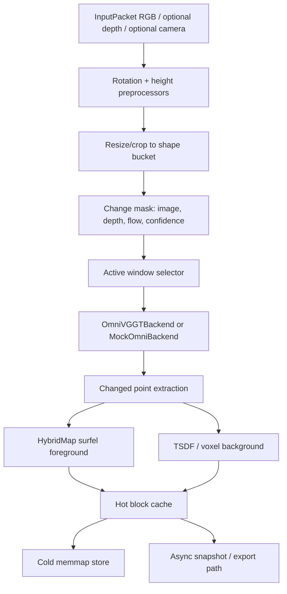

# Stream OmniVGGT

`stream_omnivggt` is a no-training, system-layer streaming wrapper around OmniVGGT. It does not fine-tune weights, does not add training code, and does not change OmniVGGT attention or token logic. OmniVGGT is treated as a local-window inference black box; persistent state lives in change masks, keyframes, caches, and an incremental hybrid map. C++ model: 'https://www.modelscope.cn/models/springx/sand_vggt/files' python model: 'omnivggt'.



## Run Without Omni Weights

From the repository root:

```bash
python -m pytest stream_omnivggt/tests
python -m stream_omnivggt.cli.benchmark_stream --strategy block_incremental --output-json stream_benchmark.json
python -m stream_omnivggt.cli.run_stream_demo --image-dir example/office/images --mock-backend
```

`MockOmniBackend` deterministically converts RGB/depth into pseudo point maps and confidence maps, so tests and benchmarks run without real weights.

## Connect Real OmniVGGT

The default backend is `OmniVGGTBackend`, which looks for:

- `cfg.omni.checkpoint_path`
- `cfg.omni.repo_root/checkpoints/OmniVGGT.safetensors`
- `./checkpoints/OmniVGGT.safetensors`

It imports `omnivggt.models.omnivggt.OmniVGGT` and calls the official `inference()` API with `camera_gt_index` and `depth_gt_index`. If import, weights, CUDA, or initialization fail, it logs a warning and falls back to `MockOmniBackend`.

`engine_mode="onnxruntime"` and `engine_mode="tensorrt"` are reserved stubs in v0.1. `onnxruntime-gpu` is an optional extra and must match the local CUDA runtime.

## Benchmark

```bash
python -m stream_omnivggt.cli.benchmark_stream --strategy full_rebuild --output-json full.json
python -m stream_omnivggt.cli.benchmark_stream --strategy block_incremental --output-json incr.json
python -m stream_omnivggt.cli.benchmark_stream --strategy keyframe_hybrid --output-json hybrid.json
```

The benchmark writes JSON plus a markdown report with average, p90, p99, updated block count, updated point ratio, total latency, and peak memory.

## Tuning

- `small_change_ratio`: below this, keep the default short window; above it, use a medium window.
- `scene_jump_ratio`: above this, force a refresh-sized window or start a new segment.
- `window.default_window`, `medium_window`, `refresh_window`: bucketed to 3/4/6/8 frames.
- `voxel_size`: smaller values increase map detail and block count.
- `block_resolution`: larger blocks reduce hash overhead but increase per-block fusion work.
- `max_hot_blocks`: controls LRU eviction pressure; anchor blocks are protected.

## Performance Notes

- Keep input shapes in a small bucket set (`target_width`, `target_size`, `patch_multiple`).
- Keep rendering/export on the background path; `push()` does not call heavy visualization.
- Use pinned memory and `non_blocking=True` for CPU-to-GPU tensors when CUDA is active.
- Warm up GPU hot paths with `warmup_buckets`.
- Map state is float32 by default even if model inference uses fp16/bf16.

