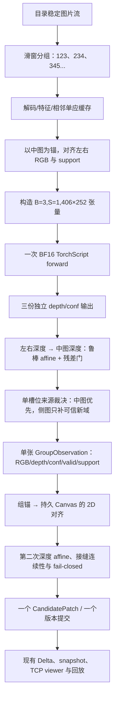

# C++ 三图单次批推理与单层融合实施方案

## 0. 文档定位

本文是后续代码模型可直接照着执行的实施规格，不是概念建议。本轮只新增本文档，不修改代码。

实施对象按仓库主 `README.md` 的定义，指以下两条一键 C++ 主链路：

- Windows：`setc/scripts/start_cpp_live_replay.bat` → `omnivggt_stream_server.exe`。
- Linux：`setc_linux/scripts/start_cpp_live_replay.sh` → `omnivggt_stream_server`。

Windows 必须完成真实 CUDA、真实 `data2`、历史回放与点云质量测试。Linux 版同步实现，但本任务不要求 Linux 实机编译、CUDA 或 GUI 测试，只做代码镜像、脚本语法和静态检查，且不得在报告中冒充已完成 Linux 实测。

`omnivggt_edge`、旧的单文件 `omnivggt_stream` CLI 和 Python 主链路不是本功能的默认入口，不应为了本功能改写其既有行为。若以后需要把相同能力扩展到旧 CLI，应复用本文要求的公共三图核心，不能另写一套不同算法。

---

## 1. 目标、输入语义与硬约束

### 1.1 目标

每个逻辑输入包含三张图。对一个三图输入只允许发生一次 OmniVGGT CUDA forward，并生成一个单层、颜色连续的组观测，再以一次 `CandidatePatch` 提交到权威 Canvas。

对当前 12 张 `data2` 测试数据，采用长度为 3、步长为 1 的滑窗：

```text
group 0 = image 1, image 2, image 3
group 1 = image 2, image 3, image 4
group 2 = image 3, image 4, image 5
...
group 9 = image 10, image 11, image 12
```

每组以中间图（index 1）为组内坐标锚。12 张图必须产生 10 个逻辑组和 10 条逻辑时间线记录。首组对应 `123`，第二组必须严格对应 `234`，不能实现成 `123、456`。

### 1.2 用户补充的最高优先级质量约束

OmniVGGT 原生多图输出会出现不同图对应不同高度层和不同颜色带。因此本方案禁止：

1. 使用 `B=1,S=3` 原生三帧图后直接拼接三个 depth/world-points 输出。
2. 把三张图各自的点云未经标定直接追加到地图。
3. 对未经深度校准的三个深度图做均值、置信度加权均值或简单覆盖。
4. 在同一重叠区域混合三张原始颜色，制造三段色带。

本方案使用 `B=3,S=1`：三张图是三个相互独立的单图样本，只共享一次 batched CUDA forward。三份输出必须在 C++ 外部经过组内几何标定、质量拒绝和单槽位裁决，最后只形成一张深度图、一张颜色图和一个有效掩码。

### 1.3 速度硬约束

1. 非跳过组的 `forward_calls` 必须恒等于 1。
2. 不得在三图图失败时静默退回“三次串行单图 forward”。
3. 不得在三图模式同时把 S1、S2 pair 和 B3S1 三个大模型常驻 GPU。
4. 三图模式仍为 CUDA BF16，不允许 CPU fallback。
5. “速度差不多”必须通过第 13 节的量化门槛验证，不能只凭观察窗口流畅度下结论。

---

## 2. 最终技术决策

### 2.1 一句话方案

将三张图缩放到固定的 `406×252`，构造 `[B=3,S=1,C=3,H=252,W=406]` 的 BF16 输入，一次 forward 得到三张独立单图深度；以中图为锚，将左右深度做鲁棒仿射标定并只补充可信新区域，颜色由同一来源裁决图控制；随后再把这张单层组观测标定、融合到持久 Canvas。

### 2.2 为什么是 406×252

当前首帧 S1 模型是 `700×434`：

```text
patch grid = (700 / 14) × (434 / 14) = 50 × 31 = 1550 patches
```

三图模型每张使用 `406×252`：

```text
per-image patch grid = (406 / 14) × (252 / 14) = 29 × 18 = 522 patches
three-image total    = 3 × 522 = 1566 patches
```

三图总 patch 数只比原 S1 多 `1.03%`。包含每图 1 个 camera token 和 4 个 register token 后：

```text
S1 total tokens   = 1550 + 5 = 1555
B3S1 total tokens = 3 × (522 + 5) = 1581
increase          = 1.67%
```

`B=3,S=1` 的注意力在三个 batch 样本内分别计算，不会像 `S=3` 那样把三图 token 串成一个全局序列。总像素/特征工作量与原 S1 接近，单个注意力序列更短，适合把三图组延迟控制在原单图量级。

若 `406×252` 未通过性能门槛，只允许按第 13.5 节降到备选 `378×238` 重新导出和全量回归；不得直接降低到任意尺寸并跳过质量验证。

### 2.3 为什么不选另外三种方案

| 方案 | 不采用为主方案的原因 |
| --- | --- |
| 三张图横向/纵向拼成一张图 | 制造不存在的空间邻接和非针孔相机，模型只产生一个错误相机 token；透视与接缝会污染深度 |
| 原生 `B=1,S=3` 后合并三个输出 | 已知会形成三层高度和三段颜色，违反用户明确约束 |
| 三次高分辨率 S1 串行推理 | 模型时间近似三倍，正是本任务要消除的问题 |
| 只推理中图、完全丢弃两侧图 | 速度好但没有利用三图的新增覆盖，不满足三图输入的功能价值 |

---

## 3. 端到端数据流



整个流程有两级深度约束：

1. **组内约束**：左右视图对齐到中图，消除三图各自的尺度/偏置和颜色带。
2. **组间约束**：单层组观测再对齐到权威 Canvas，消除相邻滑窗之间的高度漂移。

任何一级标定不可靠都必须拒绝对应新增几何，而不是“先写进去再看”。

---

## 4. 输入分组、缓存与时间线语义

### 4.1 通用组对象

将当前只含单路径的 `RawFrame` 泛化为组对象；单图兼容模式也使用 size=1 的同一类型，避免维护两套队列：

```cpp
struct RawImageRef {
    std::uint64_t source_seq;
    std::filesystem::path path;
};

struct RawFrameGroup {
    FrameSeq frame_seq;                  // 逻辑组序号，连续 0..N-1
    std::vector<RawImageRef> members;    // 三图模式固定 size=3
    int anchor_index;                    // 默认 1
    std::string group_key;               // 恢复/去重使用
};
```

`FrameRecord.image_name` 继续保存中图文件名，保证 viewer 和既有协议不必升级。三图完整成员写入独立的 `input_groups.csv`，字段至少为：

```text
frame_seq,group_key,source_seq_0,image_0,source_seq_1,image_1,source_seq_2,image_2,anchor_index,status
```

CSV 字符串必须正确转义；不得用未转义的 `|` 拼接文件名充当持久格式。

### 4.2 分组规则

新增参数：

```text
--input-group-size 1|3       二进制默认 1，保证旧命令兼容
--input-group-stride N       三图一键脚本固定为 1
--group-anchor-index N       三图一键脚本固定为 1
--model-group3 PATH          B3S1 TorchScript
--group-model-width 406
--group-model-height 252
```

同时接受当前代码风格所需的下划线别名。三图模式启动时应检查：

- group size 恰为 3；
- stride 在 `[1,3]`；
- anchor index 在 `[0,2]`；
- group model 存在；
- group model 宽高为 14 的倍数；
- 三图模式不要求 `--model-pair`，也不加载 pair graph。

`--num-images` 保持“最多读取多少张源图片”的原语义。12 张源图、group size=3、stride=1 时组数为：

```text
floor((12 - 3) / 1) + 1 = 10
```

不足三张时不复制、补零或重复最后一张；持续监听模式继续等待，`--once` 模式记录 `incomplete_tail` 后正常结束。

### 4.3 滑窗缓存

新增 CPU 侧小型 LRU，建议容量 5 张图，键由规范化绝对路径、文件大小和修改时间组成。缓存：

- 解码后的 RGB；
- 700 宽 matching RGB / support；
- SIFT 或 ORB keypoints 与 descriptors；
- 406×252 letterbox 结果及其变换；
- 相邻图的 homography、inliers、误差和失败原因。

`123 → 234` 时必须复用图片 2、3 的解码和特征；稳态只读取新图片 4。首组计算 `H(1→2)` 与 `H(3→2)`，第二组复用 `H(3→2)` 的可逆结果得到 `H(2→3)`，只新增计算 `H(4→3)`。

缓存只放 CPU `cv::Mat`/特征，不缓存每组 CUDA 激活、输出或完整 GPU tensor，避免显存随流长度增长。

### 4.4 队列与恢复

- `BoundedQueue` 的元素改为 `RawFrameGroup`，容量按“组”计数。
- 队列合并时以整组为单位标记 `Coalesced`，不能只丢掉组中一张图。
- 推理线程仍须等待提交线程确认当前组已处理，再获取下一份权威 state，保持 `base_version` 不变式。
- 三图 resume 使用 `input_groups.csv` 的 `group_key` 去重，不能沿用“跳过已完成图片名”的逻辑，因为滑窗上下文会重复使用图片。
- 新三图运行恢复旧单图 run 目录，或旧 run 缺少 group manifest 时，必须明确拒绝；不能猜测历史窗口。

---

## 5. B3S1 TorchScript 导出与 C++ 张量契约

### 5.1 导出脚本改动

在 Windows 和 Linux 的 `export_torchscript.py` 增加：

```text
--batch-size N，默认 1
```

`--num-images` 继续表示 `S`。索引校验仍只针对序列维 `S`，不能把 batch index 当作 camera/depth index。

示例张量必须从固定的 `B=1` 改为：

```text
images      [B,S,3,H,W]
extrinsics  [B,S,3,4]
intrinsics  [B,S,3,3]
depth       [B,S,H,W,1]
mask        [B,S,H,W]
```

JSON manifest 必须新增 `batch_size`，并把 `input_shape` 写成真实形状。

### 5.2 Windows 导出命令

```powershell
setc\venv_torch270_cu128\Scripts\python.exe setc\scripts\export_torchscript.py `
  --checkpoint checkpoints\OmniVGGT.safetensors `
  --output setc\artifacts\omnivggt_observer_b3s1_406x252_bf16_unfrozen_torch270.pt `
  --batch-size 3 --num-images 1 `
  --height 252 --width 406 `
  --device cuda `
  --dtype bfloat16 --autocast-dtype bfloat16 `
  --observer-depth-only --no-freeze
```

产物 manifest 必须显示：

```json
{
  "batch_size": 3,
  "num_images": 1,
  "input_shape": [3, 1, 3, 252, 406],
  "observer_depth_only": true
}
```

### 5.3 Linux 导出命令

Linux 独立包保留其 `--model-source` 约定：

```bash
python3 scripts/export_torchscript.py \
  --model-source /path/to/OmniVGGT-Python \
  --checkpoint models/OmniVGGT.safetensors \
  --output models/omnivggt_observer_b3s1_406x252_bf16_unfrozen_torch270.pt \
  --batch-size 3 --num-images 1 \
  --height 252 --width 406 \
  --device cuda \
  --dtype bfloat16 --autocast-dtype bfloat16 \
  --observer-depth-only --no-freeze
```

### 5.4 C++ forward 契约

现有 `make_image_tensor_batch()` 沿序列维拼接为 `[1,S,...]`。新增独立 batch 构造函数，沿 batch 维拼接为 `[3,1,...]`：

```text
images      [3,1,3,252,406] BF16 CUDA
extrinsics  [3,1,3,4]       FP32 CUDA，单位 [I|0]
intrinsics  [3,1,3,3]       FP32 CUDA，单位矩阵
depth       [3,1,252,406,1] BF16 CUDA，全零
mask        [3,1,252,406]   BF16 CUDA，全零
```

返回值必须严格校验：

```text
pose       [3,1,9]
depth      [3,1,252,406,1]
depth_conf [3,1,252,406]
```

按 batch index 0、1、2 分别提取三个 `Prediction`。若输出意外为 `[1,3,...]`，应直接失败，这表示错误使用了原生 S3 图。

三图 graph 在 `InferenceEngine` 构造时只 warmup 一次；warmup 后同步 CUDA，再开始记录正式 `model_ms`。

---

## 6. 三图预处理和坐标变换

### 6.1 2D 匹配域

沿用当前 700 宽 matching 逻辑和 `770×630` padded local canvas，以保证 SIFT/ORB、support 和现有全局画布坐标不变。组锚为中图。

需要把当前仅支持“图到持久 anchor”的 `estimate_homography()` 拆出可复用的图到图版本：

```text
estimate_pair_transform(source_frame, target_frame) -> PairAlignment
```

`PairAlignment` 至少包含：

```text
H_source_to_target, accepted, method, inliers,
median_error_px, overlap_ratio, phase_response, fallback
```

接受顺序仍为 SIFT → ORB → phase correlation。侧图只有通过 2D 门限才有资格进入后续深度标定；失败侧图不影响中图继续运行。

### 6.2 模型 letterbox

每张图从未 padding 的 matching RGB 等比缩放到 `406×252`，空边使用 `BORDER_REPLICATE`，不能拉伸，也不能用黑边参与模型。保存每张图的：

```text
content_width, content_height, pad_x, pad_y, scale
```

模型输出有效掩码必须排除：

- letterbox padding；
- 内容区四周 8 像素模型边界；
- 非有限深度、`depth <= 0`、非有限 confidence。

通过逆 letterbox 变换把每份 depth/conf 映射回各自 700 宽 local padded canvas，再用组内 homography 把左右图映射到中图 local canvas。深度、置信度用适当插值；有效/source label 必须最近邻。

---

## 7. 组内单层深度融合算法

### 7.1 中图是唯一基准面

中图 prediction 定义组内基准深度 `D_c`。左右图分别为 `D_l,D_r`。中图有效的位置永远由中图拥有；侧图不得在重叠区覆盖中图深度，只能：

1. 提供标定样本；
2. 在通过标定后补充中图无有效几何的新区域；
3. 在诊断中提高观测置信度，但不改变中图深度值。

### 7.2 标定样本

侧图 `s` 映射到中图后，样本掩码为：

```text
calib = valid_center
      & valid_side_warped
      & stable_photometric_overlap
      & center_conf_quality_gate
      & side_conf_quality_gate
      & not_model_border
```

置信度是 `1+exp(raw)` 的相对分数，不是 `[0,1]` 概率。每图候选不少于 256 时使用各自第 20 百分位作为质量门；不得用 `1-conf`。

`stable_photometric_overlap` 使用组锚颜色校正后的 RGB L1 与稳健中位数/MAD，排除运动物体、反光和明显视差区。

### 7.3 鲁棒 affine

拟合：

```text
D_center ≈ scale × D_side + bias
```

实现要求：

1. side depth 先做 2/98 百分位裁尾。
2. 权重使用 center/side confidence 的几何均值，再乘模型边界 feather。
3. 加权最小二乘最多 4 次 MAD 内点迭代。
4. `scale` 限制 `[0.25,4.0]`，`bias` 限制 `[-10,10]`。
5. 返回结构体而不是只返回 Mat：

```text
DepthFitResult {
  accepted, scale, bias, sample_count, inlier_count,
  inlier_ratio, median_abs_residual, p95_abs_residual,
  normalized_median_residual, normalized_p95_residual, reason
}
```

初始硬门限：

```text
sample_count >= 512
inlier_ratio >= 0.65
normalized_median_residual <= 0.03
normalized_p95_residual <= 0.10
```

归一化分母使用中心深度样本的 `P95-P05`，下限加 `1e-6`。门限必须进入配置和 metrics，后续可以基于真实数据调优；不能删除质量门以提高侧图接受率。

### 7.4 侧图新区域的接受规则

侧图只有 `DepthFitResult.accepted=true` 才能提供新几何。进一步要求：

- 新区域连通域必须与有效标定 overlap/ring 相连；
- 小于 256 像素的连通域删除；
- 对新旧边界运行当前已有的 depth continuity 修正；
- 局部修正仍限制在 `[-0.08,0.08]`；
- 无可靠重叠的孤立侧图区域全部拒绝。

### 7.5 单槽位来源裁决

维护 `source_label` 诊断图：

```text
0 = 中图
1 = 左图
2 = 右图
255 = 无效
```

每个中图 local-canvas cell 最终最多保留一个 depth：

1. 中图有效：无条件选中图。
2. 中图无效、只有一侧有效且该侧标定通过：选该侧。
3. 中图无效、左右都有效：
   - 若两侧标定深度差在允许残差内，选 `confidence × edge_feather × fit_score` 更高者；
   - 若两侧明显冲突，拒绝该 cell，不能平均出第三个表面。
4. 三者都无效：保持无效。

`GroupObservation` 至少包含：

```text
rgb, depth, confidence, valid, support, source_label,
anchor_frame, member_names, side_fit_results
```

结构上只有一张二维 depth，因此不会保存同一 slot 的三份高度。

### 7.6 fail-closed

- 左图失败：只使用中图和可能通过的右图。
- 右图失败：只使用中图和可能通过的左图。
- 两侧都失败：退化为中图单层观测，仍然只有一次已经完成的 batched forward。
- 组模型文件/shape 错误：启动时失败。
- CUDA OOM：硬失败并给出建议 profile，不得转 CPU 或改成三次串行 S1。

---

## 8. 组内颜色融合算法

颜色来源必须与 `source_label` 一致，不能出现“深度来自左图、颜色来自右图”。

### 8.1 颜色校正

在稳定 overlap 中对每个侧图拟合到中图的每通道 gain/bias 或复用当前低频残差迁移：

```text
color_corrected = clip(gain × side_rgb + bias, 0, 1)
gain ∈ [0.8,1.25]
bias ∈ [-0.08,0.08]
```

使用中位数/MAD 排除高光、阴影突变和运动物体。

### 8.2 所有权规则

1. 中图有效区域始终使用中图颜色。
2. 侧图只在自己被选为 depth source 的新区域写颜色。
3. 新旧边界使用 8 像素 feather；锚环只校正，不写回。
4. 左右同时覆盖且冲突时，颜色跟随深度裁决结果。
5. 侧图深度被拒绝时，侧图颜色也必须拒绝，不能做无几何依据的大片颜色覆盖。

这比“把三张图先平均成一张 RGB”更安全：重叠区只有一个权威来源，侧图仅增加可信覆盖，不会形成三条色带。

---

## 9. 与持久 Canvas、历史和 viewer 的衔接

### 9.1 先形成组观测，再进入现有主流程

不得把三份 prediction 分别调用三次现有 `process()`。正确顺序是：

```text
RawFrameGroup
  → one GroupObservation
  → one global change mask
  → one global depth alignment
  → one CandidatePatch
  → one version commit
```

持久 Canvas 的 frame/image 语义对应组锚（中图），但 patch 可以包含左右图经组内标定后增加的可信新区域。

### 9.2 组间高度连续性

把当前 `align_depth_to_canvas()` 改为返回带质量指标的结果。Canvas 已初始化时：

- 有足够稳定 overlap：执行现有 affine、局部 seam correction 和 continuity。
- overlap/残差不合格：本组不得把未标定新几何写进旧 Canvas；记录 `global_depth_alignment_rejected`。
- scene jump 且无法标定：保留旧 Canvas，标记新 segment 候选或失败，不得在同一 Canvas 中生成第二层。

组间 RGB 仍使用当前 `anchor_texture_transfer`、color bridge 和 anchor ring 规则；输入已经是单层组 RGB，不再按三张图分别写颜色。

### 9.3 历史协议

不修改 `PointCloudDelta`、snapshot 和 TCP schema。原因是对外仍然只有：

- 一个 `frame_seq`；
- 一个 `CandidatePatch`；
- 每个 slot 一份 before/after；
- 一个提交版本。

三图成员、来源和标定诊断属于运行元数据，写到 `input_groups.csv`、`metrics.csv` 和 debug 图，不放进 viewer 协议。

---

## 10. 需要修改/新增的文件

### 10.1 Windows `setc`

| 文件 | 必做修改 |
| --- | --- |
| `setc/scripts/export_torchscript.py` | 增加 `--batch-size`，导出/manifest 使用真实 B 维 |
| `setc/src/observer/frame_source.hpp/.cpp` | 生成 `RawFrameGroup`；滑窗、stride、incomplete tail、group key、整组 queue |
| `setc/src/observer/inference_pipeline.hpp/.cpp` | group model 生命周期；B3S1 张量；三 prediction；缓存；组内对齐/标定/单层融合；结构化 metrics；一次 patch |
| `setc/src/observer/stream_server_main.cpp` | 新 CLI、参数验证、group queue、resume/group manifest、metrics header |
| `setc/CMakeLists.txt` | 新三图纯 C++ smoke test 目标与 CTest 注册 |
| `setc/scripts/start_cpp_live_replay.bat` | 默认启用 group size=3/stride=1/anchor=1；检查 group model；三图模式不加载 pair graph |
| `README.md`、`doc/setc/README.md` | 记录新默认入口、模型导出、三图语义、性能/质量结果和回退方式 |

建议新增以下可测试模块，避免把 2682 行的 `inference_pipeline.cpp` 继续膨胀：

```text
setc/src/observer/input_group.hpp/.cpp
setc/src/observer/group_fusion.hpp/.cpp
setc/src/observer/group_fusion_smoke.cpp
```

`group_fusion` 不依赖 TorchScript module，只依赖 OpenCV 和简单数据结构，以便用合成深度/颜色做无模型测试。

### 10.2 Linux `setc_linux`

逐文件镜像对应实现：

```text
setc_linux/scripts/export_torchscript.py
setc_linux/src/observer/frame_source.hpp/.cpp
setc_linux/src/observer/inference_pipeline.hpp/.cpp
setc_linux/src/observer/stream_server_main.cpp
setc_linux/src/observer/input_group.hpp/.cpp
setc_linux/src/observer/group_fusion.hpp/.cpp
setc_linux/src/observer/group_fusion_smoke.cpp
setc_linux/CMakeLists.txt
setc_linux/scripts/start_cpp_live_replay.sh
setc_linux/README.md
```

Linux 独立包的 `--model-source`、RPATH、`${LIBTORCH}`/`${CUDA_HOME}` 和只结束自身 server PID 的行为必须保留。

除已知平台差异外，核心 `.hpp/.cpp` 应与 Windows 文本一致。不要先改 Windows、再手工写一份算法略有不同的 Linux 版本。

---

## 11. 指标与日志扩展

现有 metrics 字段保持原顺序，在行尾追加：

```text
group_size,group_stride,group_anchor_index,
forward_calls,batch_size,sequence_size,
group_model_width,group_model_height,
decoded_cache_hits,feature_cache_hits,homography_cache_hits,
intra_group_align_ms,intra_group_fuse_ms,
left_2d_status,left_depth_status,left_depth_samples,left_depth_inlier_ratio,
left_depth_scale,left_depth_bias,left_depth_nr_median,left_depth_nr_p95,
right_2d_status,right_depth_status,right_depth_samples,right_depth_inlier_ratio,
right_depth_scale,right_depth_bias,right_depth_nr_median,right_depth_nr_p95,
center_pixels,left_pixels,right_pixels,rejected_conflict_pixels,
global_depth_status,global_depth_samples,global_depth_nr_median,
color_seam_l1_p95
```

另写 `input_groups.csv`，确保 12 图测试可自动验证 10 个窗口的成员顺序。

debug 模式至少输出：

```text
group_N_source_label.png
group_N_center_valid.png
group_N_left_accepted.png
group_N_right_accepted.png
group_N_depth_residual_left.png
group_N_depth_residual_right.png
group_N_color_seam.png
```

日志必须能回答三件事：本组是否只 forward 一次、哪些侧图被拒绝、最终每块几何来自哪张图。

---

## 12. 实施顺序

### 阶段 A：冻结基线

1. 在任何代码修改前，用现有 Windows 一键 C++ 配置在 `data2` 跑一次独立 baseline 目录。
2. 保存 commit、GPU、模型文件名/大小、CUDA/LibTorch、12 帧 metrics、峰值显存和最终 PLY。
3. 不复用已有缓存结果冒充新 baseline。已有 `run_20260805_142953/metrics.csv` 可作参考，但正式验收必须重跑。

### 阶段 B：只打通 B3S1 图

1. 修改导出脚本并生成 B3S1 artifact。
2. 写最小 C++ warmup/shape 验证，确认输出是 `[3,1,...]`。
3. 测量一次 forward 的 model_ms 和峰值显存，尚不接 Canvas。
4. 若该阶段已明显超过性能门槛，先处理 shape/graph/autocast，不进入融合阶段。

### 阶段 C：分组与缓存

1. 实现 123、234 滑窗。
2. 加入 decode/feature/homography cache。
3. 用无模型 smoke test 验证 12 图→10 组、成员顺序、队列合并和 incomplete tail。

### 阶段 D：组内单层融合

1. 先用合成平面验证已知 scale/bias 可恢复。
2. 再验证非仿射/无 overlap/颜色冲突会拒绝。
3. 接入真实 B3S1 输出，生成 `GroupObservation` 与 source label。
4. 只有该阶段不出现三层后才接入持久 Canvas。

### 阶段 E：Canvas、历史与 resume

1. 每组只生成一个 candidate/commit。
2. 补充全局 depth fit 状态和 fail-closed。
3. 验证 delta 正反向、snapshot 恢复、viewer timeline 为 10 组。

### 阶段 F：Windows 一键入口与真实验收

1. 更新 bat/README。
2. 在 12 图上完成第 13 节全部测试。
3. 质量或速度任一硬门不通过，不得宣称完成。

### 阶段 G：Linux 镜像

1. 同步核心代码、CMake、导出和启动脚本。
2. 仅做第 14 节静态验证。
3. 明确记录“未做 Linux CUDA/GUI 实测”。

每个阶段形成稳定且可验证结果后，按仓库规则创建只包含本阶段文件的本地 checkpoint。

---

## 13. Windows 真实测试和硬验收门槛

### 13.1 功能测试

在 `data2` 12 图上使用 `--once --num_images 12`：

- `input_groups.csv` 恰好 10 行数据；
- 第 0 组为 1/2/3，第 1 组为 2/3/4，第 9 组为 10/11/12；
- 每组 `group_anchor_index=1`；
- 每个未 skip 组 `forward_calls=1`、`batch_size=3`、`sequence_size=1`；
- history 恰有 10 个逻辑 frame record；
- `omnivggt_validate_history` 通过；
- replay 首、中、末三组可前进、后退且 checksum 一致；
- viewer 能显示实时状态和 10 组时间轴。

### 13.2 单层高度质量门

每个被接受的侧图必须满足运行时标定门限。额外离线验收：

1. 在中图/侧图共同覆盖区，标定后归一化深度残差：
   - median `<= 0.03`；
   - p95 `<= 0.10`。
2. 以 `source_label` 分区拟合同一主平面/局部连续面，各来源的中位有符号残差差值不得超过：

   ```text
   max(1.2 × center-only baseline gap, 0.02 × depth_P95_P05)
   ```

3. 任何不满足门限的侧图必须显示为 rejected，且它的新增区域不能进入 patch。
4. 最终点云按 XY 网格检查时不得出现由 source label 对应的三组平行高度峰。
5. 至少人工检查 group 0、group 4、group 9 的点云侧视图和接缝放大图。

“Canvas 每格只有一个 depth”只是结构必要条件，不足以单独证明没有三层；必须同时通过来源分区的平面残差检查。

### 13.3 颜色连续性门

1. 中图 overlap 不得被侧图颜色覆盖。
2. 接缝带 `mean(abs(RGB_left-RGB_right))` 的 p95 必须满足：

   ```text
   <= max(12/255, 1.2 × center-only baseline seam_p95)
   ```

3. source label 改变处不得出现稳定的左/中/右三条色带。
4. 人工检查与高度检查相同的三组，并保存 debug seam 图。

### 13.4 速度门

定义：

- `T_old`：修改前生产单输入 C++ 流程在同一机器、同一数据、同一 BF16 配置下，排除启动/warmup 后的 median `total_ms`。
- `M_s1`：同一执行器中 B1S1 `700×434` 的 warmup 后 median `model_ms`。
- `T_group`、`M_group`：三图模式 10 组的对应稳态中位数。

硬门：

```text
M_group <= 1.15 × M_s1
T_group <= 1.25 × T_old
p90(total_ms_group) <= 1.35 × p90(total_ms_old)
effective_image_fps = 3 × 1000 / T_group
effective_image_fps >= 2.4 × (1000 / T_old)
```

同时记录首组延迟，但首组不混入稳态 median。若 no-change skip，速度报告同时给出：

- 所有组总吞吐；
- 仅 model-invoked 组吞吐；
- skip ratio。

不能把滑窗每次只新增一张图的“unique-new-image FPS”与每组含三张图的“input-image throughput”混为一个指标；两者都应报告。

### 13.5 性能不达标时的唯一调优顺序

1. 先确认每组只有一个 forward、没有加载 pair graph、没有 debug 写盘。
2. 确认滑窗 decode/feature/homography cache 命中，稳态只读取一张新图、只计算一对新相邻匹配。
3. 确认 CUDA BF16、`inference_mode`、输出立即转 CPU FP32，计时边界正确同步。
4. 仍不达标时，导出 `B3S1 378×238`：每图 `27×17=459` patches，总计 1377，比原 S1 少约 11.2%。
5. 对小模型重新跑全部高度、颜色和覆盖验收；不能只测速度。
6. 若仍不达标，停止并报告，不得自动改成中图-only 或牺牲质量门。

### 13.6 显存门

记录空闲基线、warmup 峰值和稳态峰值。三图模式必须满足：

```text
peak_vram <= max(1.10 × B1S1_peak_vram, 7.2 GiB)
```

在 8GB RTX 5060 Laptop GPU 上不得发生系统内存分页、CUDA OOM 或同时驻留 group/pair graph。最终报告必须写明采样方法与其他 GPU 进程占用。

### 13.7 回归门

- `--input-group-size 1` 的旧单图/pair 路径仍能启动并产生原格式 history。
- 非三图模式的 CLI 默认值不变。
- `omnivggt_observer_core_smoke` 继续通过。
- 新 `group_fusion_smoke` 通过。
- `git diff --check`、Python `py_compile` 和 Windows build 通过。

---

## 14. Linux 版允许的验证范围

本任务明确不要求 Linux 实机测试。后续执行者只做：

1. Windows/Linux 公共 `.hpp/.cpp` 的差异审查；除平台路径/加载差异外应一致。
2. `python3 -m py_compile scripts/export_torchscript.py`。
3. `bash -n scripts/start_cpp_live_replay.sh`、`build_linux.sh`、`build_linux_live_observer.sh`。
4. CMake target/source 清单静态检查。
5. README 命令、默认模型名、环境变量和参数的一致性检查。

最终交付中必须写：

```text
Linux 版已同步实现并完成静态/脚本检查；未在 Linux 上完成 C++ 编译、CUDA forward、显存、FPS 或 GUI 实测。
```

不得写“Linux 测试通过”或给出虚构 FPS。

---

## 15. 合成 smoke test 必测案例

新 `group_fusion_smoke` 不依赖真实模型，至少覆盖：

1. `12 images, size=3, stride=1 → 10 groups`，并核对 123、234。
2. 少于 3 张时不发出组。
3. queue drop 只丢整组。
4. 已知 `D_left=2×D_center+0.5`、`D_right=0.5×D_center-0.2` 时 affine 可恢复到中心面。
5. 三份深度原本是三个平行层，经标定后 source 区域只有一个连续面。
6. 非仿射波浪深度或随机深度被 residual gate 拒绝。
7. overlap 少于 512 被拒绝。
8. 左右在 center 缺失区冲突时该 cell 被拒绝，不做平均。
9. 中图有效时侧图永不覆盖中图 depth/RGB。
10. 侧图曝光 gain/bias 可校正；异常高光不会主导拟合。
11. 被拒绝侧图不会更新几何、颜色或 side-only support。
12. group manifest resume 不重复提交已完成窗口，但仍可读取重复上下文图。

---

## 16. 一键脚本目标状态

### 16.1 Windows

`start_cpp_live_replay.bat` 三图默认值：

```text
GROUP_MODEL=...\omnivggt_observer_b3s1_406x252_bf16_unfrozen_torch270.pt
INPUT_GROUP_SIZE=3
INPUT_GROUP_STRIDE=1
GROUP_ANCHOR_INDEX=1
GROUP_MODEL_WIDTH=406
GROUP_MODEL_HEIGHT=252
QUEUE_CAPACITY=1024 groups
```

三图模式命令不传 `--model-pair`、`--pair-letterbox`。若要保留一键旧模式，可由环境变量显式设置 `INPUT_GROUP_SIZE=1`，再走原 S1/S2 参数。

### 16.2 Linux

Linux 脚本提供同名环境变量：

```text
GROUP_MODEL
INPUT_GROUP_SIZE
INPUT_GROUP_STRIDE
GROUP_ANCHOR_INDEX
GROUP_MODEL_WIDTH
GROUP_MODEL_HEIGHT
```

启动日志必须明确打印：

```text
mode: B3S1 calibrated single-surface
tensor: [3,1,3,252,406]
window: size=3 stride=1 anchor=1
serial fallback: disabled
```

---

## 17. 完成定义

只有同时满足以下条件，后续代码任务才可标记完成：

- Windows 和 Linux 源码/脚本功能均已实现，Linux 明确未冒充实测。
- Windows 真实 B3S1 artifact 导出成功，C++ shape 检查为 `[3,1,...]`。
- `data2` 产生正确的 10 个 123/234 滑窗。
- 每个未跳过组三图只执行一个 CUDA forward。
- 左右图只有通过深度和颜色质量门后才补充新区域。
- 组内和组间都 fail-closed，不会将未标定深度写入旧 Canvas。
- 定量检查和人工侧视图均未出现对应三图的三层高度或三段颜色。
- 第 13 节速度、显存、质量、历史和兼容性硬门全部通过。
- README、导出命令、启动命令、metrics 字段和限制均更新。
- 所有本轮相关文件已通过构建/测试并形成安全的本地 Git checkpoint。

如果任一硬门未通过，交付状态应写“未完成/需继续调优”，不能用“功能可运行”替代速度与单层质量验收。
