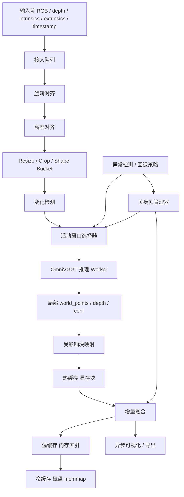
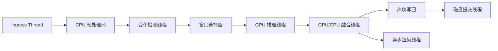

# OmniVGGT 免训练低延迟流式推理方案深度研究报告

## 执行摘要

你当前的两个免训练模块——旋转对齐与高度对齐——都只改变输入，不改 OmniVGGT 的权重与训练过程。这个前提与 OmniVGGT 的官方设计是兼容的：OmniVGGT 本身就是一个在训练与推理阶段都能接收任意数量辅助几何模态的空间基础模型，官方论文强调其 GeoAdapter 在不破坏基础表示空间的前提下引入几何信息，并声称在多种额外输入下仍保持与 VGGT 相近的推理速度；官方仓库也暴露了 `inference()` 接口，允许图像、相机、深度按“部分可用”的方式输入。citeturn0search0turn10view0turn7search0turn9view1

但关键现实是：官方 OmniVGGT 仍然属于“离线/批式多视图前向模型”，并不是原生流式模型。VGGT/OmniVGGT 一类方法擅长在单次前向中处理一幅、少量或数百幅视图，但如果把它直接拿来做在线视频流，随着每个新帧到来就整段重跑，成本会迅速升高；后续研究如 StreamVGGT、InfiniteVGGT、OVGGT、StreamCacheVGGT 之所以出现，正是因为离线 VGGT 家族在长序列与持续流输入上会面临整段重处理、KV 缓存增长或长时稳定性问题。citeturn0search9turn13search17turn15search16turn13search0turn16search0turn16search1

因此，对开源 OmniVGGT 最现实、最稳妥、也最符合“免训练”要求的方案，不是去改模型权重，而是**在模型外层包一层流式系统**：把 OmniVGGT 作为“局部窗口重建器”，把持久状态放到**块化点云/体素地图**里，仅对“受影响的局部窗口”和“受影响的空间块”做更新。这个方向和 KinectFusion 的增量 TSDF 融合、ElasticFusion 的窗口式 surfel 融合、Voxblox 的增量 TSDF/ESDF、以及 Open3D 的稀疏 Voxel Block Grid 都是同一路数。citeturn11search1turn11search16turn11search2turn11search10turn17search0turn17search5

基于这些约束，我建议的主方案是：**局部活动窗口 Omni 推理 + 受影响像素/块检测 + 热温冷三级缓存 + 增量融合 + 低频全局校正**。这条路线不需要微调 OmniVGGT 权重；每来一帧，只重算少量上下文帧与少量空间块；在大多数“小变化”场景下，平均延迟会显著低于“全序列全点云重建”；在场景突变与对齐失败时，再退回到关键帧刷新或局部全重建。对于更激进的后续优化，可以把 FastVGGT 的训练自由 token merging、SwiftVGGT 的单步 Sim(3)-SVD 对齐、以及 OVGGT/StreamCacheVGGT 的“重要锚点保护”思想，借到你的窗口选择、块优先级和缓存淘汰策略中。citeturn14search16turn14search0turn16search0turn16search1

## 背景与约束假设

下文统一写作 **OmniVGGT**。这里先把你的约束、官方实现特征、以及工程假设分开说清楚。

从官方资料看，OmniVGGT 的核心定位是“任意辅助几何模态驱动”的空间基础模型。它在推理时可接收图像、深度、内参、外参；官方 Python 示例和 `inference()` 接口都说明了这些输入的存在，而 `depth_gt_index` 与 `camera_gt_index` 允许你只给其中一部分帧提供深度/相机参数。此外，官方 loader 会为缺失的相机/深度填零占位，这对流式场景下“外部参数间歇到达”的工程形态非常友好。citeturn7search0turn10view0turn9view1

官方实现在输入预处理上也给了两个重要线索。其一，默认 `target_size=518`，宽度固定到 518，高度按比例缩放后再四舍五入到 14 的倍数，并在需要时做裁剪；这意味着如果你想配合 `torch.compile`、CUDA Graph、TensorRT profile 或 ONNX Runtime 的静态/桶化 shape 优化，最自然的做法就是继续沿用这一 shape 规范，而不是自由分辨率流式乱飞。其二，官方可视化路径里存在 `predictions_to_glb()`、`apply_scene_alignment()`、`skyseg.onnx` 下载/分割、`viser` 渲染等逻辑，这些更偏向可视化和导出，不应该放在流式低延迟主路径里逐帧同步执行。citeturn9view0turn8view4turn6view1turn6view0turn20search0

特别要注意：官方 README 明确写了一个输入约束——如果某些图像带有辅助相机信息，那么**第一张图必须带相机信息**。这意味着你的流式局部窗口设计里，任何一个被送进 OmniVGGT 的活动窗口，最好都要包含一个“锚帧”，并且这个锚帧要么有真实相机输入，要么能够通过你的旋转/高度对齐加上历史全局位姿，构造出一个稳定的伪相机锚点。citeturn2search0turn2search1

基于用户未指定项，我建议采用下表作为默认工程假设，并给出替代配置。这里的数值不是“论文结论”，而是为了便于落地实现的**起始工程配置**。

| 未指定项 | 默认假设 | 替代配置一 | 替代配置二 | 对方案的影响 |
|---|---|---|---|---|
| 输入频率 | 事件驱动、异步接收，不假定固定 FPS | 低频 5–10 Hz | 高频 30 Hz+ | 高频时必须强制小窗口、分阶段异步与块级更新 |
| 点云规模 | 中等尺度室内/近场，活动热块可驻留显存 | 大尺度长序列 | 小场景高精度 | 大尺度时必须启用冷存储与块淘汰 |
| 分辨率 | 延续 Omni 默认 518 宽输入桶 | 336/392 低延迟桶 | 518/560 高质量桶 | 与 patch 大小 14 对齐，便于静态 shape 优化 |
| 硬件 | 单张 NVIDIA GPU + 足够 CPU RAM + NVMe | 8GB 边缘 GPU | CPU-only | GPU 热缓存大小与窗口大小要同步收缩 |
| 网络 | 本地进程内共享内存 | 局域网远程推理 | 端云分离 | 远程场景要把窗口与块更新做成小消息 |

从研究侧看，这个“外层流式包装”的思路也具有现实合理性。VGGT/OmniVGGT 的价值在于其一次前向可以给出深度、点图、相机等关键几何属性；而 Open3D、KinectFusion、ElasticFusion、Voxblox 一类系统的价值在于它们擅长把**连续到来的局部观测**增量地、稳定地整合进全局地图。把前者当“局部观测生成器”，把后者当“持久地图管理器”，正好形成互补。citeturn16search17turn10view0turn11search1turn11search16turn17search5turn11search10

## 架构设计

### 总体思路

建议采用一个**三层状态、两级窗口、四阶段异步**的架构。

三层状态指：

1. **热状态**：显存中的活动块。存最近活跃空间块的 TSDF/surfel/点云片段、最近 K 帧特征、活动窗口输入张量、以及 GPU 上的预分配 I/O buffer。
2. **温状态**：内存中的块元数据与短历史。存 block 索引、时间戳、置信度统计、最近观测帧列表、关键帧列表、以及待提交的写回日志。
3. **冷状态**：磁盘上的 memmap 或分块数组。存不活跃块的持久点云/体素数据、历史关键帧快照、以及恢复所需索引。NumPy 的 `memmap` 适合“只访问大文件的小片段”的模式，这非常适合块化地图的冷存储。citeturn18search0turn17search0turn17search3

两级窗口指：

1. **微窗口**：真正送入 OmniVGGT 的活动窗口，通常由“新帧 + 最近上下文帧 + 少量锚帧”组成，窗口长度保持固定或落在少数几个 bucket 内。
2. **关键帧窗口**：低频触发，用于全局重锚、漂移修正、回环检查和突变场景恢复，不要求每帧执行。

四阶段异步指：

1. **接入与对齐阶段**：接收新图像/外参/深度/参数，运行你的旋转对齐和高度对齐模块。
2. **变化检测与窗口选择阶段**：估计哪些像素、哪些点、哪些块受影响，只挑局部窗口送模型。
3. **模型推理与融合阶段**：运行 OmniVGGT，输出局部点图/深度/置信度，然后只更新受影响块。
4. **渲染与导出阶段**：异步更新可视化和磁盘导出，绝不阻塞核心推理路径。

这个设计符合 OmniVGGT 的官方接口，也符合流式几何系统的已有经验。官方 OmniVGGT 在 `inference()` 中能输出 `depth`、`depth_conf`、`world_points`、`world_points_conf` 和 `pose_enc` 等结果；Open3D 的 Voxel Block Grid 明确是“全局稀疏、局部稠密”的数据结构，且针对 GPU 做了优化；ElasticFusion 则强调了窗口式 surfel 融合与在线增量一致性。citeturn10view0turn17search0turn17search1turn11search16

### 数据流与缓存层次



这里的 cache 分层并不是奢侈，而是为了把“模型算力”和“地图状态”彻底解耦。OmniVGGT 的官方仓库本身并没有提供流式 persistent state；它更像一个把若干输入帧映射到几何输出的前向器。因此，想要低延迟，你就必须把“长期记忆”放在模型外。Open3D 的 `VoxelBlockGrid`、`ScalableTSDFVolume` 与 TSDF integration 文档都说明了稀疏块化体素结构特别适合逐帧融合；Voxblox 也明确把增量 TSDF/ESDF 作为实时建图的核心结构。citeturn17search3turn17search5turn17search19turn11search2turn11search10

我建议的具体缓存分工如下。

| 层级 | 推荐内容 | 读写频率 | 推荐实现 |
|---|---|---|---|
| 显存热缓存 | 活动窗口张量、活动块 TSDF/surfel、最近 K 帧中间结果、预分配 I/O buffer | 每帧高频 | Torch Tensor / Open3D Tensor VoxelBlockGrid |
| 内存温缓存 | block 元数据、关键帧索引、帧到块反向索引、优先级队列 | 每帧高频 | Python dataclass + NumPy + LRU/heap |
| 磁盘冷缓存 | 老块体素、历史关键帧、恢复快照、统计日志 | 中低频 | `numpy.memmap` / Zarr / Parquet 元数据 |

`numpy.memmap` 的价值在于不需要把整块大数组全部读入内存，只访问局部片段即可；而 PyTorch pinned memory 与 `non_blocking=True` 可以减少 CPU→GPU 复制阻塞。ONNX Runtime 的 I/O Binding 文档也明确指出：如果输入输出已经布置在目标设备上，可以减少 `Run()` 中隐含的数据搬运。citeturn18search0turn18search1turn18search5turn12search13

### 增量更新策略

核心更新单元建议使用**空间块而不是整幅点云**。原因很直接：KinectFusion/TSDF、Voxblox、Open3D Voxel Block Grid 都表明，对于持续流输入，按体素块或局部表面块做更新，才能让计算量与“变化区域”而不是“全场景规模”绑定。citeturn11search1turn11search2turn17search0turn17search5

我建议把点云/体素分成三类块：

| 块类型 | 含义 | 更新优先级 | 驻留位置 |
|---|---|---|---|
| 活动块 | 当前视锥和变化区域命中的块 | 最高 | 显存 |
| 锚点块 | 历史关键帧覆盖、几何稳定、用于抗漂移的块 | 高 | 显存/内存双驻留 |
| 冷块 | 长时间未访问 | 低 | 磁盘 |

优先级可以按以下综合打分：

\[
\text{priority}(b)=\alpha \cdot \text{recency}(b)+
\beta \cdot \text{overlap}(b)+
\gamma \cdot \text{uncertainty}(b)+
\delta \cdot \text{anchor\_flag}(b)+
\epsilon \cdot \text{change\_mass}(b)
\]

这里的“anchor protection”思想实际上借鉴了 OVGGT 和 StreamCacheVGGT 的训练自由缓存保留策略：它们都发现，流式几何系统不能只按“最近/最低分就删”，因为会把几何结构关键 token/锚点删掉，导致长时漂移。因此，在你的点云块层面，也应当保护少量高几何价值块不被淘汰。citeturn16search0turn16search1

时间窗口建议分成三档：

| 档位 | 触发条件 | 组成 | 用途 |
|---|---|---|---|
| 轻量更新窗口 | 小变化，受影响比例低 | 新帧 + 最近 2–3 帧 + 1 个锚帧 | 常规低延迟 |
| 局部纠偏窗口 | 中等变化或对齐残差上升 | 新帧 + 局部上下文 + 2–3 锚帧 | 抗局部漂移 |
| 关键帧刷新窗口 | 大变化、回环、恢复 | 新帧 + 稍长关键帧序列 | 低频全局修正 |

这里的“不要把全部历史帧都喂进 OmniVGGT”非常关键。FastVGGT 对 VGGT 的分析指出，全局 attention 是长序列的主要瓶颈，并通过 token merging 在 1000 幅输入时实现了约 4× 推理加速；StreamVGGT、OVGGT、InfiniteVGGT 则分别从因果注意力、常数预算缓存和滚动记忆角度，证明了“长历史需要受控压缩/剪枝”这一点。虽然你当前方案不改 Omni 内部结构，但在**系统层的窗口选择**上，应该贯彻同一原则。citeturn14search16turn15search16turn16search0turn13search0

### 对齐模块在流式中的运行方式

你的旋转对齐和高度对齐模块应当被明确定位为**预处理层**，而不是全局持续重配准层。对于流式场景，建议采用“**局部优先、全局低频**”的策略：

- 对每个新帧，只对该帧及其局部邻域应用旋转/高度对齐，并估计一个局部对齐质量分数。
- 全局坐标系只在关键帧刷新、回环检测、或局部残差超阈值时重估一次。
- 如果外部相机参数偶尔可用，则将其作为局部窗口锚点；OmniVGGT 的官方接口天然支持“只有部分帧有相机/深度”的输入模式。citeturn10view0turn9view1turn2search1

SwiftVGGT 的一个很有价值的启发是：在大尺度几何拼接中，用**单步 Sim(3)-SVD**替代迭代 IRLS 可以显著降时；因此在你的流式全局纠偏层，也应优先选择“少量高置信对应点 + 单步 SVD/Umeyama 对齐”的便宜校正，而不是每次都跑大规模 ICP/IRLS。citeturn14search0turn14search3

另外，官方 `apply_scene_alignment()` 用第一相机外参、OpenGL 变换和一个绕 y 轴 180° 的旋转去对齐场景，这更偏向**可视化坐标统一**，不应该作为流式融合的每帧核心步骤；否则每来一帧都重做 scene-level transform，会引入额外同步与数值漂移。citeturn6view1

### 并发与异步处理模型



建议采用“**单 GPU 推理线程 + 多 CPU 辅助线程**”而不是多个线程并发抢同一 CUDA context。理由有三点。第一，OmniVGGT 官方推理默认就是标准 PyTorch 模型，不是为多上下文并发设计的。第二，PyTorch 的 `inference_mode()` 明确适合纯推理场景；`torch.compile(..., mode="reduce-overhead")` 也强调可用 CUDA Graph 降低 Python 开销，但这类优化更适合固定 shape、固定内存地址、单一稳定执行流。第三，TensorRT 文档对 CUDA Graph 的建议同样强调：每个 captured graph 应使用独立 execution context，并复用稳定的 device memory；Torch-TensorRT 也明确指出 CUDA Graph 需要静态输入 shape 与稳定内存地址。citeturn12search0turn12search3turn12search2turn12search6turn12search18

所以更推荐的并发框架是：

- CPU 端：接入、解码、对齐、变化检测、块索引更新并行。
- GPU 端：模型前向、局部回投影、热点块融合串行但异步流化。
- 可视化：独立线程低频刷新。  
  这也符合 StreamVGGT 仓库给出的经验：核心重建与 3D 可视化应该分开测量，因为第三方渲染经常显著慢于模型本身。OmniVGGT 官方仓库同样依赖 `viser` 做 3D 展示。citeturn13search8turn20search0

## 算法细节与复杂度

### 如何检测并只更新受影响的点云子集

建议把“受影响区域检测”做成**多证据融合**，而不是只看图像差分。单一信号很容易误报：纯亮度变化会误触发图像差分；纯稀疏光流对低纹理区不稳；纯深度差又可能对遮挡边界过敏。更稳妥的办法是融合四类证据：

\[
s(u)=
\lambda_I \cdot \|I_t(u)-\hat I_{t-1\rightarrow t}(u)\|_1 +
\lambda_D \cdot \frac{|D_t(u)-\hat D_{t-1\rightarrow t}(u)|}{D_t(u)+\epsilon} +
\lambda_F \cdot \|\mathbf{f}(u)-\mathbf{f}_{rigid}(u)\|_2 +
\lambda_C \cdot (1-c_t(u))
\]

其中：

- \(I_t\) 是当前图像；
- \(\hat I_{t-1\rightarrow t}\) 是依据上一帧几何与相机估计重投影到当前帧的合成图像；
- \(D_t\) 是当前深度（真实深度优先，否则用上一轮 Omni 输出的预测深度/点图）；
- \(\mathbf{f}(u)\) 是光流或稀疏跟踪位移；
- \(\mathbf{f}_{rigid}(u)\) 是由当前相机/刚体运动预测的“应有位移”；
- \(c_t(u)\) 是 Omni 输出置信度。  
  若 \(s(u)>\tau\)，则像素 \(u\) 被记为“受影响”。这一步的理论动机来自增量重建系统对“新观测 vs 现有地图”的逐帧比对，而光流层面可用 Lucas-Kanade（金字塔稀疏跟踪）或 Farneback/稀疏到稠密等 OpenCV 接口实现。citeturn11search1turn11search16turn17search20turn18search3turn19search1

将受影响像素投影到空间块时，建议同时更新两类块：

1. **表面块**：由受影响像素反投影得到的新表面点命中的块。
2. **视锥块**：沿相机到新表面的视线穿过的截断带块，用于 TSDF/carving 或遮挡一致性更新。  
   这和经典 TSDF 融合中“表面近邻 + 从相机到表面的空闲空间 carving”逻辑一致。citeturn17search20turn17search5

为了降低误报，建议再加两道后处理：

- 对 change mask 做形态学膨胀，避免只更新斑点像素；
- 对块级命中做最小质量门限，例如一个块至少累计 N 个变化像素或累计变化质量超过阈值，才真正进入更新集合。

### 局部窗口选择算法

窗口选择不是“最近 K 帧”这么简单，而要兼顾**几何锚定、覆盖、置信度和成本**。推荐如下打分：

\[
\text{score}(f)=
a \cdot \text{recency}(f)+
b \cdot \text{block\_overlap}(f)+
c \cdot \text{camera\_available}(f)+
d \cdot \text{depth\_available}(f)+
e \cdot \text{mean\_conf}(f)+
g \cdot \text{anchor\_bonus}(f)
\]

选帧规则：

- 必选：当前帧；
- 必选：一个锚帧，且优先选择带相机参数的帧；
- 候选：最近上下文帧；
- 候选：覆盖受影响块最多的历史关键帧；
- 约束：总帧数必须落在少量固定 bucket，比如 3、4、6、8 帧，以便后端 shape 静态化。  

这套策略与 OmniVGGT 官方“第一张图要带相机信息”的约束、VGGT/Omni 对多视图批式推理的特性、以及后续 Cache/Pruning 论文强调“保留锚点和几何重要上下文”的经验是一致的。citeturn2search1turn16search17turn16search0turn16search1

### 新旧点云如何融合

建议主实现采用**Hybrid Map**：  
**前台热路径使用 surfel 或 point block 融合，后台稳定存储使用 TSDF/voxel block 融合。**

这样做的原因是，ElasticFusion 一类 surfel 表示适合快速局部更新、颜色/法向融合和可视化；KinectFusion/Open3D/Voxblox 一类 TSDF 表示则更适合稳定、可控、抗噪的持续整合。citeturn11search16turn11search1turn17search5turn11search2

一个实用的 surfel 融合更新可写成：

\[
w_{new}=\min(w_{old}+w_{obs}, w_{max})
\]

\[
\mathbf{x}_{new}=\frac{w_{old}\mathbf{x}_{old}+w_{obs}\mathbf{x}_{obs}}{w_{new}}
\]

\[
\mathbf{n}_{new}=\text{normalize}\left(
\frac{w_{old}\mathbf{n}_{old}+w_{obs}\mathbf{n}_{obs}}{w_{new}}
\right)
\]

\[
\mathbf{c}_{new}=\frac{w_{old}\mathbf{c}_{old}+w_{obs}\mathbf{c}_{obs}}{w_{new}}
\]

其中观测权重建议定义为：

\[
w_{obs}=c_{pred}\cdot c_{geom}\cdot e^{-\lambda_t \Delta t}\cdot e^{-\lambda_\theta (1-\cos \theta)}
\]

含义分别是：模型置信度、几何一致性、时间衰减、观察角一致性。  
如果当前观测与旧 surfel 的深度差超过遮挡阈值 \(\tau_{occ}\)，则不做平均，而是触发“替换或分裂策略”。

若采用 TSDF 路径，则使用经典加权融合：

\[
d_{new}=\frac{w_{old}d_{old}+w_{obs}d_{obs}}{w_{old}+w_{obs}}
\quad,\quad
w_{new}=\min(w_{old}+w_{obs}, w_{max})
\]

Open3D 文档明确指出 TSDF integration 的核心是把带噪深度图融合到 Voxel Block Grid 中，以减噪并生成平滑表面；早期 ScalableTSDFVolume 文档还明确提到 TSDF 的加权平均与 carving 两个核心概念。citeturn17search5turn17search20

### 误差控制与一致性维护

误差控制建议分三层。

第一层是**局部观测层**：用 `world_points_conf` / `depth_conf` 直接过滤低置信点，官方 OmniVGGT 输出里已有这两类置信度。citeturn10view0turn8view4

第二层是**块内一致性层**：对每个块维护以下统计量：

- 观测次数；
- 最近更新时间；
- 平均置信度；
- 颜色方差；
- 法向方差；
- 与重投影一致性的最近滑动平均。  

若某块的法向/深度残差长期偏高，则提高其进入“局部纠偏窗口”的优先级。

第三层是**跨块全局层**：低频对关键帧间对应点做 Sim(3) 或 SE(3) 验证。当累计漂移超过阈值，执行一次关键帧刷新或全局轻校正。SwiftVGGT 表明，单步 Sim(3)-SVD 可以替代更慢的 IRLS 对齐而保持高效；InfiniteVGGT、OVGGT、StreamCacheVGGT 的长序列研究也都说明，长时稳定性来自“记忆选择 + 锚点保护 + 周期性纠偏”，而不是盲目保留全部历史。citeturn14search0turn13search0turn16search0turn16search1

### 伪代码

下面给出建议的核心伪代码。代码本身是工程设计，不是现成官方实现；周围文字中的背景依据见相邻段落引用。citeturn10view0turn17search5turn11search16

```python
def stream_update(packet, state, cfg):
    # 1. 轻量预处理
    packet = rotate_align(packet, state.align_ctx, cfg.rotate_cfg)
    packet = height_align(packet, state.align_ctx, cfg.height_cfg)
    packet = resize_to_bucket(packet, cfg.shape_buckets)

    # 2. 检测受影响区域
    reproj = reproject_from_map(state.map_hot, packet.camera_hint, cfg)
    change_mask = compute_change_mask(
        curr_rgb=packet.rgb,
        curr_depth=packet.depth,
        reproj_rgb=reproj.rgb,
        reproj_depth=reproj.depth,
        prev_packet=state.prev_packet,
        cfg=cfg.change_cfg,
    )

    # 3. 小变化快速路径
    if change_mask.ratio < cfg.small_change_ratio:
        affected_blocks = pixels_to_blocks(change_mask, packet, cfg.block_cfg)
        if not affected_blocks:
            state.prev_packet = packet
            return state, make_metrics("skip")

    # 4. 选择活动窗口
    window = select_active_window(
        curr_packet=packet,
        frame_history=state.frame_history,
        keyframes=state.keyframes,
        affected_blocks=affected_blocks,
        cfg=cfg.window_cfg,
    )

    # 5. 准备 Omni 输入
    omni_inputs = build_omni_inputs(window, cfg.omni_cfg)
    # 注意：第一帧应优先是带 camera 的锚帧；仅部分帧有 depth/camera 时，
    # 通过 depth_gt_index / camera_gt_index 指示

    # 6. 运行 Omni 局部推理
    pred = state.backend.run_window(omni_inputs)

    # 7. 依据变化区域筛选需要提交的点
    local_pts = extract_points(pred, mode=cfg.point_mode)  # world_points 或 depth backproject
    local_pts = gate_by_confidence(local_pts, pred.conf, cfg.conf_cfg)
    local_pts = keep_only_changed(local_pts, change_mask, cfg)

    # 8. 更新受影响块
    affected_blocks = expand_blocks_from_points(local_pts, cfg.block_cfg)
    state.map_hot.ensure_loaded(affected_blocks)
    for blk in affected_blocks:
        pts_blk = slice_points_for_block(local_pts, blk)
        surfel_fuse(state.map_hot.surfels[blk], pts_blk, cfg.surfel_cfg)
        tsdf_fuse(state.map_hot.tsdf[blk], pts_blk, packet.camera_hint, cfg.tsdf_cfg)
        update_block_metadata(state.block_meta[blk], pts_blk, packet.timestamp)

    # 9. 低频关键帧逻辑
    if should_promote_keyframe(packet, change_mask, pred, cfg):
        state.keyframes.add(make_keyframe(packet, pred, affected_blocks))

    if should_global_refresh(state, cfg):
        solve_lightweight_global_alignment(state.keyframes, state.block_meta, cfg)
        refresh_anchor_blocks(state, cfg)

    # 10. 淘汰与落盘
    evict_cold_blocks(state.map_hot, state.map_cold, state.block_meta, cfg.cache_cfg)
    async_commit_dirty_blocks(state.map_hot, state.map_cold)

    state.frame_history.append(make_frame_record(packet, pred, affected_blocks))
    state.prev_packet = packet
    return state, collect_metrics()
```

### 复杂度分析

设：

- \(P = H \times W\) 为图像像素数；
- \(\rho \in [0,1]\) 为变化像素比例；
- \(K\) 为活动窗口帧数；
- \(N_{patch}\) 为单帧 patch token 数；
- \(B_a\) 为受影响块数；
- \(Q=\rho P\) 为变化像素数。

则各阶段复杂度可估成：

| 阶段 | 时间复杂度 | 空间复杂度 | 说明 |
|---|---|---|---|
| 预处理与对齐 | \(O(P)\) | \(O(P)\) | 逐像素 resize/warp |
| 变化检测 | \(O(P)+O(F)\) | \(O(P)\) | 图像差分 + 稀疏特征/光流 |
| 窗口选择 | \(O(|H_{hist}| \log K)\) | \(O(|H_{hist}|)\) | 历史帧打分 |
| Omni 局部推理 | 近似 \(O((K N_{patch})^2)\) | \(O(K N_{patch})\) 到 \(O((K N_{patch})^2)\) | 对于 VGGT 类全局 attention，长序列通常接近 attention 主导 |
| 点/块映射 | \(O(Q)\) | \(O(B_a)\) | 仅变化区域参与 |
| Surfel/TSDF 融合 | \(O(Q)\) 或 \(O(B_a r^3)\) | \(O(B_a r^3)\) | \(r\) 为块内分辨率 |
| 冷块落盘 | 摊销 \(O(B_a)\) | \(O(1)\) 额外 | 顺序写回时较低 |

这里最需要强调的是：**真正决定总延迟的不是全局点云规模，而是活动窗口大小 \(K\) 与变化比例 \(\rho\)**。这也是为什么方案必须用“局部窗口 + 局部块”而不是“全历史 + 全点云”——因为 VGGT 家族对长序列的主要成本确实来自 token 级全局建模，而不是后处理本身。FastVGGT 对 VGGT 的分析已把这一点说得很清楚。citeturn14search16turn14search7

## 性能优化与延迟模型

### 先做系统级优化，再考虑模型内优化

对你的约束，“不训练”“低延迟”“每次只改一小部分”，优先级应该是：

1. **窗口缩小**；
2. **块更新缩小**；
3. **缓存做好**；
4. **设备拷贝优化**；
5. **编译/引擎化**；
6. **模型内部 token merging 作为可选增强**。  

原因在于：前四项完全不碰 Omni 权重，风险最低；后两项虽然仍可免训练，但已经属于“改模型执行图”的 phase 2。FastVGGT 的 token merging 是有价值的，但它更适合作为“后续增强”，不是第一版流式系统的必需前提。citeturn14search16turn14search13

### 具体优化建议

第一，**shape bucket 化**。  
因为 Omni 官方预处理本来就把宽度固定到 518、高度整理到 14 的倍数，所以最自然的做法是只允许极少数输入桶，例如 `336x336`、`392x392`、`518x(≤518 and /14)`，避免出现大量动态 shape。PyTorch `torch.compile` 的 `reduce-overhead` 模式和 CUDA Graph 更适合小批次、稳定 shape；Torch-TensorRT 和 TensorRT 文档也明确指出 CUDA Graph 要求静态 shape 与稳定地址。citeturn9view0turn12search3turn12search7turn12search18turn12search2

第二，**显式设备驻留和非阻塞拷贝**。  
CPU 侧输入张量使用 pinned memory，GPU 侧预分配长期 buffer，并尽可能复用。PyTorch 官方教程专门讨论了 `pin_memory()` 与 `non_blocking=True` 的联合使用；ONNX Runtime I/O Binding 文档则指出，把输入输出直接安排在目标设备上最有效，可以避免 `Run()` 内部的额外搬运。citeturn18search1turn18search5turn18search21turn12search13

第三，**把渲染和导出完全移出主路径**。  
官方 Omni 的 GLB/scene/sky segmentation 路径都不是低延迟核心链路；StreamVGGT 仓库也提醒过，3D 点云可视化可能比模型重建慢得多。工程实践里必须强制把“核心推理延迟”和“渲染延迟”拆开统计。citeturn8view4turn6view0turn13search8turn20search0

第四，**块元数据 LRU + 锚点保护**。  
常规 LRU 不够，因为几何锚点块即使短时间没访问，也可能对后续局部对齐很重要。这里建议把 OVGGT/StreamCacheVGGT 的“保护重要几何内容”思想映射到块缓存：一部分块永远不进普通淘汰队列，只能被“显式降级”。citeturn16search0turn16search1

第五，**引擎层可选项**。  
如果你后续接受“保持权重不变，但导出执行图”，那么有两条路：

- **PyTorch 路线**：`model.eval()` + `torch.inference_mode()` + `torch.compile(mode="reduce-overhead")`；
- **ONNX/TensorRT 路线**：导出固定 shape bucket 的 engine，配合 I/O Binding、execution context 复用和 CUDA Graph。  

这两条路线都不需要微调权重，但都依赖静态 shape 设计。citeturn12search0turn12search3turn12search13turn12search2turn12search6

### 参数化延迟模型

建议把单帧平均延迟写成：

\[
T_{frame} \approx
T_{ingest} +
T_{align} +
T_{diff} +
T_{select} +
T_{model} +
T_{project} +
T_{fuse} +
T_{commit}
\]

进一步令：

- \(P = H \times W\)；
- \(\rho\) 为变化比例；
- \(N_{tok}\) 为活动窗口总 token 数；
- \(B_a\) 为受影响块数；
- \(\Pi\) 为有效硬件吞吐；
- \(\eta\) 为执行效率因子；
- \(p\) 为并行重叠系数（不是线程数，而是能够真正 overlap 的比例）。

则可写出一个工程上很好用的估算式：

\[
T_{align} \approx \alpha_1 P / \Pi_{cpu}
\]

\[
T_{diff} \approx \alpha_2 P / \Pi_{cpu} + \alpha_3 F / \Pi_{cpu}
\]

\[
T_{model} \approx
\beta_0 +
\beta_1 \frac{N_{tok}^{\gamma}}{\eta_{gpu}\Pi_{gpu}}
\quad,\quad \gamma \in [1.5,2]
\]

\[
T_{project} \approx \beta_2 \rho P / \Pi_{gpu}
\]

\[
T_{fuse} \approx \beta_3 \rho P / \Pi_{gpu} + \beta_4 B_a
\]

\[
T_{frame}^{overlap} \approx
T_{ingest} + \max(T_{align}+T_{diff}+T_{select}, \; T_{model}+T_{project}+T_{fuse})/p + T_{commit}
\]

解释如下：

- \(T_{model}\) 随 \(N_{tok}\) 增长最快，因此活动窗口必须被严格限制；
- \(T_{project}\) 与 \(T_{fuse}\) 近似正比于变化比例 \(\rho\)，这正是你要追求的“每次只改一小部分点云”；
- 当 \(\rho \rightarrow 1\) 或窗口被迫放大时，增量方案会逐渐退化接近全重建成本。  
  这与 VGGT 家族长序列瓶颈、以及流式几何论文对缓存预算与窗口化必要性的观察一致。citeturn14search16turn15search16turn16search0turn16search1

### 不同策略的预期表现

下表不是论文原始实验，而是基于上述系统与文献的**工程预期比较**。

| 策略 | 模型调用范围 | 地图更新范围 | 平均延迟预期 | 计算增长趋势 | 一致性风险 | 适用场景 |
|---|---|---|---|---|---|---|
| 全重建 | 全历史/大窗口 | 全点云/全体素 | 最高 | 随历史显著增长 | 低 | 小规模离线验证 |
| 基于块的增量 | 小活动窗口 | 仅受影响块 | 低 | 近似随 \(\rho\) 线性 | 中 | 常规流式 |
| 关键帧混合策略 | 小活动窗口 + 低频关键帧窗口 | 受影响块 + 低频全局纠偏 | 中低 | 平时低，刷新时升高 | 低中 | 推荐主方案 |
| 纯关键帧稀疏更新 | 极小窗口 | 少量关键块 | 最低 | 最平缓 | 高 | 极限低算力 |
| 模型内 token merging 增强 | 中活动窗口 | 仅受影响块 | 低到更低 | 相比原模型更缓 | 中 | 第二阶段增强 |

这张表的依据是：增量 TSDF/surfel/voxel block 系统天然把地图更新绑定到局部变化；而 VGGT 系长序列推理在 attention 上成本敏感；FastVGGT、OVGGT、StreamCacheVGGT 都说明训练自由的剪枝/压缩在长序列上能显著改善速度与内存。citeturn11search1turn11search16turn17search0turn14search16turn16search0turn16search1

## 容错与评估计划

### 容错与边界情况

**丢帧。**  
若当前帧时间戳与上一有效帧的间隔超过正常帧间隔的 2 倍以上，建议直接跳过基于短时光流的假设，改用“锚帧 + 当前帧”的保守窗口，并把时间衰减项调大，防止旧块被过度平均。这种策略符合增量建图系统在观测间隔变长时提升保守性的通用做法。citeturn11search2turn17search5

**突变场景。**  
当变化比例 \(\rho\) 超过阈值，或当前帧与热地图的重叠率低于阈值时，不要坚持局部增量；应立即触发“关键帧刷新窗口”或“局部全重建窗口”。这和流式 VGGT 文献里长期强调的一个现实一致：在剧烈场景变化下，任何小缓存/小窗口假设都会暂时失效。citeturn15search16turn13search0turn16search0

**对齐失败。**  
你的旋转对齐与高度对齐模块若输出残差过大、SVD 条件数差或估计不收敛，回退顺序建议是：

1. 仅对当前帧禁用该对齐模块；
2. 改用历史锚帧的相机参数或 Omni 可用的已有辅助相机输入；
3. 触发关键帧刷新；
4. 仍失败则开启新 segment，但保留老 segment 地图。  

这样可以避免“一个坏对齐结果污染整张全局图”。

**数值稳定性。**  
模型前向可以用混合精度或 TensorRT/ONNX 加速，但地图融合不建议全程半精度。TSDF 权重、surfel 均值、法向平均、Sim(3)-SVD 和长期统计量最好保留 `float32`；累积权重要截断到 \(w_{max}\)，深度差要加 \(\epsilon\) 防止除零，SVD 遇到退化奇异值时要降级成 SE(3) 或仅平移校正。Open3D 的 TSDF 文档与 TensorRT CUDA Graph 限制都提醒我们：低延迟路径不能以牺牲数值与 shape 稳定性为代价。citeturn17search20turn12search18turn12search2

### 实验与评估计划

评估必须把“模型质量”“系统延迟”“长时一致性”分开测。建议指标如下：

| 指标类 | 指标 | 说明 |
|---|---|---|
| 延迟 | P50 / P90 / P99 单帧延迟 | 总延迟与分阶段延迟都要测 |
| 吞吐 | 平均 FPS / updates per second | 流式系统的持续处理能力 |
| 资源 | 峰值 VRAM / RAM / 磁盘写带宽 | 检查缓存设计是否有效 |
| 几何精度 | Chamfer、点到面距离、AbsRel 深度误差 | 有 GT 时使用 |
| 一致性 | 重投影误差、局部 ICP 残差、回环残差 | 无 GT 时也能测 |
| 长时稳定性 | 漂移率、锚帧偏差、重建闪烁率 | 流式场景尤其关键 |
| 增量效率 | 每帧更新块数、更新点比例、跳过率 | 直接反映“是否真的只改了一小部分” |

基准用例建议分成三层。第一层是**受控合成场景**：静态场景、小 patch 变化、大遮挡、突然转头、上楼梯/高度变化、人工丢帧。第二层是**常规公开序列**：室内短序列和户外中长序列。第三层是**长时连续场景**：如果条件允许，可参考 InfiniteVGGT 提出的 Long3D 一类长连续基准；同时，StreamCacheVGGT/OVGGT 等近期工作也常在 7-Scenes、ETH3D、KITTI、Bonn、NRGBD 等数据上做长序列或持续重建评测。citeturn13search0turn13search4turn16search1

可复现测量方法建议这样设计：

1. 固定随机种子、固定 shape bucket、固定窗口上限。
2. 预热若干帧后再开始计时，因为 `torch.compile`、TensorRT context、CUDA Graph 都需要 warm-up。citeturn12search3turn12search2
3. 分别记录：  
   - 核心推理时间；  
   - 融合时间；  
   - 渲染时间。  
   绝不把渲染和模型混在一起报。citeturn13search8turn20search0
4. 每组实验至少报：  
   - 平均值；  
   - P90/P99；  
   - 峰值显存；  
   - 更新块数分布。  
5. 对比基线至少包括：  
   - 全重建；  
   - 基于块的增量；  
   - 关键帧混合策略。  

## 供 Codex 使用的详细实现 Prompt

下面这段 prompt 是按“**第一版必须可运行、可测试、可增量更新、默认不改 OmniVGGT 模型内部**”来写的。依赖建议以 OmniVGGT 官方环境为基线：Python 3.10，PyTorch 2.7.0 / torchvision 0.22.0 / torchaudio 2.7.0；官方 requirements 中已包含 `numpy`、`opencv-python`、`scipy`、`einops`、`safetensors`、`trimesh`、`onnxruntime`、`viser==0.2.23` 等；Open3D 0.19 系列文档提供了适合稀疏体融合的 `VoxelBlockGrid` / `ScalableTSDFVolume`；若走 ONNX Runtime/TensorRT，则应利用 I/O Binding、静态 shape bucket 和 CUDA Graph 相关最佳实践。citeturn7search0turn20search0turn17search1turn17search3turn12search13turn12search2turn12search18

```text
你现在要为开源项目 OmniVGGT 生成一个“免训练、低延迟、流式推理包装器”的可运行 Python 项目。必须遵守以下硬性要求：

一、总目标
1. 不允许微调 OmniVGGT 权重。
2. 不修改训练流程，不新增训练代码。
3. 允许添加模型外部系统层代码：输入预处理、窗口管理、缓存、增量融合、异步调度、测试与 benchmark。
4. 第一版默认不改 OmniVGGT 内部 attention / token 逻辑；把 OmniVGGT 当作局部窗口推理黑盒。
5. 支持连续接收新图像、可选相机参数、可选深度图，并快速增量更新全局点云/体素地图。
6. 需要兼容“只有部分帧有 camera/depth”的情况。
7. 用户已有两个免训练预处理模块：rotation_align 与 height_align。请把它们当作现成可调用模块，接口由你定义，但不要实现学习逻辑。

二、项目结构
请生成如下目录结构，并确保代码可以直接运行（若缺少真实 Omni 权重，则用 Mock 后端跑通测试）：

stream_omnivggt/
  __init__.py
  config.py
  types.py
  backend/
    __init__.py
    base.py
    mock_backend.py
    omnivggt_backend.py
  align/
    __init__.py
    rotation.py
    height.py
  preprocess/
    __init__.py
    reshape.py
    camera.py
  detect/
    __init__.py
    change_mask.py
    reprojection.py
    optical_flow.py
  window/
    __init__.py
    selector.py
    keyframes.py
  map/
    __init__.py
    block_hash.py
    surfel_map.py
    tsdf_map.py
    hybrid_map.py
    cold_store.py
  pipeline/
    __init__.py
    stream_engine.py
    scheduler.py
    metrics.py
    fallback.py
  cli/
    __init__.py
    run_stream_demo.py
    benchmark_stream.py
  tests/
    test_change_mask.py
    test_window_selector.py
    test_hybrid_map.py
    test_stream_engine_small_change.py
    test_stream_engine_scene_jump.py
    test_stream_engine_drop_frame.py
    test_backend_mock.py
    test_performance_contracts.py
  pyproject.toml
  README.md

三、依赖与版本建议
请在 pyproject.toml 中给出如下建议：
- python = ">=3.10,<3.12"
- torch = "2.7.0"
- torchvision = "0.22.0"
- torchaudio = "2.7.0"
- numpy = ">=1.26,<3"
- scipy = ">=1.11"
- opencv-python = ">=4.9,<5"
- pillow = ">=10,<12"
- safetensors = ">=0.4"
- trimesh = ">=4"
- tqdm = ">=4.66"
- pydantic = "2.10.6"
- open3d = ">=0.19,<0.20"    # 可选但默认启用
- onnxruntime-gpu = "*"      # 可选，README 说明需与 CUDA 匹配
- pytest = ">=8"
- pytest-benchmark = ">=5"
- typer = ">=0.12"
- rich = ">=13"

要求：
- open3d 和 onnxruntime-gpu 作为 optional extra。
- 默认后端使用 PyTorch OmniVGGT。
- 如果找不到真实 Omni 权重或 Omni 仓库，则自动切换到 MockOmniBackend。

四、必须实现的数据类型
请定义以下 dataclass 或 pydantic model，并补全字段与类型注解：

1. InputPacket
- frame_id: int
- timestamp: float
- rgb: np.ndarray | torch.Tensor          # HxWx3, uint8 or float32
- depth: np.ndarray | None
- intrinsic: np.ndarray | None            # 3x3
- extrinsic_c2w: np.ndarray | None        # 4x4 or 3x4
- meta: dict[str, Any]

2. AlignmentResult
- packet: InputPacket
- rotation_transform: np.ndarray          # 4x4
- height_transform: np.ndarray            # 4x4
- aligned_extrinsic_c2w: np.ndarray | None
- quality_score: float
- flags: dict[str, bool]

3. ChangeMaskResult
- mask: np.ndarray                        # HxW bool
- score_map: np.ndarray                   # HxW float32
- changed_ratio: float
- changed_pixels: int
- reprojection_error_mean: float
- depth_error_mean: float
- blocks_hint: set[tuple[int,int,int]]

4. WindowFrame
- frame_id: int
- is_anchor: bool
- has_camera: bool
- has_depth: bool
- priority_score: float
- packet: InputPacket
- cached_prediction_ref: str | None

5. SelectedWindow
- frames: list[WindowFrame]
- camera_gt_index: list[int]
- depth_gt_index: list[int]
- bucket_key: str
- reason: str

6. OmniPrediction
- world_points: np.ndarray | torch.Tensor         # SxHxWx3
- world_points_conf: np.ndarray | torch.Tensor    # SxHxW
- depth: np.ndarray | torch.Tensor | None
- depth_conf: np.ndarray | torch.Tensor | None
- pose_enc: np.ndarray | torch.Tensor | None
- extra: dict[str, Any]

7. BlockMeta
- key: tuple[int,int,int]
- last_update_ts: float
- obs_count: int
- mean_conf: float
- is_anchor_block: bool
- is_hot: bool
- dirty: bool
- frame_ids: list[int]

8. StreamMetrics
- ingest_ms: float
- align_ms: float
- diff_ms: float
- select_ms: float
- model_ms: float
- project_ms: float
- fuse_ms: float
- commit_ms: float
- total_ms: float
- updated_block_count: int
- updated_point_ratio: float
- skipped_model: bool
- fallback_reason: str | None

五、必须实现的核心接口与函数签名

1. 对齐模块
def run_rotation_align(packet: InputPacket, state: dict, **kwargs) -> AlignmentResult: ...
def run_height_align(packet: InputPacket, state: dict, **kwargs) -> AlignmentResult: ...

要求：
- 这两个函数只改输入与外部位姿提示，不碰模型权重。
- 支持失败时返回 quality_score 低值和 flags["failed"]=True。

2. 预处理
def resize_to_bucket(
    rgb: np.ndarray,
    depth: np.ndarray | None,
    intrinsic: np.ndarray | None,
    target_width: int,
    target_size: int,
    patch_multiple: int = 14
) -> tuple[np.ndarray, np.ndarray | None, np.ndarray | None, dict]: ...

def normalize_rgb(rgb: np.ndarray) -> torch.Tensor: ...

def convert_camera_c2w_to_w2c(extrinsic_c2w: np.ndarray | None) -> np.ndarray | None: ...

要求：
- 宽度固定到 target_width。
- 高度按比例缩放并 round 到 patch_multiple 的倍数。
- 若高度大于 target_size，则居中裁剪。
- 与 OmniVGGT 官方 loader 的思路保持一致。

3. 变化检测
def compute_change_mask(
    curr_rgb: np.ndarray,
    prev_rgb: np.ndarray | None,
    curr_depth: np.ndarray | None,
    reproj_rgb: np.ndarray | None,
    reproj_depth: np.ndarray | None,
    flow_mode: str,
    conf_map: np.ndarray | None,
    thresholds: dict
) -> ChangeMaskResult: ...

def compute_sparse_lk_flow(prev_gray: np.ndarray, curr_gray: np.ndarray) -> dict: ...
def compute_dense_farneback_flow(prev_gray: np.ndarray, curr_gray: np.ndarray) -> np.ndarray: ...
def dilate_change_mask(mask: np.ndarray, ksize: int = 3) -> np.ndarray: ...

要求：
- score_map = 图像残差 + 深度残差 + 光流异常 + 低置信度惩罚。
- 支持没有 depth、没有 reproj、没有 prev_rgb 的退化路径。
- 输出 changed_ratio。
- 将 change mask 投影到 block hint。

4. 窗口选择
def select_active_window(
    curr_packet: InputPacket,
    frame_history: list[WindowFrame],
    keyframes: list[WindowFrame],
    affected_blocks: set[tuple[int,int,int]],
    cfg: dict
) -> SelectedWindow: ...

def score_frame_for_window(
    frame: WindowFrame,
    affected_blocks: set[tuple[int,int,int]],
    now_ts: float,
    cfg: dict
) -> float: ...

def maybe_promote_keyframe(
    packet: InputPacket,
    change: ChangeMaskResult,
    pred: OmniPrediction | None,
    cfg: dict
) -> bool: ...

要求：
- 当前帧必须入窗。
- 至少有一个 anchor 帧。
- 优先带 camera 的 anchor。
- bucket 化窗口长度，只允许 3/4/6/8 这几种。
- 若某些帧有辅助 camera，则窗口第一帧尽量是带 camera 的 anchor 帧。

5. Omni 后端协议
class BaseOmniBackend(Protocol):
    def warmup(self, bucket_shapes: list[tuple[int,int,int,int]]) -> None: ...
    def run_window(self, batch: dict[str, Any]) -> OmniPrediction: ...
    def name(self) -> str: ...

class MockOmniBackend:
    # 可运行的假模型：根据 RGB / depth 生成稳定的伪点图与置信度
    ...

class OmniVGGTBackend:
    # 真后端：调用官方 OmniVGGT
    ...

要求：
- 真后端优先查找官方 OmniVGGT 模型类与权重路径。
- 若找不到，自动 fallback 到 MockOmniBackend。
- 真后端支持 torch.inference_mode()。
- 预留 compile_mode: none / reduce-overhead。
- 预留 engine_mode: pytorch / onnxruntime / tensorrt，但第一版允许只完成 pytorch，另外两个给出接口桩和 README 说明。

6. 地图与块管理
def point_to_block_key(point_xyz: np.ndarray, voxel_size: float, block_resolution: int) -> tuple[int,int,int]: ...
def points_to_block_keys(points_xyz: np.ndarray, voxel_size: float, block_resolution: int) -> np.ndarray: ...

class SurfelMap:
    def fuse(self, block_key: tuple[int,int,int], points: np.ndarray, colors: np.ndarray, conf: np.ndarray, timestamp: float) -> None: ...
    def query_block(self, block_key: tuple[int,int,int]) -> dict | None: ...

class TsdfMap:
    def fuse_points(self, block_key: tuple[int,int,int], points: np.ndarray, conf: np.ndarray, timestamp: float) -> None: ...
    def query_block(self, block_key: tuple[int,int,int]) -> dict | None: ...

class HybridMap:
    def ensure_hot(self, block_keys: set[tuple[int,int,int]]) -> None: ...
    def fuse_prediction(
        self,
        pred: OmniPrediction,
        selected_window: SelectedWindow,
        change_mask: ChangeMaskResult,
        cfg: dict,
        timestamp: float
    ) -> set[tuple[int,int,int]]: ...
    def evict_cold(self) -> list[tuple[int,int,int]]: ...
    def commit_dirty(self) -> int: ...

要求：
- 前台使用 surfel 融合。
- 后台使用 TSDF 或简化 voxel 融合。
- 若 open3d 可用，优先用 open3d.t.geometry.VoxelBlockGrid 或相近接口。
- 若 open3d 不可用，实现一个最小可运行的 numpy block-hash 版本。
- 冷存储使用 numpy.memmap。
- 维护 BlockMeta。
- LRU + anchor protection 联合淘汰。

7. 回投影与融合筛选
def extract_points_from_prediction(
    pred: OmniPrediction,
    mode: str,                 # "world_points" or "depth_backproject"
    images_rgb: np.ndarray | None = None
) -> dict[str, np.ndarray]: ...

def keep_only_changed_points(
    points_xyz: np.ndarray,
    colors: np.ndarray,
    conf: np.ndarray,
    image_coords: np.ndarray,
    change_mask: np.ndarray
) -> dict[str, np.ndarray]: ...

def gate_by_confidence(conf: np.ndarray, min_conf: float) -> np.ndarray: ...

要求：
- 缺省使用 world_points。
- 如果没有 world_points 用 depth + camera backproject。
- 只保留 change_mask 命中的点。
- 支持颜色与置信度同步筛选。

8. fallback 与异常处理
def should_trigger_full_refresh(change: ChangeMaskResult, cfg: dict) -> bool: ...
def should_start_new_segment(overlap_ratio: float, align_quality: float, cfg: dict) -> bool: ...
def recover_from_alignment_failure(packet: InputPacket, state: dict, cfg: dict) -> SelectedWindow | None: ...
def handle_dropped_frame(packet: InputPacket, state: dict, cfg: dict) -> None: ...

要求：
- 突变场景触发关键帧刷新窗口。
- 对齐失败时禁用该次局部对齐并回退。
- 丢帧时不要依赖短时 optical flow。
- 新 segment 启动后保留旧 segment 只读状态。

9. 流式引擎
class StreamEngine:
    def __init__(self, backend: BaseOmniBackend, cfg: StreamConfig): ...
    def push(self, packet: InputPacket) -> StreamMetrics: ...
    def flush(self) -> None: ...
    def snapshot(self, path: str) -> None: ...
    def load_snapshot(self, path: str) -> None: ...

要求：
- push() 是主入口。
- 每次 push 只增量更新。
- 输出 StreamMetrics。
- 支持异步调度但默认实现一个“串行正确版”，再实现一个“线程池/队列增强版”。
- 必须把渲染/导出放后台，不阻塞 push() 的核心返回。

六、关键算法逻辑要求

1. 受影响区域检测
实现 score_map：
score = λI * L1(curr_rgb - reproj_rgb)
      + λD * relative_depth_error
      + λF * flow_anomaly
      + λC * (1 - conf)

建议默认阈值：
- image_l1_thr = 12 / 255
- depth_rel_thr = 0.03
- flow_thr_px = 2.0
- low_conf_thr = 0.2
- small_change_ratio = 0.02
- scene_jump_ratio = 0.35

要求：
- 这些参数放进 config。
- 提供 YAML / dataclass 配置。
- 用形态学膨胀清理 change mask。
- 输出 blocks_hint。

2. 窗口选择
打分函数包含：
- recency
- block overlap
- has camera
- has depth
- mean conf
- anchor bonus

默认策略：
- 当前帧强制入窗
- 至少 1 个 anchor
- 默认窗口长度上限 4
- 若中变化，窗口长度升到 6
- 若全局刷新，窗口长度升到 8

3. 融合策略
Surfel 融合：
w_new = min(w_old + w_obs, w_max)
x_new = weighted average
n_new = normalized weighted average
c_new = weighted average

w_obs = pred_conf * geom_consistency * exp(-lambda_age * dt)

TSDF 融合：
tsdf_new = weighted average
weight_new = clamp(weight_old + w_obs)

要求：
- 使用 float32 融合
- 模型输出可半精度，但地图状态不要默认 half
- 支持遮挡检测阈值 occ_z_thr
- 超过 occ_z_thr 时走 replace / split 分支（先实现 replace）

4. 缓存淘汰
- 普通块：LRU + 低 priority 先淘汰
- anchor 块：不进入普通淘汰队列
- 冷块写入 memmap
- 保证恢复后 block meta 不丢失

5. 性能优化
- 使用 torch.inference_mode()
- 可选 torch.compile(mode="reduce-overhead")
- 预留 ONNX Runtime IOBinding 接口
- 所有 CPU->GPU 张量尽量 pin_memory + non_blocking
- 预分配 bucket buffer
- 不允许每帧重复 new 大 tensor 而不复用
- 基准测试里区分 model_ms 与 render_ms

七、配置系统
请生成 StreamConfig，并拆成以下子配置：
- OmniConfig
- AlignConfig
- ChangeDetectConfig
- WindowConfig
- BlockConfig
- CacheConfig
- FuseConfig
- FallbackConfig
- BenchmarkConfig

至少包含：
- target_width
- target_size
- patch_multiple
- voxel_size
- block_resolution
- max_hot_blocks
- max_keyframes
- min_conf
- small_change_ratio
- scene_jump_ratio
- compile_mode
- flow_mode
- point_mode
- async_render
- enable_open3d
- enable_memmap
- warmup_buckets

八、CLI 工具
1. run_stream_demo.py
参数：
- --image-dir
- --camera-dir
- --depth-dir
- --poll-interval
- --mock-backend / --real-backend
- --save-snapshot
- --config

功能：
- 轮询目录，把新图片当作流输入
- 每接收一帧打印 StreamMetrics
- 支持周期性保存 snapshot

2. benchmark_stream.py
参数：
- --dataset-dir
- --strategy [full_rebuild, block_incremental, keyframe_hybrid]
- --config
- --output-json

功能：
- 运行完整 benchmark
- 输出平均值 + p90 + p99
- 输出 updated_block_count / updated_point_ratio
- 输出峰值内存
- 生成一份 markdown 报告

九、测试要求
请使用 pytest，至少写以下测试：

1. test_change_mask.py
- 无变化时 changed_ratio 应接近 0
- 小 patch 变化时 mask 应只覆盖局部
- 没有 depth/reproj 时也能退化运行

2. test_window_selector.py
- 当前帧必须入窗
- 至少一个 anchor
- 某些历史帧有 camera 时优先选 camera anchor
- bucket 长度只能来自允许集合

3. test_hybrid_map.py
- 小批量点能正确映射到 block
- 融合后权重递增但不超过 w_max
- 冷块淘汰后可从 memmap 恢复

4. test_stream_engine_small_change.py
- 连续 5 帧中只有一个小 patch 变化
- updated_block_count 应显著小于全块数
- 第 2 帧之后大多数更新应走增量路径，不应每帧 full refresh

5. test_stream_engine_scene_jump.py
- 人工构造大变化
- 应触发 full refresh 或 new segment

6. test_stream_engine_drop_frame.py
- 帧间隔突然变大
- 不应崩溃
- 应走 dropped frame 保护路径

7. test_backend_mock.py
- Mock 后端输出 shape 正确
- conf 与 points 稳定可重复

8. test_performance_contracts.py
- 使用 Mock 后端构造 20 帧序列
- block_incremental 的平均 updated_point_ratio 必须 < full_rebuild
- block_incremental 的平均 total_ms 必须 < full_rebuild
- keyframe_hybrid 的 p90 total_ms 不得比 block_incremental 高出 2 倍以上
- 若 CUDA 可用，记录 pin_memory 与 unpinned 两种输入搬运时间，并输出对比日志（不强制硬断言）

十、README 要求
README 必须包含：
1. 项目目的与限制：不训练，只做系统层流式包装
2. 架构图（mermaid）
3. 如何在没有 Omni 权重时用 Mock 后端运行
4. 如何接入真实 OmniVGGT
5. 如何 benchmark
6. 如何调参：
   - 小变化阈值
   - 窗口长度
   - voxel_size
   - block_resolution
   - max_hot_blocks
7. 性能建议：
   - 控制 shape bucket
   - 关闭同步渲染
   - 使用 pinned memory
   - 对 GPU 热路径做 warmup

十一、编码质量要求
- 所有函数必须有类型注解和 docstring
- 关键路径写清楚复杂度说明
- 错误处理不能吞异常：必须有清晰 warning/log
- 使用 logging，不要随意 print
- 提供合理默认值
- 代码风格清晰、模块边界明确
- 不要生成伪代码，必须是可运行代码
- 如果真实 OmniVGGT 后端不可用，项目仍需通过测试

十二、实现优先级
请按以下顺序生成代码：
1. types/config/base backend/mock backend
2. preprocess/change detect/window select
3. block map/hybrid map/memmap
4. stream engine
5. cli
6. tests
7. README

十三、特别注意
- 不要在每帧主路径里调用重型可视化导出逻辑
- 不要在每帧做全局 scene alignment
- 不要假设所有帧都有 camera/depth
- 不要假设固定 FPS
- 不要把所有历史帧都送进模型
- 不要引入训练步骤
- 默认实现必须以“外部窗口化 + 增量融合”为核心
```

这份 prompt 的重点，不是让 Codex 去“重新发明一个 StreamVGGT”，而是让它在**尊重 OmniVGGT 官方接口与工程约束**的前提下，先做出一个可运行、可测、可扩展的“流式包装层”。如果后续你愿意进入第二阶段，我建议再单独追加两个增强分支：其一是基于 FastVGGT 的无训练 token merging；其二是基于 TensorRT/ONNX Runtime 的固定 bucket engine 导出。前者进一步压模型算时，后者进一步压执行开销。citeturn14search16turn14search5turn12search13turn12search2

综合来看，**最值得先做、最可能快速见效、也最符合你当前已有工作形态的方案**，就是：

- 把旋转对齐与高度对齐固定在输入预处理层；
- 用**局部活动窗口**调用 OmniVGGT；
- 用**变化检测**决定只重算哪些像素/点/块；
- 用**Hybrid Map** 持久化全局状态；
- 用**关键帧混合策略**兜住长期一致性；
- 把编译、I/O Binding、TensorRT、token merging 留作第二阶段增强。  

这条路线几乎完全建立在现有官方仓库、经典增量重建系统和最新训练自由流式几何研究之间的交集上，风险最低，落地性也最好。citeturn0search0turn10view0turn11search1turn11search16turn17search0turn16search0turn14search16