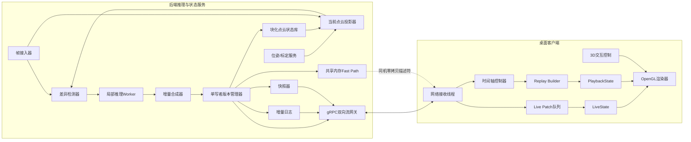

# 流式推理点云实时观察与交互式回放设计方案

## 执行摘要

本方案固定采用一条主线：**后端以“差异区域推理 + 单写者版本提交 + 快照/增量日志”维护权威点云状态，前端以“LiveState 与 PlaybackState 双状态分离 + OpenGL 增量 GPU 更新 + 帧序号时间轴解耦”实现实时观察与交互式回放**。这样做的原因是，gRPC 官方文档明确支持双向流式 RPC，且同一流内消息顺序保持；Protocol Buffers 官方文档说明其适合跨语言、跨平台的结构化高效序列化；OpenGL/Khronos 官方文档提供了部分缓冲区映射、子区间更新、持久映射与 fence/sync 原语，可以直接支撑“只更新脏块、不重建整云”的低延迟渲染路径；Potree 的论文级实现则证明了分层子采样、视锥裁剪、远近 LOD 对超大点云实时渲染是有效工程路径。基于这些一手资料，本方案选择 **Qt/ImGui + OpenGL 4.6 桌面客户端** 作为核心交互端，网络主协议为 **gRPC 双向流 + protobuf envelope + binary payload**，本机部署时可附加共享内存 fast path，但它只是同一协议语义下的优化，而不是另一套架构。来源优先级在文中按 **[P0 官方]、[P1 论文]** 标示。 citeturn4view3turn4view4turn0search16turn5search4turn5search12turn3search2turn4view8

这套方案特别针对你的流程而定制：首帧生成完整点云，后续帧通过“当前点云投影结果”与输入图像做差，得到差异区域后再局部推理，并把新结果以 patch 形式提交到全局点云。用户看到的时间轴以 **输入帧序号 frame_seq** 为基准，而系统内部再维护独立的 **commit_version**。因此即使用户把查看游标拖回历史帧，后台 `live_head_frame` 仍会继续向前推进，新的输入、推理、提交、广播与隐藏态更新都不被历史回放阻塞；用户返回“跟随实时”时可瞬时切回最新状态。这个“双头模型”是本设计解决“实时输入与历史查看互不干扰”的关键。 citeturn4view3turn5search9turn4view8

## 总体架构

本方案的后端分为五个核心域：**帧接入与相机位姿管理、当前点云投影与差异检测、差异区域局部推理、增量合成与版本管理、快照/日志/流式发布**。其中只有版本管理器有权把 patch 提交为新的权威版本，从而避免多 worker 并发写导致的状态不一致。前端则分为 **网络接收线程、LiveState 应用线程、PlaybackState 重建线程、渲染线程、UI/时间轴线程**。这样，实时态与回放态是两套物理上分离的内存/GPU 资源，只共享同一时间轴索引，不共享同一可变缓冲。这个分层设计与稀疏块化数据结构、分层 LOD 的原则，与 Open3D 的“全局稀疏、局部稠密”块哈希结构以及 Potree 的层级分辨率/视锥裁剪思路是对齐的。 citeturn4view6turn4view7turn4view8



体系上，**权威状态只在后端**，前端只做缓存、快速重建与显示；前端任何历史拖动都不会反向影响实时推理链路。gRPC 的双向流很适合把“控制消息”和“增量几何消息”放进一条有序会话里，protobuf 则适合定义 envelope 与字段演进；真正的大块几何数据则放在 `bytes` 二进制负载中，并在需要时做 Zstandard 流式压缩。Zstandard 官方文档明确指出它面向实时压缩场景，且支持 streaming compression。 citeturn4view3turn4view4turn4view5

下面这张 ASCII 示意图对应前端的“实时头”和“查看游标”解耦关系，是整个交互语义的核心。

```text
输入帧序号:      ... 118 119 120 121 122 123 124 125 126 127
提交版本号:      ... 870 871 872 873 874 875 876 877 878 879
实时头 LiveHead:                                  ^
查看游标 ViewCursor:                  ^
当前显示范围:                       [=====历史回放=====]

后台事件流: 新帧接入 ---> 差异检测 ---> 局部推理 ---> 提交新版本 ---> 推进LiveHead
用户行为:                 拖回历史帧 ------------------------------> 只影响ViewCursor
```

## 数据结构与协议

本方案把“用户可见时间”与“系统一致性时间”分开管理。用户只看到 `frame_seq`，它严格等于输入帧编号；系统内部则维护 `commit_version`，它代表一次已经原子提交到点云状态库的几何版本。任何一个输入帧在完全处理完成前，都可能只有 `frame_seq` 而没有对应的最终 `commit_version`；此时时间轴仍可前进，但该帧在前端以“最近已提交前驱版本 + pending 标识”显示。这样既满足“时间轴按帧序号持续前进”，又不把未完成推理伪装成已提交几何。gRPC 的同流有序保证与 protobuf 的 schema 演进能力，使这类双时间语义可以稳定落地。 citeturn4view3turn4view4

### 帧元数据与时间轴索引

| 字段 | 类型 | 说明 |
|---|---|---|
| `frame_seq` | `uint64` | 输入帧序号，时间轴单位 |
| `recv_ts_ns` | `uint64` | 服务端收到该帧的单调时间戳 |
| `camera_pose` | `float32[7]` | 位姿，建议 `tx,ty,tz,qx,qy,qz,qw` |
| `intrinsics_id` | `uint32` | 相机内参版本 |
| `status` | `enum` | `RECEIVED / DIFFED / INFERRED / COMMITTED / COALESCED / DROPPED` |
| `base_version` | `uint64` | 做差时使用的当前点云版本 |
| `commit_version` | `uint64` | 若已提交则记录目标版本，否则为 `0` |
| `delta_log_offset` | `uint64` | 对应增量日志位置 |
| `snapshot_id` | `uint64` | 若该帧命中了快照，则记录快照编号 |
| `pending_reason` | `enum` | `NONE / WAIT_INFER / WAIT_COMMIT / COALESCED` |

### 差异点与版本化点记录

| 字段 | 类型 | 说明 |
|---|---|---|
| `point_key` | `uint64` | 全局稳定键，建议由 `chunk_id + local_voxel + slot` 组成 |
| `chunk_id` | `int32[3]` | 稀疏块坐标 |
| `pos` | `float32[3]` | 世界坐标 |
| `color` | `uint8[3]` | RGB |
| `normal_q` | `int16[3]` | 法向量量化，可选 |
| `confidence` | `uint16` | 推理置信度或融合分数 |
| `source_frame_seq` | `uint64` | 该点由哪个输入帧产生 |
| `valid_from_version` | `uint64` | 生效版本 |
| `valid_to_version` | `uint64` | 失效版本，`0` 表示当前仍有效 |
| `flags` | `uint16` | `VISIBLE / TOMBSTONE / PENDING / LOD_PROXY` 等 |

### 增量补丁与操作粒度

| 字段 | 类型 | 说明 |
|---|---|---|
| `patch_id` | `uint64` | 全局 patch 编号 |
| `frame_seq` | `uint64` | 来源输入帧 |
| `from_version` | `uint64` | 旧版本 |
| `to_version` | `uint64` | 新版本 |
| `op_code` | `enum` | `UPSERT_POINT / DELETE_POINT / REPLACE_REGION / SWAP_CHUNK / SNAPSHOT_REF` |
| `chunk_id` | `int32[3]` | 受影响块 |
| `region_aabb` | `float32[6]` | 若为区域替换，则给出局部包围盒 |
| `payload_codec` | `enum` | `RAW_FP32 / PACKED_Q12 / ZSTD_RAW / DRACO` |
| `payload_bytes` | `bytes` | 二进制负载 |
| `point_count_add` | `uint32` | 新增/替换的点数 |
| `point_count_del` | `uint32` | 删除点数 |
| `reproj_error` | `float32` | 该 patch 的平均投影误差 |
| `producer_id` | `uint32` | 产生该 patch 的 worker |

### 网络消息格式建议

生产链路建议**只使用 бинарy 作为几何主载荷**，避免 JSON 在高频 patch 下的冗余；JSON 仅保留给调试镜像、录制文件头和手工回放工具。核心 envelope 由 protobuf 定义，几何数组放在 `bytes` 中，行优先 little-endian 打包；当 `payload_bytes >= 32 KB` 或链路接近饱和时启用 Zstd，若是远距 WAN 或需要磁盘归档，可把**快照**进一步编码为 Draco/G-PCC，但**实时小 patch 默认不走重型几何压缩**，因为其编码延迟会吃掉交互收益。Protocol Buffers 官方文档强调其小、快、简单；Zstandard 官方文档强调其面向实时与流式压缩；Draco 官方文档明确支持 point clouds。 citeturn4view4turn4view5turn1search3turn2search16

```proto
message StreamEnvelope {
  uint64 seq_no = 1;
  oneof body {
    FrameAck frame_ack = 2;
    DeltaEnvelope delta = 3;
    SnapshotEnvelope snapshot = 4;
    SeekRequest seek = 5;
    SeekReply seek_reply = 6;
    Heartbeat hb = 7;
  }
}

message DeltaEnvelope {
  uint64 frame_seq = 1;
  uint64 from_version = 2;
  uint64 to_version = 3;
  repeated ChunkPatch patches = 4;
  bytes payload_bytes = 5; // little-endian packed arrays, optional zstd
}
```

调试镜像建议保留一份 JSON 语义等价体，方便断点回放与日志比对，例如：

```json
{
  "type": "delta_patch",
  "frame_seq": 2314,
  "from_version": 8871,
  "to_version": 8872,
  "chunk_id": [18, -2, 44],
  "op_code": "REPLACE_REGION",
  "point_count_add": 1240,
  "point_count_del": 1133,
  "payload_codec": "ZSTD_RAW"
}
```

## 增量合成与一致性策略

你的现有流程可以直接升级为**投影差异驱动的局部几何替换**。做法是：对当前权威点云版本 `V_k`，依据该帧相机位姿把点云投影成当前视角下的合成图 `Î_t` 与深度 `Ď_t`；然后把输入图像 `I_t` 与 `Î_t` 做光度差，并结合可选深度残差或可见性不一致，得到差异掩码 `M_t`。如果有传感器深度，就把深度残差也纳入；如果没有，可只用颜色/语义残差与遮挡检测。差异检测本身不需要改动你的推理模型，只需要把“全图”变成“被差异掩码裁出来的区域”。Open3D 官方文档中的 ray casting / distance query 类说明了加速结构对几何查询的重要性，而 Open3D 的 VoxelBlockGrid 与 Niessner 的 voxel hashing 论文则说明，**空间块化 + 哈希检索**是实时三维更新中兼顾稀疏性与局部性的一条成熟路径。 citeturn2search5turn4view6turn4view7

建议把核心差异判定写成如下逻辑，其中阈值是工程参数而不是协议常量：

\[
M_t(u)=
\Big[\|I_t(u)-\hat I_t(u)\|_1>\tau_c\Big]
\;\lor\;
\Big[|D_t(u)-\hat D_t(u)|>\tau_d\Big]
\;\lor\;
\Big[\text{visibility\_mismatch}(u)=1\Big]
\]

拿到 `M_t` 后，不要直接在点级别全局搜改，而是先回投到三维，求受影响的 `chunk_id` 集合，再把 patch 合成限定在这些块内。块内再做两级操作选择：当差异稀疏时使用 `UPSERT_POINT + DELETE_POINT`；当差异在块内已经很密或影响连续表面时，直接升格为 `REPLACE_REGION`。这种“自适应粒度”与 Potree 所体现的层级裁剪思想一致，目的是把计算与带宽消耗局限在用户当前看得见、且确实发生变化的局部。 citeturn4view8turn4view6turn4view7

一致性方面，本方案不允许多个 worker 直接改写权威点云，只允许它们提交候选 patch，由**单写者版本管理器**按确定性规则串行提交。推荐规则是：先按 `frame_seq`，再按 `patch_id` 排序；同一空间位置发生竞争时，先比 `confidence`，再比 `reproj_error`，最后以更大的 `patch_id` 作为平局裁定。这样前端、日志与磁盘快照都能重演出同一个版本序列，不会因为线程调度不同而出现“同样输入、不同历史”的问题。gRPC 的流内有序性能够保证网络传输不改变这一提交顺序。 citeturn4view3

历史回放不应通过“每帧复制一整份点云”实现，因为那会迅速炸掉内存与延迟。本方案采用 **MVCC 式有效区间 + 周期快照 + 追加日志**：点记录带 `valid_from_version / valid_to_version`，增量日志按版本顺序追加，快照器每隔固定版本间隔或累计脏字节阈值生成一个压缩快照。前端 seek 到任意 `frame_seq = f` 时，先由时间轴索引找到其对应的 `commit_version = v_f`，再加载最近快照 `S <= v_f`，随后应用 `S+1...v_f` 的增量即可恢复历史态。因为快照是块级别的，seek 与拖动只会重建局部块缓存，不会重建全局全部数据。Zstd 支持流式压缩，因此快照与长日志都可以边读边解。 citeturn4view5turn4view6

## 渲染与同步策略

渲染端固定采用 **块化 VBO/SSBO + 脏块队列 + 部分 GPU 更新**。Khronos 的 OpenGL 参考文档说明，`glMapBufferRange` 可以映射缓冲区的部分范围，`glBufferSubData` 可以只重写某个子区间，`ARB_buffer_storage`/`EXT_buffer_storage` 允许持久映射，而 `glFenceSync` / `glWaitSync` 提供了显式同步原语；因此非常适合把每个 `chunk` 对应到一个固定容量的 GPU 子缓冲，仅对脏块做 subrange update，而不是每帧重建整片点云。对于中小 patch，直接 `glBufferSubData` 即可；对于高频 patch，改用持久映射 staging ring buffer，并通过 fence 回收写指针，避免 CPU/GPU 互相阻塞。若使用非 coherent 映射，再用 `glFlushMappedBufferRange` 显式刷脏区间。 citeturn5search4turn5search12turn0search16turn3search2turn5search8turn9search1

在内存布局上，建议**CPU 侧状态库存 SoA，GPU 侧渲染缓存存紧凑 AoS**。这样做是因为 Open3D 的 VoxelBlockGrid 文档明确说明其底层多值哈希表以 SoA 组织值，以维持局部数据访问局部性；而渲染管线则更适合把位置、颜色、法向、置信度打包成紧凑顶点结构，减少 attribute 绑定与索引跳转。具体到块粒度，RAM 中每个块可维护 `point_slots[]、free_list、dirty_ranges`；GPU 中对应一个固定容量 buffer page，新增点走空闲槽，删除点只打 tombstone，不立即挪动元素，等后台 compact 时再搬迁。这样前台更新路径始终是 O(脏字节) 而不是 O(全点云)。 citeturn4view6turn4view7

为了保证历史回放不阻塞实时输入，客户端必须维持两套状态：`LiveState` 持续吃最新 delta，`PlaybackState` 只服务当前查看游标。两者的 GPU buffer、块目录、LOD 缓存与待上传队列全部分离，渲染线程只在每个显示帧开始时原子选择“当前激活状态指针”。这意味着用户把游标拖回旧帧时，`PlaybackState` 会在后台从快照重建并逐步细化，同时 `LiveState` 仍继续接收新 patch、推进 `live_head_frame`。当用户点击“跟随实时”，只需一次指针切换，不需要重新向服务端请求“现在最新是哪一帧”。gRPC 双向流的独立收发能力天然适合这种“一边继续收实时 delta，一边发 seek 请求并接收历史快照”的工作方式。 citeturn4view3

LOD 与占位策略建议采用**近处全精度、远处降采样、历史拖动先粗后细**。Potree 的论文和项目说明都强调了层级分辨率、视锥剔除与远距低 LOD 对海量点云实时浏览的价值；因此本方案建议每个块维护 `LOD0/LOD1/LOD2` 三档，其中 `LOD1`、`LOD2` 可由后台线程用体素格下采样生成。正常观察时根据屏幕投影大小决定 LOD；当用户快速拖动时间轴时，优先显示 `LOD1/LOD2` 的占位几何，等 seek 停住后再补齐 `LOD0`。对于尚未完成局部推理的区域，可在原位置显示上一版本点并叠加黄色包围盒/闪烁边框，明确提示“该块几何仍在更新中”，而不是让场景突然消失。 citeturn4view8turn3search13

## 性能优化与可观测性

并发模型上，建议把**推理**、**版本提交**、**渲染**拆成至少三个进程域。推理域可以多 worker 并行吃差异区域；提交域只保留一个单写者；渲染域则只做网络接收、状态应用和显示。进程内再细分为异步线程：接收线程负责从 gRPC/共享内存拿 envelope，`patch-apply` 线程负责把 delta 映射到块缓存，`replay-builder` 线程负责 seek 重建，渲染线程只消费“本帧准备好的不可变块清单”。这个模型的优势不在于“线程越多越快”，而在于把**GPU 推理、CPU 合成、GPU 渲染**三类负载隔离开，避免互相争用同一锁与同一设备上下文。OpenGL 的显式同步原语与 gRPC 的双向流模型，正好分别支撑了前后端这两条异步链路。 citeturn3search2turn5search8turn4view3

内存管理上，推荐采用**块池 + 槽位分配器 + 墓碑延迟回收 + 后台压实**。稀疏块索引可借鉴 Open3D VoxelBlockGrid 与 voxel hashing 的思路：上层用块坐标哈希定位，下层保持块内数组连续，尽量保护 locality。墓碑点不会在实时线程里立刻删除，而是等块的 tombstone 比例超过阈值时由后台 compact，顺带重建该块的 LOD。这样历史版本仍可通过 `valid_to_version` 查询，实时路径也不会被内存搬运拖慢。Niessner 的论文与 Open3D 文档都强调了哈希块法在稀疏场景下的空间效率与局部访问效率。 citeturn4view7turn4view6

网络带宽上，建议把消息分为三档：小于 `32 KB` 的 delta 原样发送，`32 KB` 到 `1 MB` 的增量 patch 走 `ZSTD_RAW`，超过 `1 MB` 的快照块则允许使用更激进的压缩；但**实时 patch 不建议默认 Draco/G-PCC**，因为它们更适合传输与归档，而不是毫秒级频繁替换。Zstandard 官方文档明确指向实时与流式场景；Draco 官方文档则说明其面向点云与网格的存储/传输压缩。换言之，本方案在“实时增量”与“历史快照”上故意采用不同压缩力度。 citeturn4view5turn1search3turn2search16

可观测性建议直接纳入设计，而不是事后补。OpenTelemetry 官方文档把 traces、metrics、logs 定义为统一的 telemetry 信号，Prometheus 官方文档则建议在线服务重点关注吞吐、错误、延迟，并优先使用 native histograms。因此本方案建议：每一帧从 `recv(frame_seq)` 到 `presented(frame_seq)` 形成一条 trace，span 至少覆盖 `diff_detect`、`local_infer`、`compose`、`commit`、`stream_send`、`client_apply`、`gpu_present`；所有关键延迟都以 histogram 记录，并保留 `frame_seq、commit_version、chunk_count、dirty_bytes、payload_codec` 等标签。这样出现卡顿时，可以第一时间判断是推理慢、日志堆积、网络拥塞，还是 GPU buffer 更新阻塞。 citeturn8view0turn8view1turn8view2turn8view3

下面这组阈值不是标准，而是建议的工程目标，用于把“接近交互级”具体化：

```text
建议延迟预算（目标值，不是协议要求）
差异检测           8–15 ms   ███
局部推理          15–35 ms   ███████
增量合成/提交       2–6  ms   █
LAN传输             1–4  ms   █
客户端应用/绘制      4–12 ms   ██
-----------------------------------
端到端目标         30–72 ms   ███████████
```

```text
建议监控指标（目标值）
end_to_end_live_p50        < 80 ms
end_to_end_live_p95        < 150 ms
seek_near_keyframe_p95     < 200 ms
seek_far_p95               < 800 ms
gpu_dirty_upload/frame     < 8–32 MB
delta_backlog_frames       < 2 × 输入FPS
live/playback内存占用      各自独立，单独告警
```

## 开发调试与关键风险

开发期最重要的不是“先把 UI 做漂亮”，而是先把**版本、差异、渲染、回放**四条线做成可审计。日志必须至少携带 `frame_seq、base_version、to_version、patch_id、chunk_id、point_count_add/del、payload_bytes、codec、pending_reason、trace_id`；并在客户端支持三种专门调试视图：其一是**差异高亮视图**，把本帧变化块渲染成醒目颜色；其二是**版本热力图**，按点的 `source_frame_seq` 或 `valid_from_version` 着色；其三是**追帧视图**，同时显示 `live_head_frame` 与 `view_cursor_frame` 的距离。OpenTelemetry 的 trace/context 模型特别适合把后端 patch、网络报文与前端显示事件串成同一条因果链。 citeturn8view0turn8view1

断点回放要建立在“**可重放日志**”之上。建议把所有提交后的 delta 按 protobuf envelope 原样落盘，再提供一个离线播放器：可以从任意 `frame_seq`、任意 `commit_version`、任意 `patch_id` 开始重放，也可以注入人工故障，例如乱序 patch、重复 patch、丢失一个 snapshot descriptor。只要版本管理器真的是单写者且规则确定，这个离线播放器重放出的历史应该与线上一致；如果不一致，问题就一定落在非确定性提交、未记录的随机数种子或隐式并发共享状态上。gRPC 与 protobuf 的优势之一，就是线上与离线可共用一份消息定义。 citeturn4view3turn4view4

测试集建议覆盖五类场景。第一类是**正确性极小例**，例如单点新增、单点删除、跨块边界替换、相同位置高低置信度冲突；第二类是**时序一致性例**，例如同一 frame 产生多个 patch、seek 时 live head 继续推进、重连后从 `last_seen_version` 恢复；第三类是**性能应力例**，例如单块 80% 点被替换、连续 1000 帧稀疏小 patch、十万帧长历史随机拖动；第四类是**可视化质量例**，例如 diff mask 漏检/误检、小物体闪烁、占位 LOD 持续时间过长；第五类是**恢复与容错例**，例如 snapshot 损坏、delta 缺口、网络抖动和客户端热重启。Prometheus 对在线服务强调吞吐、错误、延迟三类核心指标，这些测试也应围绕这三类指标验收。 citeturn8view3turn8view2

关键风险主要有四个。第一，**差异点突然变得非常密集**，此时逐点 upsert/delete 会造成 CPU 合成和 GPU 脏区更新双重失速；本方案内建的降级路径是自动把块切到 `REPLACE_REGION` 或 `SWAP_CHUNK`，并允许同一块对多个连续帧做 patch coalescing，只保留对最新 `frame_seq` 有用的结果。第二，**输入帧率过高而局部推理跟不上**，这时不要硬追每个中间版本，而应把 `frame_seq` 继续登记到时间轴，但把几何提交改为“跳帧合并”，即多个输入帧共享一个后续 `commit_version`，UI 明确标识 `COALESCED`。第三，**历史回放频繁大范围拖动** 会触发大量 seek rebuild，这时应优先显示粗 LOD 并限制并发 seek 任务数，始终只保留“最后一次用户意图”的重建任务。第四，**显存/内存逼近上限** 时，优先回收 PlaybackState 的旧块与旧快照，只保留 LiveState 热窗口，历史数据改从 SSD 日志按需重建。Potree 的层级裁剪思路、Zstd 的流式恢复能力以及块哈希结构的稀疏特性，正是这些降级路径可行的基础。 citeturn4view8turn4view5turn4view6turn4view7

综合来看，这个方案最重要的并不是某个具体库，而是三个不可替代的结构性决策：**用 `frame_seq` 和 `commit_version` 分离用户时间与系统一致性时间；用块化稀疏状态 + 单写者提交控制增量合成；用 LiveState/PlaybackState 分离实时观察与历史回放**。只要这三点不动，推理模型、块大小、具体压缩参数和 UI 细节都可以逐步迭代；反过来，如果没有这三点，系统即使暂时跑起来，也很难在高帧率、高变化率和长历史拖动下维持低延迟与可解释性。 citeturn4view3turn4view4turn4view6turn4view8